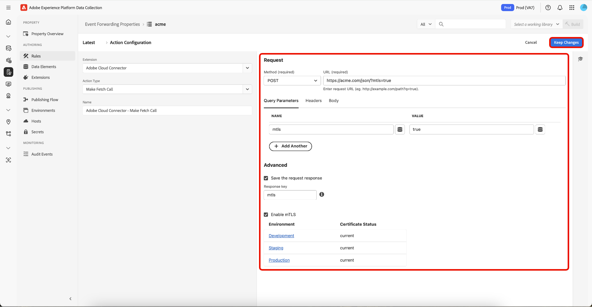

# Översikt över tillägget Cloud Connector

>[!NOTE]
>
>Adobe Experience Platform Launch har omprofilerats till en serie tekniker för datainsamling i Adobe Experience Platform. Som ett resultat av detta har flera terminologiska förändringar genomförts i produktdokumentationen. Se följande [dokument](../../../term-updates.md) för en konsoliderad referens av terminologiändringarna.

Med tillägget för händelsevidarebefordran i Cloud Connector kan du skapa anpassade HTTP-begäranden för att skicka data till ett mål eller hämta data från ett mål. Cloud Connector-tillägget fungerar som att ha Postman på Adobe Experience Platform Edge Network och kan användas för att skicka data till en slutpunkt som ännu inte har något dedikerat tillägg.

Använd den här referensen för information om de alternativ som är tillgängliga när du använder det här tillägget för att skapa en regel.

## Åtgärdstyp för Cloud Connector-tillägg

I det här avsnittet beskrivs åtgärdstypen Skicka data som finns i tillägget Adobe Experience Platform Cloud Connector.

### Typ av begäran

Om du vill välja vilken typ av begäran som krävs av slutpunkten väljer du lämplig typ i listrutan [!UICONTROL Request Type].

| Metod | Beskrivning |
|---|---|
| [GET](https://developer.mozilla.org/en-US/docs/Web/HTTP/Methods/GET) | Begär en representation av angiven resurs. Begäranden som använder GET bör endast hämta data. |
| [POST](https://developer.mozilla.org/en-US/docs/Web/HTTP/Methods/POST) | Skickar en entitet till den angivna resursen, vilket ofta orsakar en ändring av tillstånd eller biverkningar på servern. |
| [PUT](https://developer.mozilla.org/en-US/docs/Web/HTTP/Methods/PUT) | Ersätter alla aktuella representationer av målresursen med den begärda nyttolasten. |
| [PATCH](https://developer.mozilla.org/en-US/docs/Web/HTTP/Methods/PATCH) | Tillämpar partiella ändringar på en resurs. |
| [DELETE](https://developer.mozilla.org/en-US/docs/Web/HTTP/Methods/DELETE) | Tar bort angiven resurs. |

### URL för slutpunkt

I textfältet bredvid listrutan Typ av begäran anger du URL:en för den slutpunkt som du skickar data till.

### Frågeparametrar, rubriker och konfiguration av brödtext

Använd var och en av dessa flikar (Query Params, Headers och Body Data Elements) för att styra vilka data som skickas till en viss slutpunkt.

#### Frågeparametrar

Definiera en nyckel och ett värde för varje nyckelvärdepar som du vill skicka som en frågesträngsparameter. Om du vill ange ett dataelement manuellt använder du klammerparentesens dataelementtokenisering för vidarebefordran av händelser. Om du vill referera till värdet för ett dataelement med namnet&quot;siteSection&quot; som en nyckel eller ett värde anger du `{{siteSection}}`. Du kan också markera det dataelement som skapades tidigare genom att markera det i listrutan.

Om du vill lägga till fler frågeparametrar väljer du **[!UICONTROL Add Another]**.

#### Sidhuvuden

Definiera en nyckel och ett värde för varje nyckelvärdepar som du vill skicka som en rubrik. Om du vill ange ett dataelement manuellt använder du klammerparentesens dataelementtokenisering för vidarebefordran av händelser. Om du vill referera till värdet för ett dataelement med namnet&quot;pageName&quot; som en nyckel eller ett värde anger du `{{pageName}}`. Du kan också markera det dataelement som skapades tidigare genom att markera det i listrutan.

Om du vill lägga till fler rubriker väljer du **[!UICONTROL Add Another]**.

I följande tabell visas de fördefinierade rubrikerna. Du är inte begränsad till dessa rubriker och kan lägga till egna rubriker om det behövs, men de är tillgängliga för att underlätta.

>[!NOTE]
>
>Mer information om dessa rubriker finns på [https://developer.mozilla.org/en-US/docs/Web/HTTP/Headers](https://developer.mozilla.org/en-US/docs/Web/HTTP/Headers).

| Sidhuvud | Beskrivning |
|---|---|
| [A-IM](https://developer.mozilla.org/en-US/docs/Web/HTTP/Headers/Accept) | |
| [Acceptera](https://developer.mozilla.org/en-US/docs/Web/HTTP/Headers/Accept) | |
| [Accept-Charset](https://developer.mozilla.org/en-US/docs/Web/HTTP/Headers/Accept-Charset) | |
| [Acceptera-kodning](https://developer.mozilla.org/en-US/docs/Web/HTTP/Headers/Accept-Encoding) | |
| [Acceptera-språk](https://developer.mozilla.org/en-US/docs/Web/HTTP/Headers/Accept-Language) | |
| [Acceptera-dateTime](https://developer.mozilla.org/en-US/docs/Web/HTTP/Headers/Accept) | Överförd av en användaragent för att ange att den vill komma åt ett tidigare tillstånd för en ursprunglig resurs. Därför förmedlas rubriken `Accept-Datetime` i en HTTP-begäran som utfärdas mot en TimeGate för en ursprunglig resurs, och dess värde anger datum/tid för det önskade tidigare tillståndet för den ursprungliga resursen. |
| Access-control-request-headers | Används av webbläsare vid utfärdande av en [preflight-begäran](https://developer.mozilla.org/en-US/docs/Glossary/preflight_request) för att tala om för servern vilka [HTTP-huvuden](https://developer.mozilla.org/en-US/docs/Web/HTTP/Headers) klienten kan skicka när den faktiska begäran görs. |
| access-control-request-method | Används av webbläsare vid utfärdande av en [preflight-begäran](https://developer.mozilla.org/en-US/docs/Glossary/preflight_request) för att tala om för servern vilken [HTTP-metod ](https://developer.mozilla.org/en-US/docs/Web/HTTP/Methods) som kommer att användas när den faktiska begäran görs. Det här huvudet är nödvändigt eftersom preflight-begäran alltid är en [OPTION](https://developer.mozilla.org/en-US/docs/Web/HTTP/Methods/OPTIONS) och inte använder samma metod som den faktiska begäran. |
| Behörighet | Innehåller autentiseringsuppgifter för att autentisera en användaragent med en server. |
| [Cache-Control](https://developer.mozilla.org/en-US/docs/Web/HTTP/Headers/Cache-Control) | Direktiv om mekanismer för cachelagring i både förfrågningar och svar. |
| [Anslutning](https://developer.mozilla.org/en-US/docs/Web/HTTP/Headers/Connection) | Kontrollerar om nätverksanslutningen förblir öppen när den aktuella transaktionen har slutförts. |
| [Innehållslängd](https://developer.mozilla.org/en-US/docs/Web/HTTP/Headers/Content-Length) | Resursens storlek i antal byte. |
| [Innehållstyp](https://developer.mozilla.org/en-US/docs/Web/HTTP/Headers/Content-Type) | Anger medietypen för resursen. |
| Cookie | Innehåller lagrade [HTTP-cookies](https://developer.mozilla.org/en-US/docs/Web/HTTP/Cookies) som servern tidigare skickade med rubriken [`Set-Cookie`](https://developer.mozilla.org/en-US/docs/Web/HTTP/Headers/Set-Cookie). |
| Datum | Allmän HTTP-rubrik innehåller datum och tid då meddelandet skapades. |
| [DNT](https://developer.mozilla.org/en-US/docs/Web/HTTP/Headers/DNT) | Uttrycker användarens spårningsinställning. |
| Förvänta | Anger förväntningar som servern måste uppfylla för att kunna hantera begäran korrekt. |
| Vidarebefordrad | Innehåller information från de [omvända proxyservrarna](https://developer.mozilla.org/en-US/docs/Web/HTTP/Proxy_servers_and_tunneling) som ändras eller förloras när en proxy är inblandad i sökvägen till begäran. |
| Från | Innehåller en Internet-e-postadress för en användare som styr den begärande användaragenten. |
| Värd | Anger värd- och portnummer för servern som begäran skickas till. |
| If-Match | |
| If-Modified-Since | |
| [If-None-Match](https://developer.mozilla.org/en-US/docs/Web/HTTP/Headers/If-None-Match) | |
| [If-Range](https://developer.mozilla.org/en-US/docs/Web/HTTP/Headers/If-Range) | |
| [If-Unmodified-Since](https://developer.mozilla.org/en-US/docs/Web/HTTP/Headers/If-Unmodified-Since) | |
| [Max-Forwards](https://developer.mozilla.org/en-US/docs/Web/HTTP/Headers/If-Unmodified-Since) | |
| [Ursprung](https://developer.mozilla.org/en-US/docs/Web/HTTP/Headers/Origin) | |
| [Pragma](https://developer.mozilla.org/en-US/docs/Web/HTTP/Headers/Pragma) | Implementeringsspecifikt huvud som kan ha olika effekter var som helst längs kedjan för begäran/svar. Används för bakåtkompatibilitet med HTTP/1.0-cacheminnen där Cache-Control-huvudet ännu inte finns. | |
| [Proxyauktorisering](https://developer.mozilla.org/en-US/docs/Web/HTTP/Headers/Proxy-Authorization) |
| [Intervall](https://developer.mozilla.org/en-US/docs/Web/HTTP/Headers/Range) | Anger den del av ett dokument som servern ska returnera. | |
| [Referent](https://developer.mozilla.org/en-US/docs/Web/HTTP/Headers/Referer) | Adressen till den föregående webbsidan från vilken en länk till den begärda sidan följdes. | |
| TE | Anger de överföringskoder som användaragenten är villig att acceptera. (Du kan ringa `Accept-Transfer-Encoding`, vilket skulle vara mer intuitivt). |
| Uppgradera | Det relevanta RFC-dokumentet för rubrikfältet [`Upgrade` är RFC 7230, avsnitt 6.7](https://tools.ietf.org/html/rfc7230#section-6.7). Standarden innehåller regler för uppgradering eller ändring till ett annat protokoll på den aktuella klient-, server- och transportprotokollanslutningen. Den här huvudstandarden tillåter till exempel en klient att ändra från HTTP 1.1 till HTTP 2.0, förutsatt att servern bestämmer sig för att bekräfta och implementera rubrikfältet `Upgrade`. Ingen part behöver acceptera villkoren som anges i rubrikfältet `Upgrade`. Den kan användas både i klient- och serverrubriker. Om rubrikfältet `Upgrade` anges MÅSTE avsändaren även skicka rubrikfältet `Connection` med alternativet `upgrade` angivet. | |
| [Användaragent](https://developer.mozilla.org/en-US/docs/Web/HTTP/Headers/User-Agent) | Innehåller en karakteristisk sträng som gör att nätverksprotokollets peer-datorer kan identifiera programtyp, operativsystem, programvaruleverantör eller programvaruversion för den begärande programvaruanvändarens agent. |
| [Via](https://developer.mozilla.org/en-US/docs/Web/HTTP/Headers/Via) | Läggs till av proxies, både framåt- och bakåt-proxies, och kan visas i begäranrubrikerna och svarshuvudena. |
| [Varning](https://developer.mozilla.org/en-US/docs/Web/HTTP/Headers/Warning) | Allmän varningsinformation om möjliga problem. |
| X-CSRF-token | |
| X-requested-with | |

#### Brödtext som JSON

Definiera en nyckel och ett värde för varje nyckelvärdepar som du vill skicka i själva förfrågningen. Om du vill ange ett dataelement manuellt använder du klammerparentesens dataelementtokenisering för vidarebefordran av händelser. Om du vill referera till värdet för ett dataelement med namnet&quot;appSection&quot; som en nyckel eller ett värde anger du `{{appSection}}`. Du kan också markera det dataelement som skapades tidigare genom att markera det i listrutan.

Om du vill lägga till fler nyckelvärdepar väljer du **[!UICONTROL Add Another]**.

#### Brödtext som Raw

Definiera en nyckel och ett värde för varje nyckelvärdepar som du vill skicka i själva förfrågningen. Om du vill ange ett dataelement manuellt använder du klammerparentesens dataelementtokenisering för vidarebefordran av händelser. Om du vill referera till värdet för ett dataelement med namnet&quot;appSection&quot; som en nyckel eller ett värde anger du `{{appSection}}`. Du kan också markera det dataelement som skapades tidigare genom att markera det i listrutan. Du kan lägga till ett eller flera dataelement.

### Avancerat

Åtgärder i regler för vidarebefordran av händelser utförs sekventiellt. Det kan finnas situationer där du vill hämta data från en extern källa som inte finns i den inkommande händelsen från klienten och sedan ta detta svar och antingen omvandla eller skicka dessa data till ett slutmål i en efterföljande åtgärd i en enda regel. Det här aktiveras av&quot;Spara begäransvaret&quot; i det avancerade avsnittet.

Om du vill spara svarstexten från en slutpunkt markerar du rutan **[!UICONTROL Save the request response]** och definierar en svarsnyckel i textfältet.

Om du definierade svarsnyckeln som `productDetails` refererar du till dessa data i ett dataelement och refererar sedan detta dataelement i en efterföljande åtgärd i samma regel. Om du vill skapa ett dataelement som refererar till `productDetail` skapar du ett dataelement av typen `path` och anger följande sökväg:

```Json
arc.ruleStash.[EXTENSION-NAME-HERE].responses.[RESPONSE-KEY-HERE] 

arc.ruleStash.adobe-cloud-connector.reponses.productDetails 
```

## Använd säkerhet för lager för ömsesidig transport [!DNL mTLS] i reglerna för händelsespridning {#mtls-rules}

Certifikatet [!DNL mTLS] är en digital autentiseringsuppgift som bevisar identiteten på en server eller klient i säker kommunikation. När du använder tjänst-API:t [!DNL mTLS] hjälper dessa certifikat dig att verifiera och kryptera din interaktion med Adobe Experience Platform Event Forwarding. Denna process skyddar inte bara dina data, utan säkerställer även att alla anslutningar kommer från en betrodd partner.

### Installera Adobe Cloud Connector-tillägget {#install}

Om du vill installera tillägget [skapar du en egenskap för vidarebefordring av händelser](../../../ui/event-forwarding/overview.md#properties) eller väljer en befintlig egenskap att redigera i stället.

Välj **[!UICONTROL Extensions]** i den vänstra panelen. På fliken **[!UICONTROL Catalog]** väljer du **[!UICONTROL Adobe Cloud Connector]** Real-Time Conversions API-kort och sedan **[!UICONTROL Install]**.

![Tilläggskatalogen som visar installationen av [!DNL Adobe Cloud Connector] tilläggskort.](../../../images/extensions/server/cloud-connector/install-extension.png)

### Konfigurera en regel för vidarebefordran av händelser {#rule}

>[!NOTE]
>
>Om du vill konfigurera en regel att använda [!DNL mTLS] måste du ha Adobe Cloud Connector version 1.2.4 eller senare.

När du har installerat tillägget kan du skapa en regel för vidarebefordran av händelser som använder [!DNL mTLS] och lägga till den i biblioteket.

Skapa en ny händelsevidarebefordring av [regel](../../../ui/managing-resources/rules.md) i din händelsevidarebefordringsegenskap. Ange ett namn för regeln, lägg sedan till en ny åtgärd under **[!UICONTROL Actions]** och ange tillägget till **[!UICONTROL Adobe Cloud Connector]**. Välj sedan **[!UICONTROL Make Fetch Call]** för **[!UICONTROL Action Type]**.


När du har gjort ditt val visas ytterligare kontroller för att konfigurera metoder och mål för [!DNL mTLS]-begäran. Om du vill aktivera användning av aktiva certifikat i miljöer väljer du **[!UICONTROL Enable in [!DNL mTLS]]** och sedan **[!UICONTROL Keep Changes]** för att spara regeln.



Din nya regel är nu klar. Välj **[!UICONTROL Save to Library]** och välj sedan **[!UICONTROL Build]** för att distribuera den. [!DNL mTLS]-begäran är nu aktiv och tillgänglig i ditt bibliotek.


## Nästa steg

I den här guiden beskrivs hur du konfigurerar mTLS-regler vid vidarebefordran av händelser. Mer information om hur du konfigurerar mTLS för en miljö finns i [Ömsesidig säkerhet för transportlager [!DNL mTLS] guide](../cloud-connector/mtls.md).

Mer information om funktioner för vidarebefordran av händelser i Experience Platform finns i [översikten över vidarebefordran av händelser](../../../ui/event-forwarding/overview.md).
