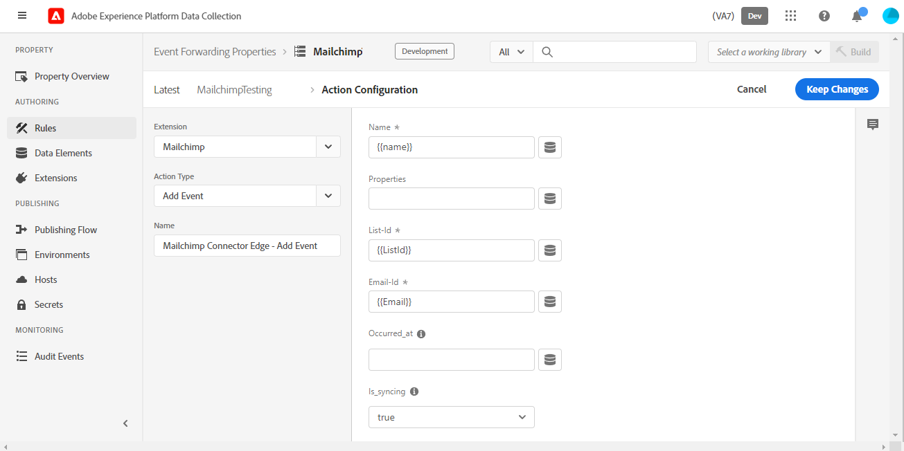

# Översikt över vidarebefordringstillägg för Mailchimp-händelse

>[!NOTE]
>  
>Adobe Experience Platform Launch har omklassificerats som en serie datainsamlingstekniker i Adobe Experience Platform. Som ett resultat av detta har flera terminologiska förändringar införts i produktdokumentationen. Se följande [dokument](https://experienceleague.adobe.com/docs/experience-platform/tags/term-updates.html) för en konsoliderad hänvisning till terminologiska förändringar.

The Mailchimp [händelsevidarebefordran](../../../ui/event-forwarding/overview.md) tillägg skickar händelser till Mailchimp Marketing API som kan utlösa e-postmeddelanden för marknadsföringskampanjer, resor och transaktioner i Mailchimp.

Det här dokumentet beskriver hur du konfigurerar tillägget och konfigurerar regler med åtgärden Lägg till händelse.

## Förutsättningar

I det här dokumentet förutsätts att du känner till de relevanta Mailchimp-produkter som används av tillägget. Mer information finns i hjälpdokumentationen för Mailchimp. [kampanjer](https://mailchimp.com/help/getting-started-with-campaigns/), [resor](https://mailchimp.com/help/about-customer-journeys/)och [transaktioner](https://mailchimp.com/help/transactional/).

Det krävs ett Mailchimp-konto för att kunna använda det här tillägget. Du kan registrera dig för ett konto [här](https://login.mailchimp.com/signup/). Observera följande värden som kan användas i den här handboken på kontrollpanelen för Mailchimp-kontot:

- Ditt prefix för Mailchimp-domänen
- Din API-nyckel
- Målgrupps-ID
- Standarde-postadressen&quot;från&quot;

Beroende på din plan för Mailchimp-kontot kan du ha begränsad tillgång till kundreseverktygen för Mailchimp.

>[!TIP]
>  
>Om du använder Mailchimp-automatisering som transaktionsmejl eller kundresor kan stegen och skärmarna skilja sig något från dem som listas här. Du behöver dock fortfarande samma information för att använda det här tillägget enligt beskrivningen ovan. Se [Hjälp om Mailchimp](https://mailchimp.com/help/) om du vill ha information om vart och ett av dessa värden för ditt specifika konto och din plan.

### Domänprefix

När du har loggat in på Mailchimp och landat i vyn Kontrollpanel bör webbläsarens adressfält visa en URL som `https://us11.admin.mailchimp.com` eller bara `us11.admin.mailchimp.com`. I det här exemplet är prefixet `us11` är bara en platshållare och ditt värde kommer att bli annorlunda. Registrera din URL med ditt prefix för ett senare steg.

### API-nyckel

Om du vill hitta API-nyckeln för ditt konto väljer du din profilikon i gränssnittet för Mailchimp och väljer sedan **Profil**. Du bör se en URL som `https://us11.admin.mailchimp.com/account/profile/` men med **din** prefix i stället för `us11`.

Välj **Extrafunktioner** sedan **API-nycklar**:

Under **Dina API-nycklar** kan du välja en befintlig nyckel eller markera **Skapa en nyckel** för att skapa en ny. Du kan skapa en ny nyckel som ska användas specifikt med det här tillägget. Kopiera API-nyckeln och spara den i ett senare steg. Mer information finns i dokumentationen för Mailchimp om hur du [generera API-nyckeln](https://mailchimp.com/developer/marketing/guides/quick-start/#generate-your-api-key).

### Målgrupps-ID och Från-adress

Välj **Målgrupp** i den vänstra navigeringen och sedan **Audience dashboard**. Välj sedan den målgrupp du tänker använda med det här tillägget. Mer information finns i Mailchimp-dokumentet på [skapa en målgrupp](https://mailchimp.com/help/create-audience/).

När målgruppen har skapats och valts väljer du **Hantera målgrupp** listruta och välj **Inställningar**. På den här skärmen visas olika inställningar för din målgrupp.

Längst ned på inställningsskärmen visas `Unique id for audience [audience name]` där `[audience name]` är namnet på den verkliga målgruppen. Kopiera publikens ID och spara det för ett senare steg.

Välj **Målgruppsnamn och standardvärden** och bekräfta att **Standard från e-postadress** har rätt värde för era kampanjer. Observera att Audience ID även finns i listan överst på den här sidan och är samma värde som du kopierade ned i det sista steget.

## Automatisering av e-postmeddelanden

Beroende på din Mailchimp-plan och om du använder transaktionsbaserade e-postmeddelanden, kundresor eller andra Mailchimp-automatiseringar kan dina specifika reseinställningar variera.

>[!IMPORTANT]
>  
>Det händelsenamn som du valde för att utlösa din automatisering eller resa i Mailchimp är samma händelsenamn som du måste skicka med det här tillägget. Anteckna händelsenamnet i din Mailchimp-automatisering och spara det för ett senare steg.

## Installation och konfiguration

I det här avsnittet beskrivs stegen för hur du installerar och konfigurerar tillägget. Om du vill spara API-nyckeln för Mailchimp på ett säkert sätt måste du använda vidarebefordran av händelser [hemligheter](../../../ui/event-forwarding/secrets.md).

### Skapa en hemlighet och ett dataelement

I en egenskap för vidarebefordring av händelser [skapa en [!UICONTROL Token] hemlig](../../../ui/event-forwarding/secrets.md#token) anropad `Mailchimp API Key`.

Nästa, [skapa ett dataelement](../../../ui/managing-resources/data-elements.md#create-a-data-element) med [!UICONTROL Core] tillägg och en [!UICONTROL Secret] dataelementtyp som refererar till `Mailchimp API Key` hemlighet du nyss skapade. Retur `Mailchimp Token` som dataelementets namn.

### Installera och konfigurera tillägget

I samma händelsevidarebefordringsegenskap väljer du **[!UICONTROL Extensions],** sedan **[!UICONTROL Catalog]** för att visa de tillägg som är tillgängliga för installation. Här söker du efter tillägget Mailchimp och väljer **[!UICONTROL Install]**.

Konfigurationsskärmen visas. Under **[!UICONTROL Mailchimp Server Prefix Domain Name]** anger du den domän du kopierade tidigare från ditt Mailchimp-konto, inklusive ditt unika domänprefix.

>[!IMPORTANT]
>
>Inkludera inte `http://` eller `https://` i detta fält.

Under **[!UICONTROL Mailchimp token]** markerar du dataelementsikonen och väljer `Mailchimp Token` dataelement som du skapade tidigare. Välj **[!UICONTROL Save]** för att spara ändringarna.

Tillägget är nu installerat och konfigurerat för att användas i din egenskap.

## Datainsamling

När du använder det här tillägget i en [regel](../../../ui/managing-resources/rules.md), finns det flera datavärden som tillägget skickar till Mailchimp för varje händelse. För en vanlig implementering kan du konfigurera [Adobe Experience Platform Web SDK-tillägg](../../client/sdk/overview.md) för att skicka data till [!DNL Platform Edge Network] som används av tillägget i egenskapen för händelsens vidarebefordring.

De data som krävs för det här tillägget kan skickas från Web SDK som antingen XDM-data eller data som inte är XDM-data. Läs mer om [skicka XDM-data](../../../../edge/fundamentals/tracking-events.md#sending-non-xdm-data).

Om en kund till exempel gör ett köp eller registrerar sig för en händelse på din webbplats, kan du skicka en bekräftelse via e-post via Mailchimp med det här tillägget. När du har skickat den nödvändiga informationen från Web SDK till Edge Network utlöser tillägget e-postmeddelandet med Mailchimp.

### Dataelement

Skärmbilden i föregående avsnitt visar de data som du kan skicka med varje händelse från det här tillägget till Mailchimp. När du har konfigurerat Web SDK för att skicka dessa data till Edge Network kan du skapa dataelement i egenskapen för händelsevidarebefordran så att tillägget kan komma åt dessa värden.

Tabellen nedan innehåller mer information om varje möjligt värde.

| Namn | Exempel på sökväg | Typ | Beskrivning | Obligatoriskt | Gränser |
|:---|:---:|:---:|:---|:---:|:---|
| `email` | `arc.event.xdm._tenant.emailId`  eller  `arc.event.data._tenant.emailId` | Sträng | Den adress som tar emot e-postmeddelandet | **Ja** | Måste finnas i Mailchimp-målgruppen |
| `listId` | `arc.event.xdm._tenant.listId`  eller  `arc.event.data._tenant.listid` | Sträng | Målgrupps-ID | **Ja** | Måste matcha ett befintligt målgrupps-ID |
| `name` | `arc.event.xdm._tenant.name`  eller  `arc.event.data._tenant.name` | Sträng | Händelsens namn | **Ja** | 2-30 tecken långt |
| `properties` | `arc.event.xdm._tenant.properties`  eller  `arc.event.data._tenant.properties` | Objekt | En valfri lista med egenskaper i JSON-format med information om händelsen | Nej |  |
| `isSyncing` | `arc.event.xdm._tenant.isSyncing`  eller  `arc.event.data._tenant.isSyncing` | boolesk | Händelser skapade med `is_syncing` ange till `true` **inte** aktivera automatisering | Nej |  |
| `occurredAt` | `arc.event.xdm._tenant.occuredAt`  eller `arc.event.data._tenant.occuredAt` | Sträng | En ISO 8601-tidsstämpel för när händelsen inträffade | Nej |  |

{style="table-layout:auto"}

>[!IMPORTANT]
>  
>The **Exempel på sökväg** värdena ovan är endast exempel. Fältnamnen och [banor](../../../ui/event-forwarding/overview.md#data-element-path) som refereras i dessa dataelement kan skilja sig åt i din egenskap, beroende på hur du namnger och konfigurerar Web SDK i stegen ovan.

I egenskapen för vidarebefordran av händelser kan du skapa ett dataelement för vart och ett av de fält som beskrivs ovan. När du har skapat det kan du referera till dataelementen i [!UICONTROL Add Event] åtgärd för det här tillägget.

Du kan nu använda det här tillägget och åtgärden Lägg till händelse för att utlösa e-postmeddelanden från Mailchimp för dina målgrupper.

## Dataverifiering

När du arbetar med tillägg för vidarebefordran av händelser [Adobe Experience Platform Debugger](https://chrome.google.com/webstore/detail/adobe-experience-platform/bfnnokhpnncpkdmbokanobigaccjkpob) är mycket användbar. I avsnittet Loggar, under Edge-loggar, kan du se de begäranden som har gjorts av reglerna för vidarebefordran av händelser när de har utlösts. Följande skärmbilder visar en begäran som görs till Mailchimp API av tillägget.

På Mailchimp-kontrollpanelen i vyn Activity Feed (Aktivitetsfeed) för din publik eller målmedlem visas en lista med händelser för den målgruppen eller målgruppsmedlemmen. Detta bör matcha de händelser som skickas av tillägget och visa alla valfria data som skickas, tillsammans med e-postmeddelandet eller kampanjen som de fick. Se [Hjälpguider för Mailchimp Automation](https://mailchimp.com/help/automation/) för mer information.
