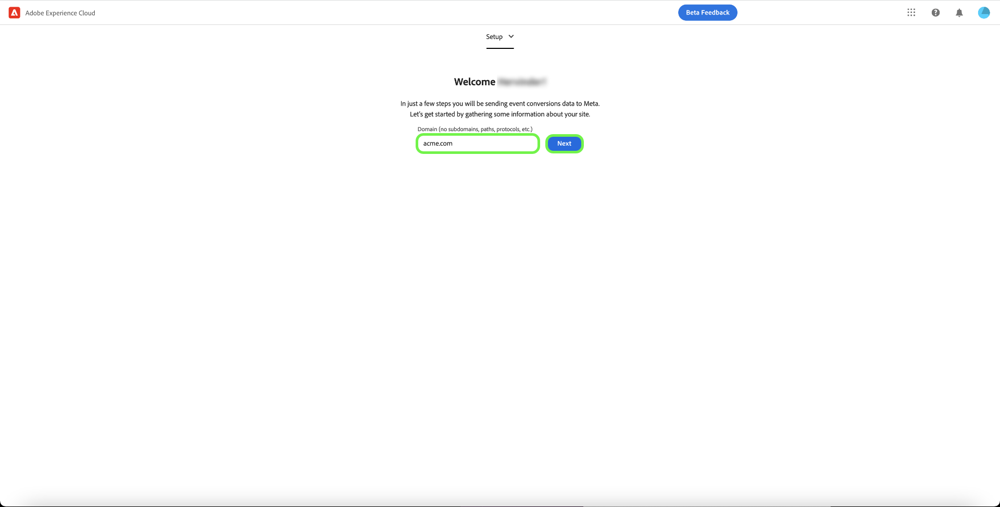

# Översikt över tillägget [!DNL Meta Conversions API]

Med [[!DNL Meta Conversions API]](https://developers.facebook.com/docs/marketing-api/conversions-api/) kan du koppla marknadsföringsdata på serversidan till [!DNL Meta]-tekniker för att optimera er annonsinriktning, minska kostnaden per åtgärd och mäta resultat. Händelser är länkade till ett [[!DNL Meta Pixel]](https://developers.facebook.com/docs/meta-pixel/)-ID och bearbetas på ungefär samma sätt som händelser på klientsidan.

Med tillägget [!DNL Meta Conversions API] kan du utnyttja API:ts funktioner i reglerna för [ vidarebefordran av händelser](../../../ui/event-forwarding/overview.md) för att skicka data till [!DNL Meta] från Adobe Experience Platform Edge Network. Det här dokumentet beskriver hur du installerar tillägget och använder dess funktioner i en händelsevidarebefordring av [regeln](../../../ui/managing-resources/rules.md).

## Demo

Följande video är avsedd att stödja din förståelse av [!DNL Meta Conversions API].

>[!VIDEO](https://unlockmarketingdata.com/video-meta-conversions-api)

## Förhandskrav

Vi rekommenderar starkt att du använder [!DNL Meta Pixel] och [!DNL Conversions API] för att dela och skicka samma händelser från klient- respektive serversidan, eftersom detta kan hjälpa till att återställa händelser som inte plockats upp av [!DNL Meta Pixel]. Innan du installerar tillägget [!DNL Conversions API] ska du läsa guiden för tillägget [[!DNL Meta Pixel] ](../../client/meta/overview.md) för steg om hur du integrerar det i implementeringar av taggar på klientsidan.

>[!NOTE]
>
>Avsnittet om [händelseavduplicering](#deduplication) senare i det här dokumentet beskriver stegen för att se till att samma händelse inte används två gånger, eftersom den kan tas emot både från webbläsaren och servern.

För att kunna använda tillägget [!DNL Conversions API] måste du ha tillgång till händelsevidarebefordran och ha ett giltigt [!DNL Meta]-konto med tillgång till [!DNL Ad Manager] och [!DNL Event Manager]. Du måste kopiera ID:t för en befintlig [[!DNL Meta Pixel]](https://www.facebook.com/business/help/952192354843755?id=1205376682832142) (eller [skapa en ny [!DNL Pixel]](https://www.facebook.com/business/help/952192354843755) i stället) så att tillägget kan konfigureras för ditt konto.

>[!INFO]
>
>Om du planerar att använda det här tillägget med mobilappsdata, eller om du även arbetar med offlinehändelsedata i dina [!DNL Meta]-kampanjer, måste du skapa datauppsättningen med en befintlig app och välja **Skapa från ett pixel-ID** när du uppmanas till det. Mer information finns i artikeln [Bestäm vilket alternativ för att skapa datauppsättningar som passar ditt företag](https://www.facebook.com/business/help/5270377362999582?id=490360542427371). Se dokumentet [Konverterings-API för apphändelser](https://developers.facebook.com/docs/marketing-api/conversions-api/app-events) för alla obligatoriska och valfria parametrar för appspårning.

## Installera tillägget

Om du vill installera tillägget [!DNL Meta Conversions API] går du till användargränssnittet för datainsamling eller användargränssnittet för Experience Platform och väljer **[!UICONTROL Event Forwarding]** i den vänstra navigeringen. Här väljer du en egenskap som tillägget ska läggas till i eller skapar en ny egenskap i stället.

När du har markerat eller skapat den önskade egenskapen väljer du **[!UICONTROL Extensions]** i den vänstra navigeringen och väljer sedan fliken **[!UICONTROL Catalog]**. Sök efter kortet [!UICONTROL Meta Conversions API] och välj sedan **[!UICONTROL Install]**.

![Det [!UICONTROL Install]-alternativ som väljs för tillägget [!UICONTROL Meta Conversions API] i användargränssnittet för datainsamling.](../../../images/extensions/server/meta/install.png)

I konfigurationsvyn som visas måste du ange det [!DNL Pixel]-ID som du kopierade tidigare för att kunna länka tillägget till ditt konto. Du kan klistra in ID:t direkt i indata eller använda ett dataelement i stället.

Du måste också ange en åtkomsttoken för att kunna använda [!DNL Conversions API] specifikt. Mer information om hur du hämtar det här värdet finns i [!DNL Conversions API]-dokumentationen om [generering av en åtkomsttoken](https://developers.facebook.com/docs/marketing-api/conversions-api/get-started#access-token).

När du är klar väljer du **[!UICONTROL Save]**

![Det [!DNL Pixel]-ID som anges som ett dataelement i tilläggskonfigurationsvyn.](../../../images/extensions/server/meta/configure.png)

Tillägget är installerat och du kan nu använda dess funktioner i reglerna för vidarebefordran av händelser.

## Integrering med Facebook och Instagram {#facebook}

Tack vare integreringen med Facebook och Instagram kan du snabbt autentisera dig i ditt Meta Business Account. Detta fyller sedan automatiskt i [!UICONTROL Pixel ID] och Meta Conversion API [!UICONTROL Access Token], vilket gör det enklare att installera och konfigurera API:t för metakonvertering.

En dialogruta om att autentisera i Facebook och Instagram visas när tillägget [!UICONTROL Meta Conversions API] installeras.

![Markering av [!UICONTROL Meta Conversions API Extension]-installationssidan [!UICONTROL Connect to Meta].](../../../images/extensions/server/meta/mbe-extension-install.png)

En dialogruta för att autentisera i Facebook och Instagram visas också i snabbstartsgränssnittet vid vidarebefordran av händelser.

![Gränssnittet för snabbstartsarbetsflöde markeras [!UICONTROL Connect to Meta].](../../../images/extensions/server/meta/mbe-extension-quick-start.png)

## Integrering med EMQ (Event Quality Match Score) {#emq}

Integrationen med EMQ (Event Quality Match Score) gör att du enkelt kan se hur effektiv implementeringen är genom att visa EMQ-poäng. Den här integreringen minimerar kontextväxling och hjälper dig att förbättra framgången för implementeringarna av Meta Conversions API. De här händelsepoängen visas på konfigurationsskärmen [!UICONTROL Meta Conversions API extension].

![Markering av [!UICONTROL Meta Conversions API Extension]-konfigurationssidan [!UICONTROL View EMQ Score].](../../../images/extensions/server/meta/emq-score.png)

## Integrering med LiveRamp (Alpha) {#alpha}

[!DNL LiveRamp]-kunder som har [!DNL LiveRamp]s ATS (Authenticated Traffic Solution) distribuerat på sina webbplatser kan välja att dela RampID:n som en kundinformationsparameter. Samarbeta med ditt [!DNL Meta]-kontoteam för att gå med i Alpha-programmet för den här funktionen.

![Framhävning av metahändelse [!UICONTROL Rule] på konfigurationssidan [!UICONTROL Partner Name (alpha)] och [!UICONTROL Partner ID (alpha)].](../../../images/extensions/server/meta/live-ramp.png)

## Konfigurera en regel för vidarebefordran av händelser {#rule}

I det här avsnittet beskrivs hur du använder tillägget [!DNL Conversions API] i en allmän regel för vidarebefordran av händelser. I praktiken bör du konfigurera flera regler för att skicka alla godkända [standardhändelser](https://developers.facebook.com/docs/meta-pixel/reference) via [!DNL Meta Pixel] och [!DNL Conversions API]. Information om mobilappsdata finns i obligatoriska fält, appdatafält, kundinformationsparametrar och anpassad datainformation [här](https://developers.facebook.com/docs/marketing-api/conversions-api/app-events).

>[!NOTE]
>
>Händelser ska [skickas i realtid](https://www.facebook.com/business/help/379226453470947?id=818859032317965) eller så nära realtid som möjligt för bättre optimering av annonskampanjer.

Börja skapa en ny regel för vidarebefordring av händelser och konfigurera villkoren efter behov. När du väljer åtgärder för regeln väljer du **[!UICONTROL Meta Conversions API Extension]** som tillägg och sedan **[!UICONTROL Send Conversions API Event]** som åtgärdstyp.

![Åtgärdstypen [!UICONTROL Send Page View] som väljs för en regel i användargränssnittet för datainsamling.](../../../images/extensions/server/meta/select-action.png)

Det visas kontroller som gör att du kan konfigurera händelsedata som ska skickas till [!DNL Meta] via [!DNL Conversions API]. Dessa alternativ kan anges direkt i de angivna inmatningarna eller så kan du välja befintliga dataelement som ska representera värdena i stället. Konfigurationsalternativen är uppdelade i fyra huvudavsnitt enligt nedan.

| Konfig.avsnitt | Beskrivning |
| --- | --- |
| [!UICONTROL Server Event Parameters] | Allmän information om händelsen, inklusive tidpunkten då den inträffade och källåtgärden som utlöste den. Mer information om [standardhändelseparametrarna](https://developers.facebook.com/docs/marketing-api/conversions-api/parameters/server-event) som accepteras av [!DNL Conversions API] finns i dokumentationen för [!DNL Meta]-utvecklaren.  Om du använder både [!DNL Meta Pixel] och [!DNL Conversions API] för att skicka händelser måste du ta med både en **[!UICONTROL Event Name]** (`event_name`) och **[!UICONTROL Event ID]** (`event_id`) för varje händelse, eftersom dessa värden används för [händelsededuplicering](#deduplication).  Du kan även välja att **[!UICONTROL Enable Limited Data Use]** ska hjälpa till att följa kundavanmälningarna. Mer information om den här funktionen finns i [!DNL Conversions API]-dokumentationen om [databearbetningsalternativ](https://developers.facebook.com/docs/marketing-apis/data-processing-options/). |
| [!UICONTROL Customer Information Parameters] | Användar-ID-data som används för att tilldela händelsen till en kund. Vissa av dessa värden måste hashas innan de kan skickas till API:t.  För att säkerställa en bra gemensam API-anslutning och hög händelsematchningskvalitet (EMQ) rekommenderar vi att du skickar alla [accepterade kundinformationsparametrar](https://developers.facebook.com/docs/marketing-api/conversions-api/parameters/customer-information-parameters) tillsammans med serverhändelser. Dessa parametrar bör också [prioriteras baserat på deras betydelse och påverkan på EMQ](https://www.facebook.com/business/help/765081237991954?id=818859032317965). |
| [!UICONTROL Custom Data] | Ytterligare data som ska användas för annonsleveransoptimering, tillhandahålls i form av ett JSON-objekt. Mer information om godkända egenskaper för det här objektet finns i [[!DNL Conversions API] dokumentationen](https://developers.facebook.com/docs/marketing-api/conversions-api/parameters/custom-data).  Om du skickar en köphändelse måste du använda det här avsnittet för att ange de nödvändiga attributen `currency` och `value`. |
| [!UICONTROL Test Event] | Det här alternativet används för att verifiera om konfigurationen gör att serverhändelser tas emot av [!DNL Meta] som förväntat. Om du vill använda den här funktionen markerar du kryssrutan **[!UICONTROL Send as Test Event]** och anger sedan en testhändelsekod i indata nedan. När regeln för vidarebefordran av händelser har distribuerats och du har konfigurerat tillägget och åtgärden korrekt, bör du se aktiviteter som visas i vyn **[!DNL Test Events]** i [!DNL Meta Events Manager]. |

{style="table-layout:auto"}

När du är klar väljer du **[!UICONTROL Keep Changes]** för att lägga till åtgärden i regelkonfigurationen.

![[!UICONTROL Keep Changes] väljs för åtgärdskonfigurationen.](../../../images/extensions/server/meta/keep-changes.png)

När du är nöjd med regeln väljer du **[!UICONTROL Save to Library]**. Publicera slutligen en ny händelse som vidarebefordrar [build](../../../ui/publishing/builds.md) för att aktivera ändringar som gjorts i biblioteket.

## Borttagning av händelser {#deduplication}

Som vi nämnt i avsnittet [Krav](#prerequisites) rekommenderar vi att du använder både taggtillägget [!DNL Meta Pixel] och tillägget [!DNL Conversions API] för händelsevidarebefordran för att skicka samma händelser från klienten och servern i en redundant konfiguration. Detta kan hjälpa till att återställa händelser som inte har hämtats av ett tillägg eller av ett annat.

Om du skickar olika händelsetyper från klienten och servern utan överlappning mellan de båda behöver du inte deduplicera. Om en enskild händelse delas av både [!DNL Meta Pixel] och [!DNL Conversions API] måste du dock se till att dessa redundanta händelser dedupliceras så att din rapportering inte påverkas negativt.

När du skickar delade händelser måste du se till att du inkluderar ett händelse-ID och namn för varje händelse som du skickar från både klienten och servern. När flera händelser med samma ID och namn tas emot, använder [!DNL Meta] automatiskt flera strategier för att deduplicera dem och behålla de mest relevanta data. Mer information om den här processen finns i [!DNL Meta]-dokumentationen om [deduplicering för [!DNL Meta Pixel] och [!DNL Conversions API] händelser](https://www.facebook.com/business/help/823677331451951?id=1205376682832142).

## Snabbstart: API-tillägg för metakonveringar (Beta) {#quick-start}

>[!IMPORTANT]
>
>* Snabbstartsfunktionen är tillgänglig för kunder som har köpt Real-Time CDP Prime- och Ultimate-paketet. Kontakta din Adobe-representant om du vill ha mer information.
>* Den här funktionen är avsedd för nya implementeringar och stöder för närvarande inte automatisk installation av tillägg och konfigurationer i befintliga taggar och egenskaper för händelsevidarebefordran.

>[!NOTE]
>
>Alla befintliga klienter kan använda snabbstartsarbetsflödena för att skapa en referensimplementering som kan användas för följande:
>* Använd det som början på en helt ny implementering.
>* Utnyttja det som en referensimplementering som du kan undersöka för att se hur det har konfigurerats och sedan replikera i dina nuvarande produktionsimplementationer.

Med snabbstartsfunktionen blir det enklare och effektivare att konfigurera med Meta Conversions API och Meta Pixel-tilläggen. Det här verktyget automatiserar flera steg som utförs i taggar för Adobe och vidarebefordran av händelser, vilket avsevärt minskar konfigurationstiden.

Den här funktionen installerar och konfigurerar automatiskt både Meta Conversion API och Meta Pixel-tilläggen på en nyligen genererad tagg och händelsevidarebefordringsegenskap med nödvändiga regler och dataelement. Dessutom installeras och konfigureras Experience Platform Web SDK och Datastream automatiskt. Slutligen publicerar snabbstartsfunktionen automatiskt biblioteket till den angivna URL:en i en utvecklingsmiljö, vilket möjliggör datainsamling på klientsidan och vidarebefordran av händelser på serversidan i realtid via Event Forwarding och Experience Platform Edge Network.

I följande video visas en introduktion till snabbstartsfunktionen.

>[!VIDEO](https://video.tv.adobe.com/v/3416939?quality=12&learn=on)

### Installera snabbstartsfunktion

>[!NOTE]
>
>Den här funktionen är utformad för att hjälpa dig att komma igång med en implementering av vidarebefordran av händelser. Den ger inte en komplett, fullt funktionell implementering som passar alla användningsfall.

Den här installationen installerar både Meta Conversion API och Meta Pixel-tilläggen automatiskt. Den här hybridimplementeringen rekommenderas av Meta för att samla in och vidarebefordra händelsekonverteringar på serversidan.
Snabbinstallationsfunktionen är utformad för att hjälpa kunderna att komma igång med en händelsevidarebefordringsimplementering och är inte avsedd att leverera en heltäckande, fullt fungerande implementering som passar alla användningsfall.

Om du vill installera funktionen väljer du **[!UICONTROL Get Started]** för **[!DNL Send Conversions Data to Meta]** på sidan Adobe Experience Platform Data Collection **[!UICONTROL Home]**.

Ange din **[!UICONTROL Domain]** och välj sedan **[!UICONTROL Next]**. Den här domänen kommer att användas som namngivningskonvention för dina automatiskt genererade taggar och egenskaper för händelsevidarebefordran, regler, dataelement, datastreams osv.

I dialogrutan **[!UICONTROL Initial Setup]** anger du **[!UICONTROL Meta Pixel ID]**, **[!UICONTROL Meta Conversion API Access Token]** och **[!UICONTROL Data Layer Path]** och väljer sedan **[!UICONTROL Next]**.

Det tar några minuter innan den första installationsprocessen har slutförts och välj sedan **[!UICONTROL Next]**.

I dialogrutan **[!UICONTROL Add Code on Your Site]** kopierar du koden som har tillhandahållits med funktionen  och klistrar in den i `<head>` på källwebbplatsen. Välj **[!UICONTROL Start Validation]** när den är implementerad

Dialogrutan [!UICONTROL Validation Results] visar metatilläggets implementeringsresultat. Välj **[!UICONTROL Next]**.  Du kan även se ytterligare valideringsresultat genom att välja länken **[!UICONTROL Assurance]**.

Skärmbilden **[!UICONTROL Next Steps]** bekräftar att konfigurationen har slutförts. Härifrån har du möjlighet att optimera implementeringen genom att lägga till nya händelser, som visas i nästa avsnitt.

Om du inte vill lägga till fler händelser väljer du **[!UICONTROL Close]**.

#### Lägga till ytterligare händelser

Välj **[!UICONTROL Edit Your Tags Web Property]** om du vill lägga till nya händelser.

Markera den regel som motsvarar metahändelsen som du vill redigera. Exempel: **MetaConversion_AddToCart**.

>[!NOTE]
>
>Om det inte finns någon händelse körs inte den här regeln. Detta gäller alla regler, med regeln **MetaConversion_PageView** som undantag.

Om du vill lägga till en händelse väljer du **[!UICONTROL Add]** under rubriken [!UICONTROL Events].

Markera [!UICONTROL Event Type]. I det här exemplet har vi markerat händelsen [!UICONTROL Click] och konfigurerat den så att den utlöses när **.add-to-cart-button** väljs. Välj **[!UICONTROL Keep Changes]**.

Den nya händelsen har sparats. Välj **[!UICONTROL Select a working library]** och välj det bibliotek som du vill bygga till.

Markera sedan listrutan bredvid **[!UICONTROL Save to Library]** och välj **[!UICONTROL Save to Library and Build]**. Ändringen publiceras i biblioteket.

Upprepa dessa steg för alla andra metakonverteringshändelser som du vill konfigurera.

#### Datalagerkonfiguration {#configuration}

>[!IMPORTANT]
>
>Hur du uppdaterar det här globala datalagret beror på webbplatsens arkitektur. Ett program med en enda sida skiljer sig från ett återgivningsprogram på serversidan. Det är också möjligt att du har det fulla ansvaret för att skapa och uppdatera dessa data i Tags-produkten. I alla instanser måste datalagret uppdateras mellan körning av var och en av `MetaConversion_* rules`. Om du inte uppdaterar data mellan regler kan du även stöta på ett fall där du skickar inaktuella data från den sista `MetaConversion_* rule` i aktuell `MetaConversion_* rule`.

Under konfigurationen tillfrågades du var datalagret finns. Som standard är detta `window.dataLayer.meta` och i objektet `meta` förväntas dina data enligt nedan.

Detta är viktigt att förstå eftersom varje `MetaConversion_*`-regel använder den här datastrukturen för att skicka relevanta datadelar till [!DNL Meta Pixel]-tillägget och till [!DNL Meta Conversions API]. Mer information om vilka data olika metahändelser kräver finns i dokumentationen för [standardhändelser](https://developers.facebook.com/docs/meta-pixel/reference#standard-events).

Om du till exempel vill använda regeln `MetaConversion_Subscribe` måste du uppdatera `window.dataLayer.meta.currency`, `window.dataLayer.meta.predicted_ltv` och `window.dataLayer.meta.value` enligt objektegenskaperna som beskrivs i dokumentationen för [standardhändelser](https://developers.facebook.com/docs/meta-pixel/reference#standard-events).

Nedan visas ett exempel på vad som behöver köras på en webbplats för att datalagret ska uppdateras innan regeln körs.

Som standard genereras `<datalayerpath>.conversionData.eventId` slumpmässigt av åtgärden Generera nytt händelse-ID på någon av `MetaConversion_* rules` .

Om du vill ha en lokal referens om hur datalagret ska se ut kan du öppna den anpassade kodredigeraren för dataelementet `MetaConversion_DataLayer` i din egenskap.

## Nästa steg

I den här guiden beskrivs hur du skickar händelsedata på serversidan till [!DNL Meta] med tillägget [!DNL Meta Conversions API]. Här rekommenderas att du utökar integreringen genom att ansluta fler [!DNL Pixels] och dela fler händelser när det är tillämpligt. Om du gör något av följande kan du förbättra din annonsering ytterligare:

* Anslut alla andra [!DNL Pixels] som ännu inte är anslutna till en [!DNL Conversions API]-integrering.
* Om du skickar vissa händelser exklusivt via [!DNL Meta Pixel] på klientsidan, skickar du även dessa händelser till [!DNL Conversions API] från serversidan.

Mer information om hur du implementerar din integrering finns i [!DNL Meta]-dokumentationen om [bästa praxis för  [!DNL Conversions API]](https://www.facebook.com/business/help/308855623839366?id=818859032317965). Mer allmän information om taggar och vidarebefordran av händelser i Adobe Experience Cloud finns i [taggöversikten](../../../home.md).
