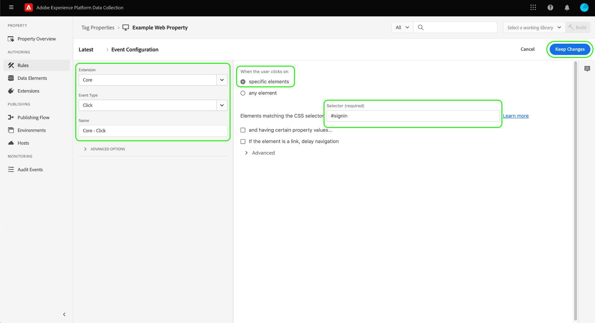
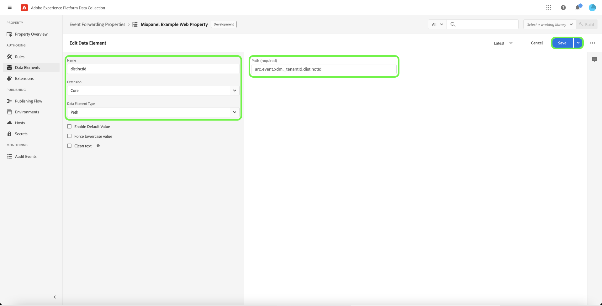

# [!DNL Mixpanel Track Events] API-händelsevidarebefordringstillägg

[[!DNL Mixpanel]](https://www.mixpanel.com) är ett verktyg för produktanalys som gör det möjligt att samla in data om hur användarna interagerar med en digital produkt. Du kan analysera produktdata med enkla, interaktiva rapporter där du kan ställa frågor och visualisera data med bara några klick. [!DNL Mixpanel] har utformats för att göra teamen mer effektiva genom att låta alla analysera användardata i realtid för att identifiera trender, förstå användarbeteende och fatta beslut om produkten.

[!DNL Mixpanel] använder en händelsebaserad, användarcentrerad modell som kopplar varje interaktion till en enskild användare. The [!DNL Mixpanel] datamodellen bygger på begreppen användare, händelser och egenskaper.

>[!NOTE]
>
>Se [!DNL Mixpanel] dokumentation om [identitetshantering](https://help.mixpanel.com/hc/en-us/articles/360041039771-Getting-Started-with-Identity-Management) för att förstå hur [!DNL Mixpanel] sammanfogar händelser för att skapa identitetskluster. Vi rekommenderar även att du granskar dokumentet på [distinkta ID:n](https://help.mixpanel.com/hc/en-us/articles/115004509426-Distinct-ID-Creation-JavaScript-iOS-Android-) för att förstå hur de används för att identifiera användare i händelsedata.

The [!DNL Mixpanel Track Events] API-tillägget gör att du kan utnyttja båda [händelsevidarebefordran](../../../ui/event-forwarding/overview.md) och [taggar](../../../home.md) för att samla in händelseinformation i Adobe Experience Platform Edge Network och skicka den till [!DNL Mixpanel] med [[!DNL Track Events] API](https://developer.mixpanel.com/reference/track-event). Det här dokumentet beskriver tilläggets användningsfall, hur det installeras och hur du integrerar dess funktioner i din händelsevidarebefordran [regler](../../../ui/managing-resources/rules.md).

## Användningsfall

Det här tillägget bör användas om du vill använda data från Edge Network i [!DNL Mixpanel] för att utnyttja funktionerna för produktanalys.

Ta till exempel en detaljhandelsorganisation som har en flerkanalsnärvaro (webbplats och mobil). Organisationen hämtar in transaktions- eller konverteringsdata som händelsedata från sina plattformar och läser in dessa i [!DNL Mixpanel] med tillägget för händelsevidarebefordran.

Analysteam kan sedan utnyttja [!DNL Mixpanel's] funktioner för att bearbeta datauppsättningar och få affärsinsikter, som kan användas för att generera diagram, instrumentpaneler eller andra visualiseringar för att informera affärsintressenter.

Mer information om användningsfall för [!DNL Mixpanel]finns i följande dokumentation:

* [Ny på [!DNL Mixpanel]](https://help.mixpanel.com/hc/en-us/sections/360008533532-New-to-Mixpanel)
* [Vad är  [!DNL Mixpanel]?](https://developer.mixpanel.com/docs)
* [12 must-try [!DNL Mixpanel] funktioner](https://mixpanel.com/blog/12-things-you-probably-didnt-know-you-could-do-with-mixpanel/)

## [!DNL Mixpanel] krav {#prerequisites-mixpanel}

Du måste ha en giltig [!DNL Mixpanel] för att kunna använda tillägget. Gå till [[!DNL Mixpanel] registreringssida](https://mixpanel.com/register/) för att registrera och skapa ett konto om du inte redan har ett.

Se till att [[!DNL Identity Merge]](https://help.mixpanel.com/hc/en-us/articles/9648680824852-ID-Merge-Implementation-Best-Practices) inställningen är aktiverad för ditt projekt. Navigera till **[!DNL Settings]** > **[!DNL Project Setting]** > **[!DNL Identity Merge]** och växla inställning.

<!-- (If these don't apply, do we need to include here at all?)
### API guardrails {#guardrails}

Refer to the [[!DNL Mixpanel] documentation](https://developer.mixpanel.com/reference/import-events#rate-limits) for limits and response codes. As [!DNL Mixpanel] only sends live events these limits should not apply.
-->

### Samla nödvändig konfigurationsinformation {#configuration-details}

För att ansluta Experience Platform till [!DNL Mixpanel] du måste ha följande indata:

| Nyckeltyp | Beskrivning | Exempel |
| --- | --- | --- |
| Projekttoken | Projekttoken som är associerad med din [!DNL Mixpanel] konto. Se [!DNL Mixpanel] dokumentation om [hitta din projekttoken](https://help.mixpanel.com/hc/en-us/articles/115004502806-Find-Project-Token-) för vägledning. | `25470xxxxxxxxxxxxxxxxxxx1289` |

## Krav för Experience Cloud

I det här avsnittet beskrivs de nödvändiga stegen i Experience Cloud för alla implementeringar. Beroende på vilka implementeringsbehov du har kan det vara bra att ställa in följande konstruktioner innan du konfigurerar tillägget:

1. A [schema](../../../../xdm/schema/composition.md) för att beskriva strukturen på de data som du matar in i Experience Cloud
1. A [datastream](https://experienceleague.adobe.com/docs/platform-learn/data-collection/event-forwarding/set-up-a-datastream.html) för att dirigera inkommande data till lämpliga Adobe Experience Cloud-program
1. A [datauppsättning](https://experienceleague.adobe.com/docs/platform-learn/tutorials/data-ingestion/create-datasets-and-ingest-data.html) lagra insamlade data

För alla implementeringar krävs följande på Experience Cloud:

1. [Skapa en hemlighet](#create-a-secret)
1. [Ange taggegenskaper](#set-up-tag-properties)
1. [Lägga till dataelement i taggegenskaper](#add-data-elements-within-tag-properties)
1. [Lägga till regler i taggegenskaper](#add-rules-within-tag-properties)

### Skapa en hemlighet

Skapa ett nytt [händelsevidarebefordringshemlighet](../../../ui/event-forwarding/secrets.md) och ange värdet för [[!DNL Mixpanel] projekttoken](#configuration-details). Detta används för att autentisera anslutningen till ditt konto samtidigt som värdet är säkert.

### Ange taggegenskaper

[Skapa en taggegenskap](https://experienceleague.adobe.com/docs/platform-learn/implement-in-websites/configure-tags/create-a-property.html?lang=en) eller välj en befintlig egenskap att redigera i stället. Den här egenskapen kommer att konfigureras för att samla in nödvändiga datastrukturer för [!DNL Mixpanel] när de hämtas till Edge Network innan de skickas med händelsevidarebefordran.

### Lägga till dataelement i taggegenskaper

Om webbplatsen använder [[!DNL Mixpanel] SDK](https://developer.mixpanel.com/docs/nodejs)måste du [skapa ett dataelement](../../../ui/managing-resources/data-elements.md) som använder **[!UICONTROL Cookie]** typ (tillhandahålls av [[!UICONTROL Core] taggtillägg](../../client/core/overview.md)) så att [!DNL Mixpanel] `distinct_id` kan läsas från cookien.

The **[!UICONTROL Cookie Name]** värdet måste matcha [!DNL Mixpanel] cookie-namn för webbplatsen. Namnet ska ha ett format som liknar `mp_{MIXPANEL_PROJECT_TOKEN_FOR_WEBSITE}_mixpanel`. Välj **[!UICONTROL Save]** när du är klar.

>[!IMPORTANT]
>
>Namnet på dataelementet ovan (`distinctId` i det här exemplet) ska matcha namnet som används för samma fält i ditt schema. Detta gäller även dataelementet för händelsevidarebefordran som du skapar senare.

För det andra dataelementet ställer du in typen på **[!UICONTROL XDM Object]** (från [Adobe Experience Platform Web SDK-tillägg](../../client/sdk/overview.md)) och mappa det till det schema som skapades tidigare. Se till att värdet för `distinct_id` dataelement (som innehåller [!DNL Mixpanel] `distinct_id` värdet från cookien) refereras som ett värde i ett av dina schemafält.

>[!NOTE]
>
>Om webbplatsen inte körs på [!DNL Mixpanel] SDK, ett Adobe Experience Cloud-ID (ECID) kommer att användas som reserv `distinct_id` värde som ska skickas med händelsen som skickas till [!DNL Mixpanel].

Beroende på ditt scenario kan du behöva skapa ett annat dataelement som kan användas för att mappa till händelsenamnet i schemat. Detta kan du göra med **[!UICONTROL DOM Attribute]** typ som tillhandahålls av [!UICONTROL Core] tillägg.

### Lägga till regler i taggegenskaper

När dataelementen har konfigurerats kan du börja skapa regler som avgör vilka händelser som får till resultat att data skickas till [!DNL Mixpanel].

Börja med att skapa en regel som aktiveras för användaridentifieringshändelsen. Detta kan representera inloggningar, registreringar, registreringar eller andra händelser som du vill använda för användaridentifiering.

Under **[!UICONTROL Events]**, lägger du till ett villkor (som är specifikt för din webbplats) som utlöser identifieringshändelsen. Ett exempel på hur inloggningsregeln aktiveras när användaren klickar visas nedan:

Välj **[!UICONTROL Keep Changes]** för att lägga till händelsen i regeln.

Nästa, under **[!UICONTROL Actions]** lägger du till de resulterande åtgärder som du vill att regeln ska utföra när den aktiveras. Bland dessa åtgärder måste **[!UICONTROL Send event]** som tillhandahålls av plattformens Web SDK-tillägg, som skickar händelsen till Edge Network, där den kan hämtas av tillägg för händelsevidarebefordran som [!DNL Mixpanel].

När åtgärden konfigureras, under **[!UICONTROL XDM data]** välj [dataelement som du skapade tidigare](#add-data-elements-within-tag-properties) som innehåller `distinct_id` värde.

Välj **[!UICONTROL Keep Changes]** om du vill lägga till händelsen i regeln väljer du **[!UICONTROL Save]** om du vill lägga till regeln i taggbiblioteket. Härifrån kan du [skapa en ny version och distribuera den till din webbplats](../../../ui/publishing/overview.md).

## Installera och konfigurera [!DNL Mixpanel] extension {#install}

Installera tillägget genom att [skapa en egenskap för vidarebefordring av händelser](../../../ui/event-forwarding/overview.md#properties) eller välj en befintlig egenskap att redigera i stället.

Välj **[!UICONTROL Extensions]** i den vänstra navigeringen. I **[!UICONTROL Catalog]** flik, välja **[!UICONTROL Install]** på kortet för [!DNL Mixpanel] tillägg.

![Installera [!DNL Mixpanel] tillägg.](../../../images/extensions/server/mixpanel/install-extension.png)

## Konfigurera dataelement för händelsevidarebefordran

När du har installerat tillägget är nästa steg att skapa dataelement för vidarebefordran av händelser som hämtar nödvändiga datakonstruktioner som skickas till [!DNL Mixpanel].

### Skapa en `distinctId` dataelement

Lägg till dataelement under händelsevidarebefordran. Om platsen är konfigurerad med [[!DNL Mixpanel] SDK](https://developer.mixpanel.com/docs/nodejs) den [taggegenskapens dataelement](#setup-tag-properties-data-element) skulle ha definierats. För dataelementet för vidarebefordran av händelser kommer du nu att ange en **[!UICONTROL Path]** i stället.

### Skapa en `event_type` dataelement

Nedan visas ett exempel på ett dataelement som har definierats för en händelsetyp:

### Skapa ytterligare mappningar av dataelement

The `distinctId` och `event_type` dataelement krävs båda för att skicka data till [!DNL Mixpanel], men vi rekommenderar även att du inkluderar ett känt användar-ID och ett anpassat dataobjekt med varje händelse om det är tillgängligt. Se guiden på [[!DNL Mixpanel Track Events] REST API](https://developer.mixpanel.com/reference/track-event) för ytterligare vägledning.

De rekommenderade mappningarna för dataelement beskrivs nedan.

>[!IMPORTANT]
>
>Alla dataelement som listas nedan ska använda **[!UICONTROL Path]** så att de kan mappa till specifika fält i schemat enligt instruktionerna i **Schemasökväg** kolumn.
>
>För schemasökvägarna måste du ersätta `{TENANT_ID}` platshållare med din unika [klient-ID](../../../../xdm/api/getting-started.md#know-your-tenant_id), som fungerar som ett namnutrymme för anpassade fält som definieras av din organisation.

| [!DNL Mixpanel] key | Schemasökväg | Beskrivning | Obligatoriskt |
| --- | --- | --- | --- |
| [!DNL Mixpanel Distinct ID] | `arc.event.xdm._{TENANT_ID}.distinct_id` | `distinct_id` identifierar användaren som utförde händelsen. `distinct_id` måste specificeras för varje händelse, eftersom det är avgörande för [!DNL Mixpanel] att utföra beteendeanalyser korrekt och effektivt, inklusive unika användare, trattar, lojalitet, kohorter med mera. | Ja |
| [!DNL Event Type] | `arc.event.xdm._{TENANT_ID}.event_type` | Det här är namnet på händelsen. [!DNL Mixpanel] rekommenderar att antalet unika händelsenamn hålls relativt litet och att egenskaper används för variabelkontext som är kopplad till händelsen.  I stället för att spåra händelser med namn som&quot;Betald registrering&quot; och&quot;Gratis registrering&quot;, rekommenderar vi att du spårar en händelse som kallas&quot;Registrering&quot; och har en egenskap som heter&quot;Kontotyp&quot; med möjliga värden&quot;Betald&quot; och&quot;Kostnadsfri&quot;. | Ja |
| [!DNL Known User ID] | `arc.event.xdm._{TENANT_ID}.LoginID` | Användarens e-postadress eller inloggnings-ID, om tillgängligt. | Nej |
| [!DNL Data] | `arc.event.xdm._{TENANT_ID}.properties` | Ett JSON-objekt som representerar alla egenskaper för händelsen. Data trunkeras till 255 tecken. | Nej |

{style="table-layout:auto"}

## Ställ in regler för vidarebefordran av händelser

När alla dataelement har konfigurerats kan du börja skapa regler för vidarebefordran av händelser som bestämmer när och hur händelserna ska skickas till [!DNL Mixpanel]. Innan du konfigurerar reglerna är det dock viktigt att du förstår hur identitetskluster fungerar i [!DNL Mixpanel] så att de händelser du skickar tilldelas enskilda användare på rätt sätt.

### Identitetskluster i [!DNL Mixpanel]

I [!DNL Mixpanel], ett identitetskluster innehåller en samling `distinct_id` värden som ansluter till en enskild användare. [!DNL Mixpanel] hanterar klustring av identiteter för varje användare och löser en kanonisk `distinct_id` från varje kluster som ska användas för rapportering. Du kan även inkludera en egen identifierare (kallas lokal `distinct_id`) för anonyma händelser som inträffar före en användaridentifieringshändelse.

[!DNL Mixpanel] löser identitetsgrupper på två sätt:

* **Identifiera** : [!DNL Mixpanel] kopplar den valda identifieraren till en anonym `distinct_id`. Om [!DNL Mixpanel] SDK är konfigurerat på din webbplats, Platform använder `distinct_id` som tilldelats den inloggade användaren.
* **Alias**: [!DNL Mixpanel] sammanfogar två icke-anonyma `distinct_id`är tillsammans om andra villkor för sammanslagning har skickats.

>[!NOTE]
>
>Se [!DNL Mixpanel] dokument på [identitetshantering](https://help.mixpanel.com/hc/en-us/articles/360041039771-Getting-Started-with-Identity-Management#user-identification) om du vill ha mer information om de här metoderna.
>
>Bekräfta att du har aktiverat [[!DNL Mixpanel] funktion för identitetssammanfogning](#prerequisites-mixpanel) för att säkerställa att identitetskluster löses på rätt sätt.

I enlighet med detta [!DNL Mixpanel] tillägg för händelsevidarebefordring har stöd för **[!UICONTROL Track Event]** regelkonfigurationens åtgärdstyp.

>[!IMPORTANT]
>
>För varje regel måste en av åtgärderna använda **[!UICONTROL Track Event]** typ. Utan den här åtgärdstypen skickar regeln inte Adobe Experience Edge Network-händelser till [!DNL Mixpanel].

### Skapa en regel för händelsespårning

Börja skapa en ny regel i egenskapen för vidarebefordran av händelser. Under **[!UICONTROL Actions]**, lägga till en ny åtgärd och ange tillägget till **[!UICONTROL Mixpanel]**. Ange sedan åtgärdstypen till **[!UICONTROL Track Event]** skicka Adobe Experience Edge Network-händelser till [!DNL Mixpanel].

| Indata | Beskrivning |
| --- | --- |
| [!UICONTROL Project Token] | Det här fältet ska mappas till den projekttoken som är kopplad till din [!DNL Mixpanel] konto. |
| [!UICONTROL Event Type] | Händelsens namn. |
| [!UICONTROL Event Time] | Händelsens tid. |
| [!UICONTROL Mixpanel Distinct ID] | Det här fältet ska mappas till `distinctId` dataelement som du skapade tidigare. |
| [!UICONTROL Insert ID] | Det här fältet ska mappas till `insertId` dataelement. |
| [!UICONTROL Event Properties] | Välj mellan att tillhandahålla rå JSON eller att använda en förenklad uppsättning indata för nyckelvärden. |

>[!NOTE]
>
>Mer information om standardfälten för [!DNL Mixpanel] -händelsen, se [officiell dokumentation](https://developer.mixpanel.com/reference/import-events#event).

När [!UICONTROL Track Event] åtgärden läggs till i regeln, du kan konfigurera regelns villkor så att den bara aktiveras för vissa händelser, eller så kan du lämna villkorsavsnittet tomt för att få regeln att aktiveras för alla händelser.

>[!IMPORTANT]
>
>Om din webbplats använder [!DNL Mixpanel] SDK, du kan fortsätta till nästa steg i [validera data inom [!DNL Mixpanel]](#validate). Om du inte använder [!DNL Mixpanel] SDK, du måste [skapa en separat regel för identitetsspårning](#create-an-identity-tracking-rule) säkerställa att lämpliga händelser och `distinct_id` värden skickas till [!DNL Mixpanel] när en användaridentifieringshändelse inträffar.

### Skapa en regel för identitetsspårning

Om du inte använder [!DNL Mixpanel SDK]är nästa steg att skapa en annan regel. Med den här regeln säkerställs att när en användaridentifieringshändelse inträffar på webbplatsen (som inloggning, registrering, registrering osv.) ska rätt händelser och `distinct_id` värden skickas till [!DNL Mixpanel].

Starta processen att skapa en ny regel. För [!UICONTROL Conditions] lägger du till ett villkor som kontrollerar om händelsen är en användaridentifieringshändelse. I exemplet nedan använder villkoret [!UICONTROL Value Comparison] (från [!UICONTROL Core] tillägg) för att kontrollera om den inkommande händelsen har ett händelsenamn som är lika med `signin`, vilket anger en inloggningshändelse för användare.

![Visa åtgärdskonfigurationen för [!DNL Mixpanel] åtgärdstyperna Alias och Identifiera.](../../../images/extensions/server/mixpanel/ef-rule-condition.png)

När du har lagt till rätt villkor till regeln måste du skapa en [!UICONTROL Send Event] skicka Adobe Experience Edge Network-händelser till [!DNL Mixpanel].

>[!NOTE]
>
>Mer information om identiteter i [!DNL Mixpanel], se [officiell dokumentation](https://developer.mixpanel.com/reference/create-identity).

När åtgärden har lagts till i regeln väljer du **[!UICONTROL Save]** om du vill lägga till regeln i ditt händelsevidarebefordringsbibliotek. Härifrån kan du [skapa en ny version och aktivera dina ändringar](../../../ui/publishing/overview.md).

![Lägg till en regel för vidarebefordran av händelser för [!DNL Mixpanel] åtgärdstyperna Alias och Identifiera.](../../../images/extensions/server/mixpanel/ef-rule-complete.png)

## Validera data i [!DNL Mixpanel] {#validate}

Om implementeringen lyckas och händelser samlas in visas händelser i [[!DNL Mixpanel] konsol](https://help.mixpanel.com/hc/en-us/articles/4402837164948).

Kontrollera om [!DNL Mixpanel] har sammanfogat händelserna efter inloggning ifyllda med e-postvärden och händelserna som skapades när **[!UICONTROL Send Event]**. Om den implementeras korrekt [!DNL Mixpanel] associerar dem med en [användarprofil](https://help.mixpanel.com/hc/en-us/articles/115004501966).

## Nästa steg

I den här guiden beskrivs hur du skickar konverteringshändelser till [!DNL Mixpanel] med händelsevidarebefordran. Det här tillägget för händelsevidarebefordran utnyttjar [!DNL Mixpanel] SDK och JavaScript API. Mer information om dessa underliggande tekniker finns i den officiella dokumentationen:

* [[!DNL Mixpanel] SDK](https://developer.mixpanel.com/docs/nodejs)
* [[!DNL Mixpanel] JavaScript API](https://developer.mixpanel.com/docs/javascript-full-api-reference#mixpanelidentify)

Mer information om funktioner för att vidarebefordra händelser i Experience Platform finns i [händelsevidarebefordring - översikt](../../../ui/event-forwarding/overview.md).
