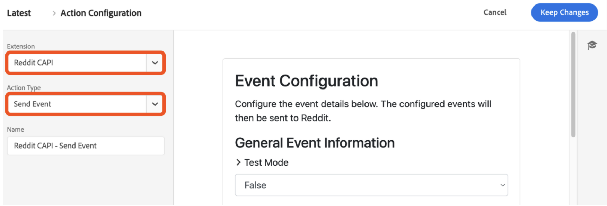

# Översikt över tillägget [!DNL Reddit] för konverterings-API

Reddit är en plattform för sociala medier med en mångfaldig användarbas, vilket gör den idealisk för annonsörer med specifika målgrupper.

Använd [[!DNL Reddit] API-tillägget för konvertering](https://ads-api.reddit.com/docs/v2/#tag/Conversions-API) för att skicka användarinteraktionshändelser som hämtats i Adobe Experience Platform Edge Network till [!DNL Reddit Ads]. Använd det här tillägget för att hjälpa ert varumärke att nå ut till fler än 379 miljoner aktiva användare varje vecka, och få en bättre förståelse för användarbeteende och köra riktade annonser.

Läs den här vägledningen när du vill lära dig hur du installerar, konfigurerar och använder API-tillägget [!DNL Reddit] Conversions i [regler](https://experienceleague.adobe.com/sv/docs/experience-platform/tags/ui/rules) för vidarebefordran av händelser.

## Viktiga fördelar {#benefits}

Använd tillägget API för Redigera konverteringar för att:

- **Nå ut till din publik**: Engagera med över 379 miljoner aktiva användare varje vecka på [!DNL Reddit].
- **Analysera användarbeteende**: Använd användarinteraktionsdata för att förstå beteende och optimera kampanjer.
- **Leverera riktade annonser**: Kör personaliserade annonser baserat på användarinteraktioner som hämtats i Adobe Experience Platform.

## Förhandskrav {#prerequisites}

Du måste ha ett giltigt Reddit Ads-konto för att kunna använda det här tillägget. Gå till [[!DNL Reddit Ads] registreringssidan](https://business.reddithelp.com/s/article/Create-and-manage-your-Reddit-Ads-account) för att registrera och skapa ett konto om du inte redan har ett. När du har konfigurerat ditt konto [begär åtkomst till API:t för annonser](https://www.redditforbusiness.com/api-partnership).

### Samla nödvändig konfigurationsinformation {#configuration-details}

Följande indata krävs för att ansluta Experience Platform till [!DNL Reddit]:

| Autentiseringsuppgifter | Beskrivning | Exempel |
| --- | --- | --- |
| Pixel-ID | Pixel-ID:t är en unik identifierare som är associerad med ditt [!DNL Reddit Ads]-konto. Den används för att spåra användarinteraktioner och konverteringshändelser på din webbplats eller i din app. Du kan hitta ditt Pixel-ID i ditt [!DNL Reddit Ads] [konto](https://ads.reddit.com/accounts). | 123456789012 |
| Åtkomsttoken för konvertering | Åtkomsttoken för konvertering av [!DNL Reddit]. Mer information finns i [[!DNL Reddit] Konverterings-API](https://business.reddithelp.com/s/article/conversion-access-token) -dokumentet.   **Du behöver bara gå igenom den här processen en gång eftersom denna token inte upphör att gälla.** | {YOUR_REDDIT_BEARER_TOKEN} |

## Installera och konfigurera tillägget [!DNL Reddit] {#install-configure}

Så här installerar och konfigurerar du API-tillägget [!DNL Reddit] för konvertering:

1. I användargränssnittet för Experience Platform Data Collection väljer du [!UICONTROL Extensions] i den vänstra navigeringen för att komma åt katalogen [!UICONTROL Extensions]. [Skapa sedan en ny egenskap för vidarebefordring av händelse](https://experienceleague.adobe.com/sv/docs/experience-platform/tags/event-forwarding/overview#properties) eller välj en befintlig egenskap.
2. Navigera till **[!UICONTROL Extensions]** i den vänstra navigeringspanelen. Välj **[!UICONTROL Catalog]** och välj sedan tillägget **[!DNL Reddit]**.
   
3. Ange följande konfigurationsinformation:
   - **Pixel-ID**: Ange ditt [!DNL Reddit Ads] pixel-ID.
   - **Åtkomsttoken för konvertering**: Ange den token som har genererats i ditt [!DNL Reddit Ads]-konto och välj **[!UICONTROL Save]** när du är klar.

     

## Konfigurera en regel för vidarebefordran av händelser {#config-rule}

När du har konfigurerat dataelementen kan du skapa regler för vidarebefordran av händelser som avgör när och hur händelser skickas till [!DNL Reddit Ads].

1. Navigera till **Regler** i egenskapen för vidarebefordran av händelser och skapa en ny [regel](https://experienceleague.adobe.com/sv/docs/experience-platform/tags/ui/rules).
2. Lägg till en ny åtgärd under **Åtgärder** och ange tillägget till **[!DNL Reddit CAPI]**.
3. Ange **åtgärdstypen** till **Skicka händelse**.
   
4. Konfigurera ytterligare kontroller för händelsen enligt tabellen nedan:

   | Fältnamn | Beskrivning | Exempel |
   | --- | --- | --- |
   | `Event Name` | Ange namnet på konverteringshändelsen. | `Purchase` |
   | `Event Type` | Definiera händelsetypen som kan vara en [kompatibel Redigera-konverteringshändelse](https://business.reddithelp.com/s/article/supported-conversion-events#supported-conversion-events) eller en anpassad. | `SignUp`, `MyCustomEvent` |
   | `Timestamp` | Ange händelsetiden i ISO-format eller epoktid. | `2025-04-15T16:01:00.000Z`, `1744742460000` |
   | `Client Dedupe ID` | Lägg till ett unikt ID för deduplicering. | `abc123` |
   | `Match Keys` | Inkludera användar- och enhetsidentifierare för attribuering. | `{"email":"hashed_email@example.com", "phone":"hashed_phone"}` |
   | `Value` | Ange det monetära värdet för händelsen. | `99.99` |
   | `Currency Code` | Använd ISO-4217-format för valutan. | `USD` |
   | `Units Sold` | Ange antalet inköpta artiklar. | `3` |
   | `Country Code` | Ange landet där händelsen inträffade. | `US` |
   | `Data Processing Options` | Lägg till sekretessflaggor, till exempel LDU (begränsad dataanvändning). | `{"modes":["LDU"],"country":"US","region":"US-NY"}` |
   | `Consent` | Ange användarens samtycke för användning av annonsdata. | `true` |

5. Välj **Behåll ändringar** om du vill spara regeln.

## Händelsens metadata {#event-metadata}

I det här avsnittet finns en detaljerad beskrivning av händelsemetadata och användardatafält, så att du vet vilka parametrar som krävs och vilka som är valfria för att konfigurera dina händelser. Vilka fält som visas kan variera beroende på vilken händelsetyp som har valts.

>[!NOTE]
>
>För att få bästa möjliga resultat från dina konverteringshändelser måste du fylla i alla fält när du konfigurerar [dynamiska produktannonser](https://business.reddithelp.com/s/article/dynamic-product-ads).

### Metadatafält för händelse

| Fältnamn | Beskrivning | Exempel |
| --- | --- | --- |
| `Conversion ID` (obligatoriskt) | Det unika ID:t för konverteringshändelsen, som används för deduplicering. | `abc123` |
| `Item Count` | Det totala antalet artiklar för konverteringshändelsen. | `6` |
| `Currency` | Valutan för värdet anges i formatet [ISO-4217](https://www.iso.org/iso-4217-currency-codes.html). | `USD` |
| `Value` | Det totala monetära värdet för konverteringshändelsen, inklusive decimaler. | `1.23` |
| `Products` | En JSON-array med objekt med information om de produkter som är associerade med händelsen. Varje objekt måste innehålla minst `id`. | `[{"id":"SKU123","name":"ProductName","category":"CategoryName"},{"id":"SKU456","name":"ProductName","category":"CategoryName"}]` |

### Användardatafält

Följande parametrar är valfria men rekommenderas:

| Fältnamn | Beskrivning | Exempel |
| --- | --- | --- |
| `Email` (rekommenderas starkt) | En hashad eller ohashad e-postadress till användaren. | `example@email.com` |
| `External ID` | Ett hash-kodat eller ohashad annonsörtilldelat användar-ID. | `customer12345` |
| `UUID` (rekommenderas starkt) | Det ID som skapades av Redigera pixel på webbplatsen. | `1677712978045.b8f7eb7d-b357-437b-8bd3-e1c8166c7132` |
| `IP Address` (rekommenderas starkt) | Användarens enhetens IP-adress. | `192.168.0.1` |
| `User Agent` (rekommenderas starkt) | Webbläsaren eller appen som används av användaren. | `Chrome/98.0.4758.102` |
| `IDFA` | En hashad eller ohashad Apple-identifierare för annonsörer. | `8A2E4F6D-0852-4B2A-B9D5-79334DE14B16` |
| `AAID` | Ett hashas- eller hashas-Android Advertising ID. | `38400000-8cf0-11bd-b23e-10b96e40000d` |
| `Screen Width` | Bredden på användarens skärm. | `1920` |
| `Screen Height` | Höjden på användarens skärm. | `1080` |
| `Data Processing Options` (JSON-format) | Användarens sekretessinställningar. Stöder endast LDU (Limited Data Usage). | `{"modes":["LDU"],"country":"US","region":"US-NY"}` |

### Viktiga överväganden

Innan data skickas till [!DNL Reddit Ads], kommer tillägget att krascha och normalisera värdena för följande fält: `Email`, `External ID`, `IDFA` och `AAID`. Tillägget återhash-kodar inte dessa värden om de redan har hashats i [!DNL SHA-256].

## Validera och distribuera {#validate-deploy}

När du har konfigurerat tillägget och reglerna validerar du integreringen genom att kontrollera händelsedata i [[!DNL Reddit Ads] Händelsehanteraren](https://business.reddithelp.com/s/article/Events-Manager). Använd [MQS (Match Quality Score)](https://business.reddithelp.com/s/article/match-quality-score) för att utvärdera noggrannheten och tillförlitligheten för dina signalintegreringar.

Mer information om [!DNL Reddit Ads] finns i [dokumentationen för Reddit Ads](https://ads.reddit.com/).

## Nästa steg {#next-steps}

När du har läst det här dokumentet bör du nu förstå hur du konfigurerar och använder API-tillägget [!DNL Reddit] Conversions. Mer information om funktioner för vidarebefordran av händelser i Adobe Experience Platform finns i [översikten över vidarebefordran av händelser](../../../ui/event-forwarding/overview.md) eller i följande resurser:

- [Dela matchningsnycklar](https://business.reddithelp.com/s/article/about-attribution-matching-signals) och [händelsemetadata](https://business.reddithelp.com/s/article/about-event-metadata): Lär dig hur du delar matchningsnycklar och händelsemetadata effektivt.
- [Deduplicera händelser](https://business.reddithelp.com/s/article/event-deduplication): Kontrollera korrekt händelsespårning genom att deduplicera händelser.
- [Skapa en token för konverteringsåtkomst](https://business.reddithelp.com/helpcenter/s/article/conversion-access-token): Följ stegen för att skapa en token för konverteringsåtkomst för säker API-autentisering.
