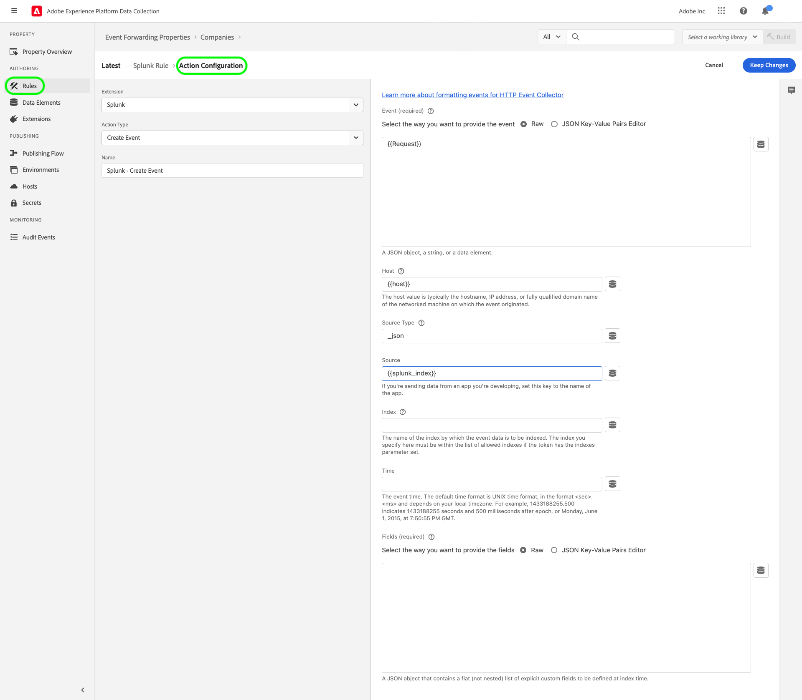
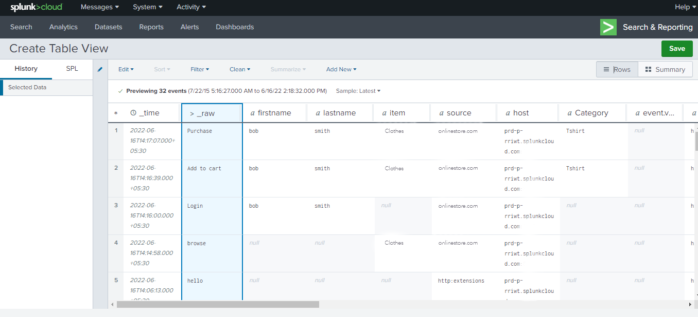

# Översikt över segmenttillägg

[Splunk](https://www.splunk.com) är en observerbarhetsplattform som tillhandahåller sökning, analys och visualisering för åtgärdbara insikter i dina data. Tillägget [Splunk ](../../../ui/event-forwarding/overview.md) för händelsevidarebefordran[ utnyttjar REST API:t för HTTP-händelseinsamlaren ](https://docs.splunk.com/Documentation/Splunk/8.2.5/Data/HECRESTendpoints) för att skicka händelser från Adobe Experience Platform Edge Network till [Splunk HTTP Event Collector](https://docs.splunk.com/Documentation/Splunk/8.2.5/Data/UsetheHTTPEventCollector).

Splunk använder lagertoken som autentiseringsmekanism för att kommunicera med Splunk Event Collector API.

## Användningsfall {#use-cases}

Marknadsföringsteamen kan använda tillägget för följande användningsområden:

| Användningsfall | Beskrivning |
| --- | --- |
| Kundbeteendeanalys | Organisationer kan samla in data om kundinteraktionshändelser från sin webbplats och vidarebefordra relevanta händelser till Splunk. Marknads- och analysteam kan sedan utföra efterföljande analyser inom Splunk-plattformen för att förstå viktiga användarinteraktioner och beteenden. Splunk-plattformen kan användas för att generera diagram, instrumentpaneler eller andra visualiseringar för att informera affärsintressenter. |
| Skalbar sökning på stora datamängder | Organisationer kan samla in transaktions- eller konverteringsdata som händelsedata från webbplatsen och vidarebefordra händelser till Splunk. Analysteam kan sedan utnyttja Splunk skalbara indexeringsfunktioner för att filtrera och bearbeta stora datamängder för att ta fram affärsinsikter och fatta välgrundade beslut. |

{style="table-layout:auto"}

## Förhandskrav {#prerequisites}

Du måste ha ett Splunk-konto för att kunna använda det här tillägget. Du kan registrera dig för ett Splunk-konto på [Splunk-startsidan](https://www.splunk.com/page/sign_up).

>[!NOTE]
>
> Splunk-tillägget stöder både Splunk Cloud- och Splunk enterprise-instanser. Den här guiden dokumenterar en implementering med [Splunk Cloud](https://www.splunk.com/en_us/products/splunk-cloud-platform.html) som referens. Konfigurationsprocessen för [Splunk Enterprise](https://www.splunk.com/en_us/products/splunk-enterprise.html) liknar den, men kräver särskild vägledning från Splunk Enterprise-administratören.

Du måste också ha följande tekniska värden för att konfigurera tillägget:

* En [händelseinsamlingstoken](https://docs.splunk.com/Documentation/Splunk/8.2.5/Data/UsetheHTTPEventCollector#Create_an_Event_Collector_token_on_Splunk_Cloud_Platform). Token har oftast UUIDv4-format som följande: `12345678-1234-1234-1234-1234567890AB`.
* Splunk-plattformens instansadress och port för din organisation. En plattformsinstansadress och port har vanligtvis följande format: `mysplunkserver.example.com:443`.
  >[!IMPORTANT]
  >
  > Splunk-slutpunkter som refereras inom händelsevidarebefordran bör endast använda port `443`. Portar som inte är standard stöds för närvarande inte i implementeringar av händelsevidarebefordran.

## Installera segmenttillägget {#install}

Om du vill installera tillägget Splunk Event Collector i gränssnittet går du till **Händelsevidarebefordran** och väljer en egenskap som tillägget ska läggas till i. Du kan också skapa en ny egenskap i stället.

När du har markerat eller skapat den önskade egenskapen går du till **Tillägg** > **Katalog**. Sök efter [!DNL Splunk] och välj sedan **[!DNL Install]** i segmenttillägget.

## Konfigurera segmenttillägget {#configure_extension}

>[!IMPORTANT]
>
>Beroende på ditt implementeringsbehov kan du behöva skapa ett schema, dataelement och en datauppsättning innan du konfigurerar tillägget. Granska alla konfigurationssteg innan du startar för att avgöra vilka enheter du måste konfigurera för ditt användningsfall.

Välj **Tillägg** i den vänstra navigeringen. Under **Installerad** väljer du **Konfigurera** för segmenttillägget.

För **[!UICONTROL HTTP Event Collector URL]** anger du din Splunk-plattformsinstansadress och port. Ange ditt [!DNL Event Collector Token]-värde under **[!UICONTROL Access Token]**. När du är klar väljer du **[!UICONTROL Save]**.

## Konfigurera en regel för vidarebefordran av händelser {#config_rule}

Börja skapa en ny regel för vidarebefordran av händelse [regel](../../../ui/managing-resources/rules.md) och konfigurera villkoren efter behov. När du väljer åtgärder för regeln väljer du tillägget [!UICONTROL Splunk] och sedan åtgärdstypen [!UICONTROL Create Event]. Ytterligare kontroller visas för att ytterligare konfigurera Splunk Event.

Nästa steg är att mappa Splunk-händelseegenskaperna till dataelement som du tidigare har skapat. De valfria mappningar som stöds baserat på de indatahändelsedata som kan ställas in anges nedan. Mer information finns i [Splunk-dokumentationen](https://docs.splunk.com/Documentation/Splunk/8.2.5/Data/FormateventsforHTTPEventCollector#Event_metadata).

| Fältnamn | Beskrivning |
| --- | --- |
| [!UICONTROL Event]  **(OBLIGATORISKT)** | Ange hur du vill ange händelsedata. Händelsedata kan tilldelas till nyckeln `event` i JSON-objektet i HTTP-begäran, eller vara rå text. Nyckeln `event` finns på samma nivå i JSON-händelsepaketet som metadatanycklarna. Inom klammerparenteserna `event` kan data finnas i alla former som du behöver (till exempel en sträng, ett tal, ett annat JSON-objekt). |
| [!UICONTROL Host] | Värdnamnet för klienten som du skickar data från. |
| [!UICONTROL Source Type] | Källtypen som ska tilldelas till händelsedata. |
| [!UICONTROL Source] | Källvärdet som ska tilldelas till händelsedata. Om du till exempel skickar data från ett program som du utvecklar, anger du den här nyckeln som namnet på programmet. |
| [!UICONTROL Index] | Namnet på händelsedatas index. Det index som du anger här måste finnas i listan över tillåtna index om variabeln har parametern indexes inställd. |
| [!UICONTROL Time] | Händelsens tid. Standardtidsformatet är UNIX-tid (i formatet `<sec>.<ms>`) och beror på den lokala tidszonen. `1433188255.500` anger till exempel 1433188255 sekunder och 500 millisekunder efter epok, eller måndag, 1 juni 2015, 7:50:55 PM GMT. |
| [!UICONTROL Fields] | Ange ett obearbetat JSON-objekt eller en uppsättning nyckelvärdepar som innehåller explicita anpassade fält som ska definieras vid indextiden.  Nyckeln `fields` kan inte användas för rådata.  Begäranden som innehåller egenskapen `fields` måste skickas till slutpunkten `/collector/event`, annars indexeras de inte. Mer information finns i Splunk-dokumentationen om [indexerade fältextraheringar](https://docs.splunk.com/Documentation/Splunk/8.2.5/Data/IFXandHEC). |

### Validera data i Splunk {#validate}

När du har skapat och kört regeln för vidarebefordran av händelser, kontrollerar du om händelsen som skickas till Splunk API visas som förväntat i Splunk-gränssnittet. Om händelseinsamlingen och integreringen med Experience Platform lyckades ser du händelser i Splunk-konsolen som:

## Nästa steg

Det här dokumentet beskriver hur du installerar och konfigurerar tillägget för vidarebefordran av Splunk-händelser i användargränssnittet. Mer information om hur du samlar in händelsedata i Splunk finns i den officiella dokumentationen:

* [Konfigurera och använd HTTP-händelseinsamlare i Splunk Web](https://docs.splunk.com/Documentation/Splunk/8.2.5/Data/UsetheHTTPEventCollector)
* [Konfigurera autentisering med token](https://docs.splunk.com/Documentation/Splunk/8.2.5/Security/Setupauthenticationwithtokens#Prerequisites_for_activating_tokens)
* [Felsök HTTP Event Collector](https://docs.splunk.com/Documentation/Splunk/8.2.5/Data/TroubleshootHTTPEventCollector) (visar även en översikt över [möjliga felkoder](https://docs.splunk.com/Documentation/Splunk/8.2.5/Data/TroubleshootHTTPEventCollector#Possible_error_codes))
