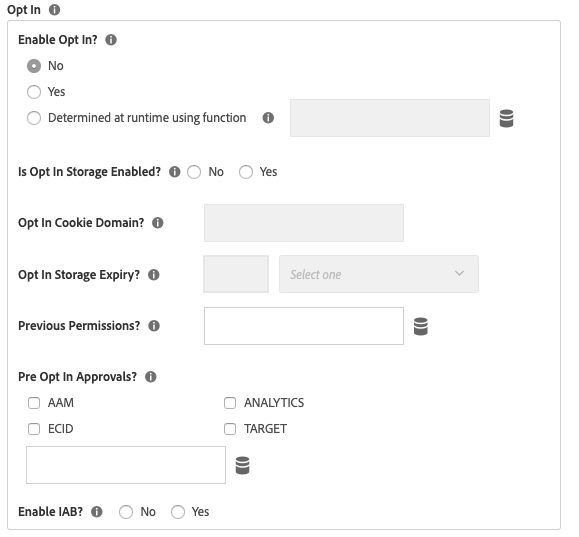

# Versionsinformation om Adobe Experience Cloud Identity Service-tillägget

>[!NOTE]
>
>Adobe Experience Platform Launch har omklassificerats som en serie datainsamlingstekniker i Adobe Experience Platform. Som ett resultat av detta har flera terminologiska förändringar införts i produktdokumentationen. Se följande [dokument](../../../term-updates.md) för en konsoliderad hänvisning till terminologiska förändringar.

Det här dokumentet innehåller versionsinformation för tillägget Adobe Experience Cloud Identity Service. Versionsinformation om själva identitetstjänsten för Experience Cloud finns i [Identitetstjänstens dokumentation](https://experienceleague.adobe.com/docs/id-service/using/release-notes/release-notes.html).

## 17 okt 2022

### Experience Cloud ID Extension 5.5.0

* Tillägget har nu stöd för version 5.5.0 av [JS-klient för besökare](https://github.com/Adobe-Marketing-Cloud/id-service). Se [Versionsinformation för besökare](https://github.com/Adobe-Marketing-Cloud/id-service/releases/tag/5.5.0) för specifika uppdateringar.

## 9 mars 2022

### Experience Cloud ID Extension 5.4.0

* Den här versionen innehåller den senaste versionen av Visitor 5.4.0 som har följande uppdateringar:

   * Möjlighet att konfigurera livstiden för `s_ecid` cookie med konfiguration av cookieLifetime
   * Uppdatering för ett problem med webbläsaren Firefox som inträffar när en sida läses in i en underordnad iFrame

## 10 okt 2021

### Experience Cloud ID-tillägg 5.3.1

* Den här versionen innehåller den senaste versionen av Visitor 5.3.0, som har följande nya uppdateringar:

   * Uppdaterad algoritm för att generera lokalt ECID
   * Senaste deltagande med `Secure` och `SameSite` flaggor för sekretesskakan
   * Åtgärda ett problem med webbläsaren Firefox när en sida läses in i en underordnad iFrame

## 12 jan 2021

### Experience Cloud ID Extension 5.2.0

* Det gick inte att uppdatera uppdateringen till VisitorJS 5.2.0 med en korrigering för ECID DataElement när du fick godkännande.

## 3 nov 2020

### Experience Cloud ID-tillägg 5.2.1

* Den här korrigeringen innehåller en korrigering för att skriva cookies från en iFrame med attribut `SameSite=None` i webbläsaren Google Chrome.

## 27 okt 2020

### Experience Cloud ID Extension 5.1.0

* Lägger till `sameSiteCookie` konfigurera för att ange `SameSite` attributet för `AMCV` cookie.
Denna konfiguration stöder följande värden för `SameSite` attribute:

   * `Strict`
   * `Lax`
   * `None`

Information om dessa attributvärden finns på [web.dev](https://web.dev/samesite-cookies-explained/) och [krom](https://www.chromium.org/updates/same-site)

## 13 augusti 2020

### Experience Cloud ID-tillägg 5.0.1

* Uppdaterar till korrigeringsfilen VisitorJS 5.0.1 med en korrigering för att lägga till d_cf-flaggan när IAB-medgivandesträngen har ändrats.

## 15 juni 2020

### Experience Cloud ID Extension 5.0.0

* Stöd för `IAB TCF` - Genomskinlighet och samtycke - `Version 2.0`.

## 13 april 2020

### Experience Cloud ID Extension 4.6.0

* Gjord `loadSSL` flagga som standard. Alla anrop till identitetstjänsten är aktiverade `https` som standard. Kunderna kan ställa in det på false om de vill anropa Identity Services på http från sina icke-ssl-sidor.
* Funktionen som används för att identifiera Internet-Explorer-versionen (IE) har uppdaterats för att åtgärda ett problem som rapporterats av ESLint.
* Felkorrigering för prestandaproblem i Internet-Explorer (IE) 11 när ECID ges optIn-förhandsgodkännande och uppdateras senare.

## 22 januari 2020

### Experience Cloud ID-tillägg 4.5.2

* Besökare.js har uppdaterats till 4.5.2
* Besökaren 4.5.1 innehåller en felkorrigering för IAB-plugin för Option
* Uppdaterat `setCustomerIDs` metod för att avvisa tomma ID:n som skickas.

## 7 januari 2020

### Experience Cloud ID-tillägg 4.4.2

* Besökare.js har uppdaterats till 4.4.2
* Förbättringar för `getVisitorValues` metod för att hämta värden snabbare

## 19 september 2019

### Experience Cloud ID-tillägg 4.4.1

* Besökare.js har uppdaterats till 4.4.1
* Korrigerat ett fel för hämtning av förauktoriserade indata för godkännande
* Namnet på VIDEO_ANALYTICS har ändrats till MEDIA_ANALYTICS i preOptInApprovals

   

## 17 juli 2019

### Experience Cloud ID Extension 4.4.0

* Besökare.js har uppdaterats till 4.4.0
* Stöd för SHA256-hashing för setCustomerID:n har lagts till

   

## 13 maj 2019

### Experience Cloud ID-tillägg 4.3.1

* Besökare.js har uppdaterats till 4.3
* Lagt till dataelementtyp för ECID som en del av taggtillägget

   

## 9 apr 2019

### Experience Cloud ID Extension 4.2.0

* Besökare.js har uppdaterats till 4.2, vilket inkluderade stöd för plugin-programmet Audience Manager IAB TCF

## 25 februari 2019

### Experience Cloud ID Extension 4.1.0

* visitor.js har uppdaterats till 4.1 som uppdaterade publishDestinations per ny API-ändring. Med den här uppdateringen kan sidans referensinformation visas under ID - synkronisera om så önskas.

## 15 februari 2019

### Experience Cloud ID Extension 4.0.0

* Besökare.js har uppdaterats till 4.0
* Ett konfigurationsalternativ för det nya inbyggda Opt-In-objektet har lagts till. Inställningarna kan användas för att undertrycka cookie- och beacon-anrop från Adobe Solutions för att bättre stödja bestämmelser som GDPR

   

## 20 mars 2018

### Experience Cloud ID-tillägg 3.1.0

* Besökare.js har uppdaterats till 3.1
* Lägger till två konfigurationsegenskaper: `resetBeforeVersion` och `serverState`
