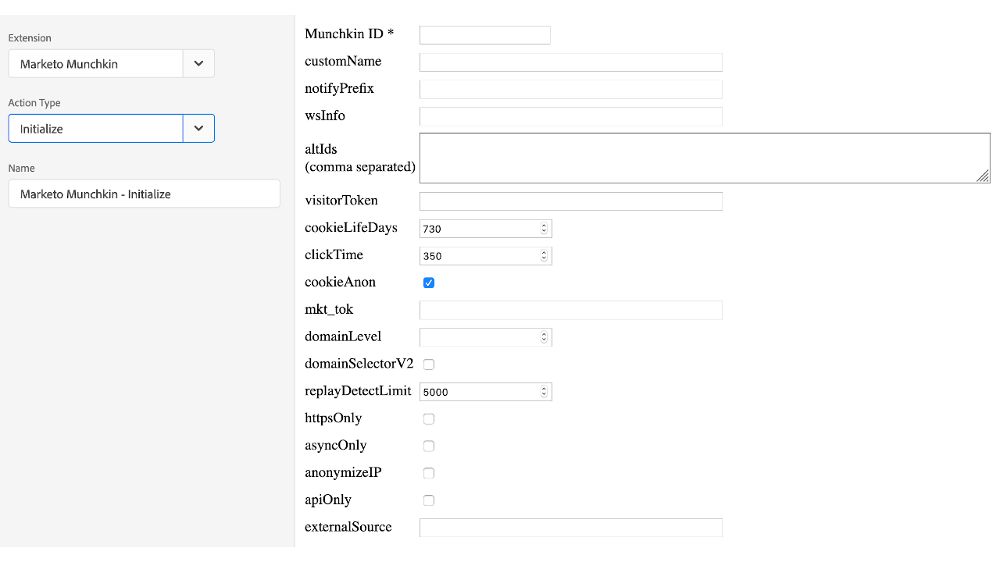

# Marketo Munchkin-tillägg - översikt

>[!NOTE]
>
>Adobe Experience Platform Launch omdöms till en serie datainsamlingstekniker i Experience Platform. Som ett resultat av detta har flera terminologiska förändringar införts i produktdokumentationen. Se följande [dokument](../../../term-updates.md) för en konsoliderad referens till terminologiska ändringar.

Använd det här tillägget om du vill integrera JavaScript-spårningskoden [!DNL Marketo Munchkin] med egenskapen. [!DNL Marketo Munchkin] JavaScript gör det möjligt att följa upp besök på slutanvändarens sidor och navigerar till Marketo landningssidor och externa webbsidor.

## Installera Marketo Munchkin-tillägg

Om [!DNL Marketo Munchkin]-tillägget inte är installerat ännu öppnar du egenskapen, väljer **[!UICONTROL Extensions > Catalog]**, hovrar över [!DNL Marketo Munchkin]-tillägget och väljer **[!UICONTROL Install]**.

Tillägget har ingen nödvändig konfiguration.

## Åtgärdstyper för Marketo Munchkin-tillägg

I det här avsnittet beskrivs de åtgärdstyper som är tillgängliga i tillägget [!DNL Marketo Munchkin].

### Initiera

**Munchkin-ID: (obligatoriskt)** Munchkins konto-ID finns under Admin > Integration > Munchkin-menyn.

**Konfigurationer:** Alla konfigurerbara parametrar finns dokumenterade  [här](https://developers.marketo.com/javascript-api/lead-tracking/configuration/)

### Besök webbsidan

**url: (obligatoriskt)** Den URL-filsökväg som används för att registrera ett sidbesök.

**parametrar:** En frågesträng med de parametrar som ska registreras.

**name:** Det anpassade namnet på webbsideresursen.

### Klicka på länken

**href: (obligatoriskt)** Den URL-filsökväg som används för att registrera ett länkval.
