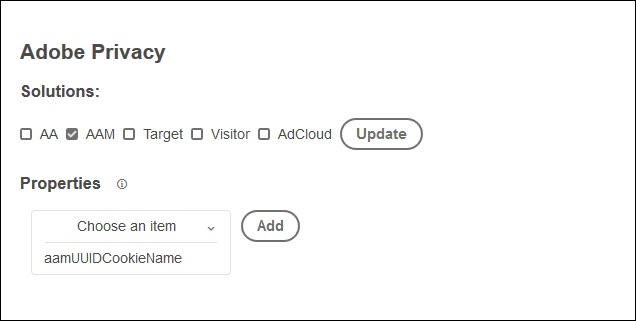

# Översikt över tillägget Sekretess i Adobe

>[!NOTE]
>
>Adobe Experience Platform Launch omdöms till en serie datainsamlingstekniker i Experience Platform. Som ett resultat av detta har flera terminologiska förändringar införts i produktdokumentationen. Se följande [dokument](../../../term-updates.md) för en konsoliderad referens till terminologiska ändringar.

Tillägget för skydd av privatlivet i Adobe innehåller funktioner för att samla in och ta bort användar-ID:n som tilldelats slutanvändare av Adobe-lösningar.

## Konfigurera lösningar under installation

När du installerar tillägget Sekretess för Adobe från tilläggskatalogen uppmanas du att välja vilka lösningar du vill uppdatera. För närvarande kan du uppdatera följande lösningar:

* Analyser (AA)
* Audience Manager (AAM)
* Målgrupp
* Besökningstjänst
* AdCloud
* Välj en eller flera lösningar och välj sedan Uppdatera.
* När du har valt och konfigurerat dina lösningar väljer du Spara. Sekretesstillägget för Adobe läggs till i listan över installerade tillägg.

   Alternativen för varje lösning beskrivs nedan.

### Analytics 


Som standard måste du ange en rapportserie genom att ange en sträng eller välja ett dataelement.

Om du vill konfigurera andra objekt väljer du **[!UICONTROL Choose an Item]**, markerar det objekt som du vill konfigurera, väljer **[!UICONTROL Add]** och anger den begärda parametern eller ett dataelement.

### Audience Manager



Välj **[!UICONTROL Choose an Item]**, markera objektet som du vill konfigurera, markera **[!UICONTROL Add]** och ange den begärda parametern eller ett dataelement. För närvarande kan du bara konfigurera `aamUUIDCookieName`.

### Målgrupp


Ange målklientkoden.

### Besökningstjänst


Ange ditt IMS-organisations-ID.

### AdCloud


Det finns inga specifika parametrar att konfigurera för AdCloud.

## Konfigurera sekretesstillägget för Adobe

När du har installerat tillägget kan du inaktivera eller ta bort det. Välj **[!UICONTROL Configure]** på sekretesskortet för Adobe i de installerade tilläggen och välj sedan antingen **[!UICONTROL Disable]** eller **[!UICONTROL Uninstall]**.

## Instruktioner

Följande åtgärder är tillgängliga när du konfigurerar en regel med tillägget Sekretess i Adobe.

### Hämta identiteter

När händelsen och villkoren är uppfyllda hämtar du identitetsinformation som lagras för besökaren.

Ange namnet på den JavaScript-funktion som du vill skicka data till. Den här funktionen eller metoden hanterar de hämtade identiteterna. Oavsett om du lagrar, visar dem eller skickar dem till Adobe GDPR API:t finns det i din kontroll.

### Ta bort identiteter

När händelsen och villkoren är uppfyllda tar du bort identitetsinformation som är lagrad för besökaren.

Ange namnet på den JavaScript-funktion som du vill skicka data till. Den här funktionen eller metoden hanterar de hämtade identiteterna. Oavsett om du lagrar, visar dem eller skickar dem till Adobe GDPR API:t finns det i din kontroll.

### Hämta och ta bort indrag

När händelsen och villkoren är uppfyllda hämtar du identitetsinformation som är lagrad för besökaren och tar sedan bort den.

## Självstudiekurs: Konfigurera sekretesstillägget

Nedan visas ett exempel på hur du ställer in ett dataelement och använder det med tillägget Sekretess.

1. Skapa ett dataelement med namnet `privacyFunc`.

   ```JavaScript
   window.privacyFunc = function(a,b){
       console.log(a,b);
   }
   return window.privacyFunc
   ```

1. Skapa en regel som ska köras vid biblioteksladdning (överst på sidan) med en åtgärd från tillägget Sekretess i Adobe.  Välj `privacyFunc` som dataelement.

   * **tillägg:** Adobe sekretess
   * **Åtgärdstyp:** Hämta identiteter Den här åtgärdstypen visar identiteter som har skapats, tagits bort eller inte tagits bort.
   * **namn:** Hämta identiteter

1. Uppdatera ditt utvecklingsbibliotek och publicera och testa det sedan.
