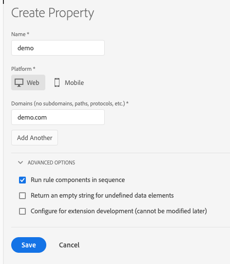

# Egenskaper

>[!NOTE]
>
>Adobe Experience Platform Launch har omklassificerats som en serie datainsamlingstekniker i Adobe Experience Platform. Som ett resultat av detta har flera terminologiska förändringar införts i produktdokumentationen. I följande [dokument](../../term-updates.md) finns en konsoliderad referens till de ändrade terminologin.

## Webbegenskaper

En webbegenskap är en samling regler, dataelement, konfigurerade tillägg, miljöer och bibliotek.  Varje webbegenskap har en egen uppsättning inbäddningskoder och kan distribueras på ett valfritt antal olika webbplatser (olika domäner).

## Mobilegenskaper

En mobil egenskapstyp kan innehålla flera program. I en mobil egenskap kan du till exempel hantera samma uppsättning regler och tillägg för flera iOS- och Android-program.

## Bästa tillvägagångssätt för att planera egenskaper {#best-practices-for-planning-properties}

Varje taggimplementering i Adobe Experience Platform kan vara mycket annorlunda. De har ett stort antal datainsamlingsbehov, variabel användning, tillägg, tredjepartstaggar, andra system och tekniker, människor, team, geografiska regioner osv. Du bör strukturera egenskaperna på ett sätt som överensstämmer med organisationens arbetsflöde och processer.

Tänk på följande när du planerar egenskaper:

* Kodstruktur
* Data
* Variabel
* Tillägg, taggar och system
* Folk

### Kodstruktur

Webbplatserna bygger på HTML, mobilappar på kod.  Om de underliggande HTML-mallarna eller kodebaserna är desamma för flera webbplatser och program kan det vara bra att använda en taggegenskap för att hantera flera webbplatser eller appar.

### Data

Är de data som du kommer att samla in mycket liknande, något liknande eller unika för alla dina webbplatser eller tillämpningar?

Om de data du behöver samla in liknar varandra kan det vara bra att gruppera dessa webbplatser eller program i en egenskap för att undvika att regler dupliceras eller att regler kopieras från en egenskap till en annan.

Om dina datainsamlingsbehov är unika för varje webbplats eller program kan det vara bra att separera dem i deras egna egenskaper. Med den här metoden kan du styra datainsamlingen mer specifikt, utan att använda stora mängder villkorslogik i anpassade skript.

### Variabel

Liknar data, är variablerna som du anger i [!DNL Analytics] och andra tillägg väldigt lika, lite lika eller unika?

Om eVar27 till exempel används för samma källvärde på alla webbplatser och i alla program kan det vara bra att gruppera dessa webbplatser och program tillsammans så att du kan ange de gemensamma variablerna i bara en egenskap.

### Tillägg, taggar och system

Är tilläggen, taggarna och systemen som du kommer att distribuera mycket lika, något liknande eller unika?

Om tilläggen, taggarna och systemen som du ska distribuera är mycket lika för alla dina webbplatser och program, kanske du vill inkludera dem i samma egenskap.

Om du distribuerar [!DNL Adobe Analytics] på endast en plats eller ett program, och dina andra tillägg och taggar också är unika, kan du skapa separata egenskaper så att du får mer kontroll.

Om du till exempel distribuerar [!DNL Adobe Analytics], [!DNL Target] och samma tillägg från tredje part till alla dina webbplatser eller program är det en anledning att gruppera dem tillsammans.

### Folk

Behöver de enskilda, team och organisationer som arbetar i Adobe Experience Platform tillgång till alla era webbplatser och applikationer, några av dem eller bara en?

Med funktionerna för användarhantering kan du tilldela olika roller till olika personer för alla dina egenskaper, eller per egenskap. Om någon har tillräcklig behörighet kan den personen utföra administrativa åtgärder för alla egenskaper i den plattformsorganisationen. Alla andra roller kan tilldelas per egenskap. Du kan även dölja en egenskap för vissa användare (icke-administratörer) genom att inte ge dem någon roll i den egenskapen.

## Egenskapssida

En egenskap är en samling regler, dataelement, konfigurerade tillägg, miljöer och bibliotek. För webben finns det bara en publiceringsinbäddningskod per egenskap. För mobilen finns det ett konfigurationsprogram-ID per egenskap.

En egenskap kan vara en gruppering av en eller flera domäner och underdomäner. Du kan hantera och spåra dessa resurser på liknande sätt. Anta till exempel att du har flera webbplatser som är baserade på en mall och vill spåra samma resurser på alla. Du kan använda en egenskap på flera domäner.

På vänster sida av skärmen visas företagen i din organisation. Detta är särskilt användbart om du hanterar flera konton. Välj ett företag om du vill visa egenskaperna och granskningsloggarna för det företaget.

Varje egenskap visas i listan Egenskaper.

I listan Egenskaper visas följande information:

* Egenskapsnamn
* Plattform
* Status

Välj en egenskap om du vill se en översikt över den egenskapen. I översikten visas alla aktiviteter som har utförts på egenskapen. Här listas också måtten och tilläggen för egenskapen.

## Skapa eller konfigurera en egenskap

I det här avsnittet finns anvisningar om hur du skapar och konfigurerar en taggegenskap i Adobe Experience Platform.

>[!NOTE]
>
>Endast en användare med tillräcklig behörighet kan skapa en egenskap. Se [Användarhantering](user-permissions.md).

Granska [Bästa tillvägagångssätt för att planera egenskaper](companies-and-properties.md#best-practices-for-planning-properties) innan du börjar.

Navigera till din företagssida, välj **[!UICONTROL Add Property]** eller välj en befintlig egenskap i listan och välj **[!UICONTROL Configure]**.

### För webben

Följ instruktionerna för att skapa en webbegenskap.

1. Fyll i fälten:

   **Namn:** Namnet på din egenskap.

   **Domäner:** Bas-URL:en för alla webbplatser som du planerar att distribuera den här egenskapen till

1. (Avancerat) **[!UICONTROL Run rule components in sequence]** Markera den här kryssrutan om du vill att villkor och åtgärder ska vänta på att den föregående ska slutföras innan de körs
1. (Avancerat) **[!UICONTROL Return an empty string for missing data elements:]** Om du refererar till ett dataelement som inte finns i ett bibliotek, returneras `undefined` normalt.  Markera den här kryssrutan om du vill att scenariot ska returnera en tom sträng i stället.
1. (Avancerat) **[!UICONTROL Configure for extension development:]** Markera den här kryssrutan om du tänker installera utvecklingstillägg som utvecklas aktivt av ditt företag
1. Välj **[!UICONTROL Save]**.

### För mobiler

Följ instruktionerna för att skapa en mobil egenskap.

1. Fyll i fälten:

   * **Namn:** Namnet på din egenskap.
   * **Sekretess:** Som standard är sekretessinställningen Inaktiverad, vilket innebär att du vill att SDK ska samla in och skicka data till lösningar. Om du väljer Avanmäl dig kommer SDK som standard INTE att skicka data till lösningar. Om du väljer Okänd som inställning kräver SDK att programmet först uppmanar användaren att tillåta datainsamling och delning.

     >[!NOTE]
     >
     >Dessa inställningar kan styras ytterligare via API i mobilprogrammet.

   * **Använd HTTPS:** Välj om all datakommunikation ska skickas via HTTP eller HTTPS.

1. Välj **[!UICONTROL Save]**.

När egenskapen har skapats lägger Platform automatiskt till en standardvärd, en uppsättning miljöer (Utveckling, Förproduktion och produktion) samt standardtilläggen.

## Ta bort en egenskap

Följ stegen nedan för att ta bort en taggegenskap.

>[!NOTE]
>
>Det går inte att ångra borttagning av egenskap. Den som gjorde begäran måste vara en användare på administratörsnivå. Denna begäran kan inte ångras.

1. Markera den egenskap som du vill ta bort i listan Egenskaper.

   Du kan markera flera egenskaper som ska tas bort.

1. Välj **[!UICONTROL Delete]** och bekräfta sedan borttagningen av egenskapen.
