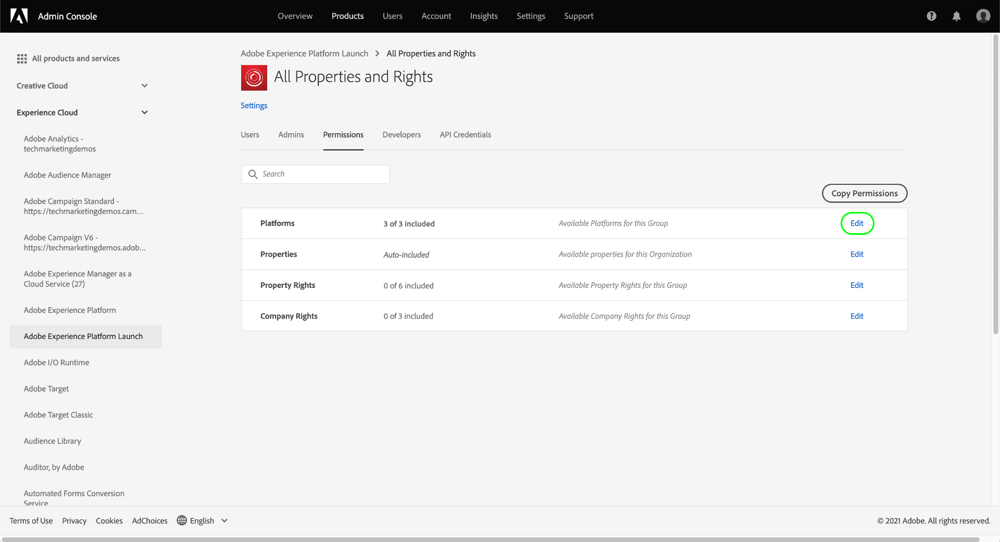

# Hantera behörigheter för taggar

>[!NOTE]
>
>Adobe Experience Platform Launch har omklassificerats som en serie datainsamlingstekniker i Adobe Experience Platform. Som ett resultat av detta har flera terminologiska förändringar införts i produktdokumentationen. Se följande [dokument](../../term-updates.md) för en konsoliderad referens till terminologiska ändringar.

Om du vill använda taggar i Adobe Experience Platform måste du ha tillgång till minst en Adobe Experience Cloud-produkt via Adobe Admin Console. Dessutom måste du ha behörighet för taggar på produktprofilnivå för att kunna utföra vissa åtgärder när du loggar in i användargränssnittet för datainsamling.

I den här handboken beskrivs hur du tilldelar behörigheter till användare som använder Admin Console.

>[!NOTE]
>
>Mer information om de olika typerna av tillgängliga taggbehörigheter som nämns i den här handboken finns i [användarbehörighetsöversikten](./user-permissions.md).

## Få administratörsbehörighet för en tagg-produktprofil

För att kunna hantera användarbehörigheter för taggar måste du vara minst en produktprofiladministratör för taggar i Adobe Admin Console. Systemadministratörer och produktadministratörer kan också hantera behörigheter för en tagg-produktprofil.

Mer information om de olika administratörsnivåerna och hur du hanterar de här rollerna inom din organisation finns i dokumentet om [administrativa roller](https://helpx.adobe.com/enterprise/admin-guide.html/enterprise/using/admin-roles.ug.html).

## Välj en produktprofil för att hantera behörigheter för

När du har administratörsbehörighet loggar du in på Admin Console och väljer **[!UICONTROL Products]** i den översta navigeringen. Välj **[!UICONTROL Adobe Experience Platform Launch]** i listan över produkter som visas.

En lista över produktprofiler visas. En produktprofil är en konstruktion som länkar en grupp behörigheter till en grupp användare. Härifrån kan du skapa en ny profil att konfigurera eller så kan du välja en befintlig produktprofil i listan som du vill redigera (förutsatt att du har administratörsbehörighet för den profilen).

### Skapa en produktprofil

>[!NOTE]
>
>Om du har valt en befintlig profil att redigera går du vidare till [nästa avsnitt](#permissions).

Om du vill skapa en ny produktprofil väljer du **[!UICONTROL New Profile]**.

En dialogruta visas där du kan ange ett namn och en valfri beskrivning för profilen. Du kan även växla om användare ska få e-post när de läggs till eller tas bort från den här profilen. När du är klar väljer du **[!UICONTROL Save]**.

## Konfigurera behörigheter för produktprofilen {#permissions}

Produktprofilens informationssida visas. På de angivna flikarna kan du hantera de användare som är tilldelade profilen och konfigurera de specifika egenskaper och rättigheter som profilen ger dessa användare.

Steg om hur du lägger till användare finns i [den här guiden](#users). För tillfället väljer du **[!UICONTROL Permissions]**.

På nästa skärm visas en översikt över antalet plattformar, egenskaper och rättigheter som för närvarande är tilldelade profilen. Välj **[!UICONTROL Edit]** bredvid en av raderna för att börja konfigurera profilens behörigheter.

Skärmen [!UICONTROL Edit Permissions] visas där du kan lägga till och ta bort behörigheter från produktprofilen. I avsnittet **[!UICONTROL Platforms]** ser du att alla plattformar har lagts till i profilen som standard.

### Tilldela egenskaper

Om du vill tilldela egenskaper till den här profilen väljer du **[!UICONTROL Properties]** i den vänstra navigeringen.

Som standard får en ny produktprofil automatiskt åtkomst till alla egenskaper som är tillgängliga för din organisation. Detta inkluderar egenskaper som är tillgängliga för tillfället och egenskaper som har gjorts i framtiden.

Om du vill begränsa de tillgängliga egenskaperna väljer du alternativet **[!UICONTROL Auto-include]**. På så sätt kan du manuellt lägga till och ta bort egenskaper för egenskapen beroende på dina behov.

Om automatisk inkludering är inaktiverat visas alla tillgängliga egenskaper till vänster. Du kan lägga till egenskaper i profilen genom att markera plusikonen (**+**) bredvid egenskapen i den vänstra kolumnen. Om du vill ta bort en egenskap markerar du ikonen **X** bredvid egenskapen i fråga i den högra kolumnen.

>[!IMPORTANT]
>
>Om du inaktiverar funktionen för automatisk infogning måste alla egenskaper som skapas i framtiden läggas till manuellt i produktprofilen för att den ska få åtkomst till dem.

### Tilldela rättigheter

Som standard är alla rättigheter inaktiverade för en produktprofil och måste läggas till manuellt för att aktiveras. Om du tillhör en produktprofil som automatiskt inkluderar egenskaper men saknar rättigheter, har du skrivskyddad åtkomst till alla egenskaper.

>[!NOTE]
>
>En användare kan tillhöra flera produktprofiler i Admin Console, men rättigheterna från dessa profiler kombineras inte till en överordnad behörighetsgrupp. Användaren har fortfarande bara de rättigheter som uttryckligen har beviljats av varje grupp.
>
>Om till exempel grupp 1 ger åtkomst till egenskap A med rättigheten Framkalla och grupp 2 ger åtkomst till egenskap B med rättigheten Publicera, kombineras inte rättigheterna Framkalla och Publicera för egenskap A och egenskap B. Du kan bara utveckla på egenskap A och publicera på egenskap B.

Välj **[!UICONTROL Property Rights]** i den vänstra navigeringen. Precis som med egenskaper kan du markera plusikonen (**+**) bredvid en egenskap till höger för att lägga till den i profilen. Om du vill lägga till alla egenskapsrättigheter till profilen kan du även välja **[!UICONTROL Add all]**.

Välj sedan **[!UICONTROL Company Rights]** i den vänstra navigeringen. Lägg till eller ta bort de rättigheter du behöver, och när du är klar väljer du **[!UICONTROL Save]**.

## Tilldela användare till profilen {#users}

Om du vill tilldela användare till produktprofilen väljer du fliken [!UICONTROL Users] och sedan [!UICONTROL Add User].

I dialogrutan som visas anger du namn, användargrupp eller e-postadress för de användare som du vill lägga till i profilen. Om en användare är en del av din organisation visas informationen i en automatiskt ifylld listruta som du kan välja för att fylla i informationen. Om de inte är en del av din organisation kan du ange deras information manuellt i stället.

När du är klar väljer du **[!UICONTROL Save]** för att lägga till de angivna användarna i produktprofilen.

När användarna har lagts till i profilen får de ett e-postmeddelande som informerar dem om att de nu har behörighet för användargränssnittet för datainsamling.

## Nästa steg

I det här dokumentet beskrivs hur du hanterar egenskaper och rättigheter för användargränssnittet för datainsamling med Adobe Admin Console. Mer information om vilka behörigheter och funktioner de ger åtkomst till finns i översikten för [användarbehörigheter](./user-permissions.md).
