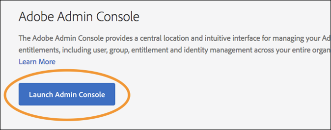

# Användarbehörigheter

>[!NOTE]
>
>Adobe Experience Platform Launch har omklassificerats som en serie datainsamlingstekniker i Adobe Experience Platform. Som ett resultat av detta har flera terminologiska förändringar införts i produktdokumentationen. Se följande [dokument](../../term-updates.md) för en konsoliderad referens till terminologiska ändringar.

## Behörighetstyper

Det finns två användarbehörigheter att förstå för användning med taggar i Adobe Experience Platform:

* **Experience Cloud behörigheter:** Finns i Admin Console på företagsnivå,  [!DNL Experience Cloud] behörigheter styr vilka som kan styra gruppbehörigheter och gruppmedlemskap för alla  [!DNL Experience Cloud] produkter.
* **Behörighet för taggar:** Behörigheterna för taggar finns i Admin Console på produktprofilnivå. Dessa behörigheter styr vilka användare som faktiskt kan utföra vissa åtgärder när de loggar in i användargränssnittet för datainsamling.

I den här artikeln behandlas dessa olika behörighetstyper i detalj.

### Experience Cloud behörigheter

I det här avsnittet beskrivs faktorer som är viktiga att förstå när du använder Platform. Se [Administrativa roller i användarhandboken för företag](https://helpx.adobe.com/au/enterprise/using/admin-roles.html) för en utförlig vy av [!DNL Experience Cloud] behörigheter.

#### Organisationsadministratör

Organisationsadministratörer kallas ofta för organisationsadministratörer. Organisationsadministratörens huvudfunktion är att tilldela behörigheter till andra användare. De gör detta genom att skapa produktprofiler (eller grupper) som innehåller en specifik uppsättning rättigheter för en viss produkt och sedan tilldela användare, befintliga eller nya, till produktprofilen.

Företagsorganisationsadministratörer ärver inte några rättigheter för taggar i Platform. De måste lägga till sig själva till en produktprofil som har rätt behörigheter om de vill göra något i användargränssnittet för datainsamling.

#### Produktadministratör

En produktadministratör (eller produktadministratör) liknar en Org Admin, men har en smalare omfattning. En produktadministratör har bara behörighet att ändra produktprofiler för en viss [!DNL Adobe]-produkt, i stället för alla [!DNL Adobe]-produkter som företaget har tillgång till.

### Behörigheter för taggar

Inom [!DNL Experience Cloud] tilldelas enskilda användare inga rättigheter eller behörigheter. De tilldelas en produktprofil (se&quot;Experience Cloud-behörigheter&quot; ovan). Enskilda användare tilldelas sedan till en eller flera produktprofiler.

Inom en produktprofil är behörigheterna för taggar uppdelade i fyra dimensioner.

1. Plattformar
1. Egenskaper
1. Egendomsrättigheter
1. Företagsrättigheter

#### Plattformar

Varje egenskap har en plattform. Det finns för närvarande två plattformar som du kan använda för taggar: *Webb* och *Mobil*. Du kan använda den här behörighetstypen för att begränsa eller bevilja åtkomst till en viss typ av egenskap. Detta kan vara användbart när det team som hanterar dina mobilappar skiljer sig från det som hanterar dina webbplatser.

#### Egenskaper

Det här är en lista över alla egenskaper som finns i företaget. Du kan använda den här behörighetstypen för att begränsa eller bevilja åtkomst till specifika befintliga egenskaper (efter namn).

#### Egendomsrättigheter

Alla egenskaper som du skapar i användargränssnittet för datainsamling blir tillgängliga i Admin Console så att du kan tilldela behörigheter. Om en viss produktprofil inte har tillgång till egenskap A1 kan användare som tillhör den profilen inte se eller ändra några inställningar i egenskap A1.

Förutsatt att en användare tillhör en profil med åtkomst till egenskap A1, bestäms vad de kan göra i egenskap A1 av vilka rättigheter de har beviljats från den här behörighetsgruppen. Användare med behörighet för egenskap A1, men utan tilldelade rättigheter, har skrivskyddad åtkomst.

Behörigheterna i den här gruppen är:

* **Utveckla:** På så sätt kan du skapa regler och dataelement. Du kan också skapa bibliotek och bygga upp dem i befintliga utvecklingsmiljöer. Du kan skicka in ett bibliotek för godkännande när det är klart. De flesta dagliga uppgifter i gränssnittet för datainsamling kräver den här rättigheten.
* **Godkänn:** Detta gör att du kan ta ett skickat bibliotek och bygga vidare till testmiljön. Du kan också godkänna ett bibliotek för publicering när testningen är klar.
* **Publicera:** Detta gör att du kan publicera godkända bibliotek i produktionsmiljön.
* **Hantera tillägg:** Detta ger möjlighet att installera nya tillägg för en egenskap, ändra tilläggskonfigurationen för ett redan installerat tillägg och ta bort ett tillägg. Mer information om tillägg[finns i översiktsdokumentationen för tillägg](../managing-resources/extensions/overview.md). Den här rollen tillhör vanligen IT eller marknadsföring, beroende på din organisation.
* **Hantera miljöer:** På så sätt kan du skapa och ändra miljöer. Mer information finns i [miljödokumentationen](../publishing/environments.md). Den här rollen tillhör vanligtvis IT-gruppen.

#### Företagsrättigheter

Företagsrättigheter gäller för behörigheter som sträcker sig över flera egenskaper.  Det finns för närvarande tre:

* **Hantera egenskaper:** Detta gör att du kan skapa nya egenskaper i användargränssnittet för datainsamling och ändra metadata och inställningar på egenskapsnivå. Du kan också ta bort egenskaper. Mer information finns i [egenskapsdokumentationen](companies-and-properties.md). Administratörer utför vanligtvis den här rollen.
* Ger möjlighet att skapa nya egenskaper och ändra metadata och inställningar på egenskapsnivå. Du kan också ta bort egenskaper.  Läs mer om egenskaper [här](companies-and-properties.md). Administratörer utför vanligtvis den här rollen.
* **Utveckla tillägg:** Ger möjlighet att skapa och ändra tilläggspaket som ägs av företaget, inklusive privata releaser och förfrågningar om allmän spridning.
* **Hantera appkonfigurationer:** Detta är endast tillgängligt för kunder som har licensierat Adobe Journey Optimizer eller någon annan lösning som ger dem tillgång till mobilmeddelanden i appen och push-meddelanden.  På så sätt kan du hantera de appar som Experience Cloud känner till tillsammans med de push-autentiseringsuppgifter som krävs för att kommunicera med meddelandetjänsten i Firebase Cloud och Apple Push Notification Service.

### Totalt antal användarbehörigheter

En enskild användares totala behörigheter bestäms av det totala medlemskapet i olika produktprofiler. Om en användare tillhör flera produktprofiler läggs behörigheterna från varje profil ihop i stället för att multipliceras.

Till exempel: Produktprofil A ger Henry rättighet att utveckla egenskap 1. Produktprofil B ger Henry rätt att publicera egendom 2. Henry kan Utveckla i egenskap 1 och Publicera i egenskap 2, men kan inte publicera i egenskap 1 eller Utveckla i egenskap 2 eftersom han inte har fått någon uttrycklig rätt att göra det.

## Rättighetsscenarier

Olika företag har olika behov när de skapar nya produktprofiler. Dessa behov varierar beroende på företagets storlek, organisationsstruktur, antal webbplatser, antalet personer som deltar i hanteringen av taggar osv.

Nedan beskrivs några vanliga scenarier och en rekommenderad utgångspunkt när du tänker på att skapa produktprofiler och lägga till användare till dem.

### Enpersonsprogram

Om du har ett litet företag som har en person som har hand om allt, ger du den här användaren behörighet till alla egenskaper och tilldelar dem alla rättigheter som anges ovan.

### Avdelning av tullar

Många är inblandade i taggning. Du har en uppsättning personer (kanske en extern konsult) som skapar regler och dataelement, men du vill inte att de ska ha tillgång till produktionsmiljön. Se till att ingen driftsätter till Production förutom IT-teamet.

1. Skapa ett konto för dina konsulter och ge dem endast utvecklingsbehörighet.
1. Konsulten bygger och testar inom de gränser ni anger.
1. Om konsulten vill ha en ny förlängning, eller är redo att publicera, utför en representant från organisationen (med rätt behörighet) dessa åtgärder.

### Enterprise

Ett företag kan ha flera platser uppdelade geografiskt, med olika team som ansvarar för varje region. Inom dessa team utvecklar och publicerar olika individer.

Detta liknar&quot;åtskillnad av tullar&quot; ovan, men är organiserat i geografiska områden.

* Nordamerika
   * Utvecklingsgrupp
   * Publicera grupp
* Europa
   * Utvecklingsgrupp
   * Publicera grupp
* ...
   * Utvecklingsgrupp
   * Publicera grupp

## Exempel

Några exempel på vilka roller du kan ha i organisationen, och vilka behörigheter du bör tilldela dem, kan göra detta enklare.

Här följer några beskrivningar av olika roller som kan gälla i din organisation och en matris som visar vilka behörigheter de behöver för att utföra sitt arbete.

* Hanteraren: Vill se vad som pågår, men ska inte kunna göra några ändringar.
* Marknadsförare: Kan installera tillägg och konfigurera nya taggar för befintliga egenskaper, men kan inte publicera till testnings- eller produktionsmiljöerna.
* Mobilappsutvecklaren: Ansvarar för implementering av Adobe och tredjepartslösningar inuti en inbyggd mobilapp.
* IT-teamet: Inga taggar ändras, men de har fullständig kontroll över staging- och produktionsmiljöerna och vad som finns i dem.
* Jack of All Trades: Gör allt.

| Roll | Egenskaper | Företagsrättigheter | Egendomsrättigheter |
|--- |--- |--- |--- |
| The Manager | Ta med automatiskt |  |  |
| Marknadsföraren | Ta med automatiskt | Hantera egenskaper | Utveckla Hantera tillägg |
| Mobilappsutvecklaren | Ta med automatiskt | Hantera egenskaper Hantera appkonfigurationer | Utveckla Hantera tillägg |
| IT-teamet | Ta med automatiskt | Godkänn Publicera Hantera miljöer |
| The Jack of All Trades | Ta med automatiskt | Hantera egenskaper | Utveckla Godkänn Publicera Hantera tillägg Hantera miljöer |
| Extension Developer | Ta med automatiskt | Hantera egenskaper framkallningstillägg | Utveckla |

## Tilldela användarbehörigheter

Stegen nedan vägleder dig genom processen att tilldela behörigheter. Du kan även visa den här processen [på video](https://www.youtube.com/watch?v=ba28BHX8cwU).

Steg 1-3 nedan kan kringgås genom att navigera direkt till [Adobe Admin Console](https://adminconsole.adobe.com/enterprise/products). Om du tillhör fler än en organisation väljer du rätt organisation i den övre navigeringen till höger.

### 1. Logga in på Experience Cloud

Logga in på [https://experiencecloud.adobe.com/](https://experiencecloud.adobe.com/) med din Adobe ID och välj sedan den organisation som ska användas i användargränssnittet för datainsamling på [!UICONTROL Navigation]-menyn.

Öppna lösningsväljaren genom att välja ikonen med nio punkter på menyn [!UICONTROL Navigation] och sedan välja **[!UICONTROL Administration]**.

Om länken inte visas gäller båda följande villkor:

* Du är inte organisationsadministratör.
* Du är inte produktadministratör för någon [!DNL Experience Cloud]-produkt.

I båda fallen kan du be en organisationsadministratör att utföra dessa steg åt dig eller göra dig till produktadministratör för taggar så att du kan göra det själv.

>[!NOTE]
>
>Om du inte vet vem din organisationsadministratör är kan du kontakta kundtjänst.

### 2. Öppna Admin Console

Välj **Admin Console**.

Välj **[!DNL Experience Platform Launch]-`Company Name`**-kortet.

<!-- Scott, update above image. Rebranding. -->

Du kan också välja **[!UICONTROL Products]** i det övre navigeringsfältet och sedan välja **[!DNL Experience Platform Launch]-`Company Name`** i det vänstra navigeringsfältet.

Om du inte ser ett [!DNL Experience Platform Launch]-kort och om [!DNL Experience Platform Launch] inte visas i den här listan är du inte en Org Admin, men du är produktadministratör för andra Experience Cloud-produkter. Eftersom du inte är administratör för Experience Platform Launch måste du hitta en Org Admin som kan utföra de här stegen åt dig eller som kan göra dig till produktadministratör för [!DNL Platform Launch].

När du har valt Platform launch visas en lista med produktprofiler. Tänk på dessa profiler som behörighetsgrupper. En profil skapas åt dig och har namnet &quot;[!DNL Platform Launch] - `Company Name`&quot;.

### 3. Skapa en produktprofil

Om du redigerar en befintlig produktprofil hoppar du över det här steget.

Välj om du vill redigera den här produktprofilen eller skapa en ny.

Om du vill skapa en ny produktprofil väljer du **[!UICONTROL New Profile]**.

Ge den nya profilen ett namn och en beskrivning, konfigurera om användare ska få e-post när de läggs till eller tas bort från profilen och välj sedan **[!UICONTROL Done]**.

### 4. Redigera din produktprofil

Välj produktprofilen i listan och öppna sedan fliken **[!UICONTROL Permissions]**. Du kan tilldela behörigheter i två dimensioner: Egenskaper och rättigheter.

Om du vill tilldela egenskaper till den här gruppdefinitionen öppnar du avsnittet **[!UICONTROL Properties]**.

En lista visar dina taggegenskaper.

Som standard inkluderas egenskaper automatiskt i nya produktkonfigurationer. Det innebär att alla egenskaper (nuvarande och framtida) inkluderas i gruppdefinitionen.

Om Inkludera automatiskt är inaktiverat visas alla tillgängliga egenskaper till vänster. Du kan flytta egenskaper till den här gruppdefinitionen genom att välja **[!UICONTROL Add]**.

Välj **[!UICONTROL Save]** när du är klar.

### 5. Tilldela rättigheter

Tilldela de rättigheter du vill ska ingå i gruppdefinitionen. Öppna avsnittet **[!UICONTROL Rights]**.

Rättigheter inkluderas inte automatiskt. Du måste tilldela varje rättighet till din profil. Du kan snabbt lägga till alla rättigheter till den här profilen genom att använda knappen [!UICONTROL + Add All] eller genom att tilldela individuella behörigheter med hjälp av de enskilda +-knapparna (lägg till). Mer information om vilka behörigheter som är associerade med respektive rättighet finns i [Rättighetsscenarier](#rights-scenarios). Välj **[!UICONTROL Save]** när du är klar. Om [!UICONTROL Save] inte är tillgängligt har inga ändringar gjorts och du tilldelas inga nya rättigheter.

Tilldela först egenskapsrättigheter:

Tilldela sedan företagsrättigheter.

Några viktiga saker att tänka på när det gäller att tilldela behörigheter:

* Bristande rättigheter innebär skrivskyddad åtkomst. Om du tillhör en produktkonfiguration med automatiskt inkluderade egenskaper och inga rättigheter, har du skrivskyddad åtkomst till alla taggegenskaper.
* Om du inte tilldelar Hantera egenskaper korrekt kan du inte lägga till några egenskaper när du loggar in.
* En användare kan tillhöra flera grupper, men rättigheterna från dessa grupper kombineras inte till en överordnad behörighetsgrupp. Användaren har fortfarande bara de rättigheter som uttryckligen har beviljats av varje grupp.

   Om till exempel grupp 1 ger åtkomst till egenskap A med rättigheten Framkalla och grupp 2 ger åtkomst till egenskap B med rättigheten Publicera, kombineras inte rättigheterna Framkalla och Publicera för egenskap A och egenskap B. Du kan bara utveckla på egenskap A och publicera på egenskap B.

### 6. Tilldela användare till grupper

Om du vill tilldela användare som ska ingå i gruppen öppnar du fliken [!UICONTROL Users] och väljer sedan [!UICONTROL Add User].

Markera ellipsen (..) om du vill ha ytterligare alternativ, till exempel gruppanvändaråtgärder.

>[!NOTE]
>
>Att vara organisationsadministratör eller produktadministratör ger dig inte några rättigheter inom taggprodukten. Du måste tillhöra minst en produktprofil.

Sök efter användaren som du vill lägga till i gruppen. Du kan söka efter namn eller e-postadress. Detta fyller i automatiskt från befintliga användare i din organisation. När du har hittat den användare du vill använda väljer du användarens namn.

När du har lagt till användare får de ett e-postmeddelande som meddelar att de nu har rättigheter. Logga in genom att följa länken till [användargränssnittet för datainsamling](https://launch.adobe.com).

>[!NOTE]
>
>Om användaren inte finns kan du skriva in hela e-postadressen och sedan ange för- och efternamn. Den nya användaren får ett e-postmeddelande, och när han/hon skapar ett [!DNL Adobe]-ID från den e-postinbjudan länkas de tillsammans med det användarkonto som du skapade åt honom/henne. Om du tilldelar behörigheter till dig själv får du inte det här problemet.

## Vanliga problem

### Fel vid inläsning av konto

När du loggar in på användargränssnittet för datainsamling visas ett meddelande med texten&quot;Error Loading Account&quot; (Fel vid kontoinläsning).

Upplösning: Användaren tillhör inte någon produktprofil för taggar. Se stegen ovan för att skapa en profil och tilldela behörigheter till den samt för att tilldela en användare till en profil.

### Knappen Egenskaper för nedtonad text

När du har loggat in kan du inte lägga till några egenskaper.

Upplösning: Ditt användarkonto tillhör inte en produktkonfiguration som har rättigheten Hantera egenskaper. Gå tillbaka till steg 5 ovan.
