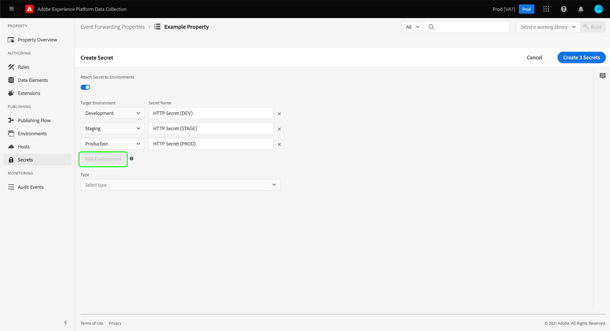
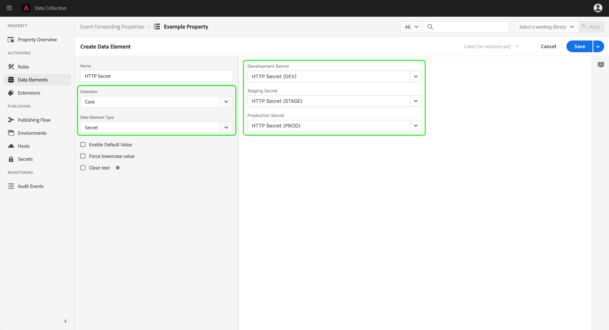

# Konfigurera hemligheter i händelsevidarebefordran

Vid vidarebefordran av händelser är en hemlighet en resurs som representerar autentiseringsuppgifter för ett annat system, vilket möjliggör säkert datautbyte. Det går bara att skapa hemligheter i egenskaper för vidarebefordran av händelser.

Följande hemliga typer stöds för närvarande:

| Hemlig typ | Beskrivning |
| --- | --- |
| [!UICONTROL Amazon OAuth 2] | Aktiverar säker autentisering med [!DNL Amazon] tjänster. Systemet lagrar token på ett säkert sätt och hanterar förnyelsen vid angivna intervall. |
| [!UICONTROL Google OAuth 2] | Innehåller flera attribut som stöder autentiseringsspecifikationen [OAuth 2.0](https://datatracker.ietf.org/doc/html/rfc6749) som kan användas i API:t [Google Ads ](https://developers.google.com/google-ads/api/docs/oauth/overview) och [API:t Pub/Sub](https://cloud.google.com/pubsub/docs/reference/service_apis_overview). Systemet ber dig om den information som krävs och hanterar sedan förnyelsen av dessa token för dig med ett angivet intervall. |
| [!UICONTROL HTTP] | Innehåller två strängattribut för ett användarnamn respektive ett lösenord. |
| [!UICONTROL [!DNL LinkedIn] OAuth 2] | Systemet ber dig om den information som krävs och hanterar sedan förnyelsen av dessa token för dig med ett angivet intervall. |
| [!UICONTROL OAuth 2] | Innehåller flera attribut som stöder [klientautentiseringstypen ](https://datatracker.ietf.org/doc/html/rfc6749#section-1.3.4) för autentiseringsspecifikationen [OAuth 2.0](https://datatracker.ietf.org/doc/html/rfc6749). Systemet ber dig om den information som krävs och hanterar sedan förnyelsen av dessa token för dig med ett angivet intervall. |
| [!UICONTROL OAuth 2 JWT] | Innehåller flera attribut som stöder JSON Web Token-profil (JWT) för [OAuth 2.0-auktoriseringsbidrag](https://datatracker.ietf.org/doc/html/rfc7523#section-2.1). Systemet ber dig om den information som krävs och hanterar sedan förnyelsen av dessa token för dig med ett angivet intervall. |
| [!UICONTROL Token] | En enda teckensträng som representerar ett autentiseringstokenvärde som är känt och begripligt för båda systemen. |

{style="table-layout:auto"}

Den här guiden ger en översikt på hög nivå över hur du konfigurerar hemligheter för en händelsevidarebefordringsegenskap ([!UICONTROL Edge]) i användargränssnittet för Experience Platform eller datainsamlingen.

>[!NOTE]
>
>Detaljerad vägledning om hur du hanterar hemligheter i Reaktors-API:t, inklusive exempel på JSON för en hems struktur, finns i [API-handboken för hemligheter](../../api/guides/secrets.md).

## Förhandskrav

I den här handboken förutsätts det att du redan känner till hur du hanterar resurser för taggar och vidarebefordran av händelser i användargränssnittet, inklusive hur du skapar ett dataelement och en regel för vidarebefordran av händelser. Se guiden [Hantera resurser](../managing-resources/overview.md) om du behöver en introduktion.

Du bör också ha en fungerande förståelse för publiceringsflödet för taggar och vidarebefordran av händelser, inklusive hur du lägger till resurser i ett bibliotek och installerar ett bygge på webbplatsen för testning. Mer information finns i [publiceringsöversikten](../publishing/overview.md).

## Skapa en hemlighet {#create}

>[!CONTEXTUALHELP]
>id="platform_eventforwarding_secrets_environments"
>title="Hemligheter"
>abstract="För att en hemlighet ska kunna användas av händelsevidarebefordran måste den tilldelas en befintlig miljö. Om du inte har några miljöer skapade för egenskapen för vidarebefordring av händelser måste du konfigurera dem innan du fortsätter."
>additional-url="https://experienceleague.adobe.com/docs/experience-platform/tags/publish/environments/environments.html?lang=sv-SE" text="Miljööversikt"

Om du vill skapa en hemlighet väljer du **[!UICONTROL Event Forwarding]** i den vänstra navigeringen och öppnar sedan den händelsevidarebefordringsegenskap som du vill lägga till hemligheten under. Välj sedan **[!UICONTROL Secrets]** i den vänstra navigeringen, följt av **[!UICONTROL Create New Secret]**.

På nästa skärm kan du konfigurera informationen om hemligheten. För att en hemlighet ska kunna användas av händelsevidarebefordran måste den tilldelas en befintlig miljö. Om du inte har skapat några miljöer för din egenskap för vidarebefordring av händelser kan du läsa guiden om [miljöer](../publishing/environments.md) om hur du konfigurerar dem innan du fortsätter.

>[!NOTE]
>
>Om du fortfarande vill skapa och spara hemligheten innan du lägger till den i en miljö inaktiverar du **[!UICONTROL Attach Secret to Environments]**-växlingen innan du fyller i resten av informationen. Observera att du måste tilldela den till en miljö senare om du vill använda hemligheten.
>
>

Under **[!UICONTROL Target Environment]** använder du listrutan för att välja den miljö som du vill tilldela hemligheten till. Under **[!UICONTROL Secret Name]** anger du ett namn för hemligheten i miljösammanhang. Det här namnet måste vara unikt för alla hemligheter under händelsevidarebefordringsegenskapen.

En hemlighet kan bara tilldelas till en miljö i taget, men du kan tilldela samma autentiseringsuppgifter till flera hemligheter i olika miljöer om du vill. Välj **[!UICONTROL Add Environment]** om du vill lägga till en till rad i listan.

För varje miljö som du lägger till måste du ange ett annat unikt namn för den associerade hemligheten. Om du tar bort alla tillgängliga miljöer är knappen **[!UICONTROL Add Environment]** inte tillgänglig.

Därifrån skiljer sig stegen för att skapa hemligheten åt beroende på vilken typ av hemlighet du skapar. Se underavsnitten nedan för mer information:

* [[!UICONTROL Token]](#token)
* [[!UICONTROL HTTP]](#http)
* [[!UICONTROL OAuth 2]](#oauth2)
* [[!UICONTROL OAuth 2 JWT]](#oauth2jwt)
* [[!UICONTROL Google OAuth 2]](#google-oauth2)
* [[!UICONTROL [!DNL LinkedIn] OAuth 2]](#linkedin-oauth2)
* [[!UICONTROL [!DNL Amazon] OAuth 2]](#amazon-oauth2)

### [!UICONTROL Token] {#token}

Om du vill skapa en tokenhemlighet väljer du **[!UICONTROL Token]** i listrutan **[!UICONTROL Type]**. I fältet **[!UICONTROL Token]** som visas anger du den autentiseringssträng som känns igen av systemet som du autentiserar till. Välj **[!UICONTROL Create Secret]** om du vill spara hemligheten.

### [!UICONTROL HTTP] {#http}

Om du vill skapa en HTTP-hemlighet väljer du **[!UICONTROL Simple HTTP]** i listrutan **[!UICONTROL Type]**. I fälten som visas nedan anger du ett användarnamn och lösenord för autentiseringsuppgifterna innan du väljer **[!UICONTROL Create Secret]** för att spara hemligheten.

>[!NOTE]
>
>När autentiseringsuppgifterna sparas kodas de med HTTP-autentiseringsschemat [&quot;Basic&quot; ](https://www.rfc-editor.org/rfc/rfc7617.html).

### [!UICONTROL OAuth 2] {#oauth2}

Om du vill skapa en OAuth 2-hemlighet väljer du **[!UICONTROL OAuth 2]** i listrutan **[!UICONTROL Type]**. Ange [[!UICONTROL Client ID] och [!UICONTROL Client Secret]](https://www.oauth.com/oauth2-servers/client-registration/client-id-secret/) samt din [[!UICONTROL Token URL]](https://www.oauth.com/oauth2-servers/access-tokens/client-credentials/) för din OAuth-integrering i fälten som visas nedan. Fältet [!UICONTROL Token URL] i användargränssnittet är en sammanfogning mellan auktoriseringsservervärden och tokensökvägen.

Under **[!UICONTROL Credential Options]** kan du ange andra autentiseringsalternativ som `scope` och `audience` i form av nyckelvärdepar. Om du vill lägga till fler nyckelvärdepar väljer du **[!UICONTROL Add another]**.

Slutligen kan du konfigurera värdet **[!UICONTROL Refresh Offset]** för hemligheten. Detta anger antalet sekunder innan token upphör att gälla som systemet utför en automatisk uppdatering. Motsvarande tid i timmar och minuter visas till höger om fältet och uppdateras automatiskt när du skriver.

Om uppdateringsförskjutningen till exempel är inställd på standardvärdet `14400` (fyra timmar) och åtkomsttoken har värdet `expires_in` `86400` (24 timmar), uppdateras hemligheten automatiskt om 20 timmar.

>[!IMPORTANT]
>
>En OAuth-hemlighet kräver minst fyra timmar mellan uppdateringarna och måste också vara giltig i minst åtta timmar. Den här begränsningen ger dig minst fyra timmar att ingripa om det uppstår problem med den genererade token.
>
>Om till exempel förskjutningen är inställd på `28800` (åtta timmar) och åtkomsttoken har `expires_in` på `36000` (tio timmar), misslyckas utbytet eftersom den resulterande skillnaden är mindre än fyra timmar.

När du är klar väljer du **[!UICONTROL Create Secret]** för att spara hemligheten.

### [!UICONTROL OAuth 2 JWT] {#oauth2jwt}

Om du vill skapa en OAuth 2 JWT-hemlighet väljer du **[!UICONTROL OAuth 2 JWT]** i listrutan **[!UICONTROL Type]**.

![Fliken [!UICONTROL Create Secret] med OAuth 2 JWT-hemligheten markerad i listrutan [!UICONTROL Type].](../../images/ui/event-forwarding/secrets/oauth-jwt-secret.png)

>[!NOTE]
>
>Den enda [!UICONTROL Algorithm] som stöds för signering av JWT är RS256.

Ange [!UICONTROL Issuer], [!UICONTROL Subject], [!UICONTROL Audience], [!UICONTROL Custom Claims], [!UICONTROL TTL] i fälten som visas nedan och välj sedan [!UICONTROL Algorithm] i listrutan. Ange sedan [!UICONTROL Private Key Id] och [[!UICONTROL Token URL]](https://www.oauth.com/oauth2-servers/access-tokens/client-credentials/) för OAuth-integreringen. Fältet [!UICONTROL Token URL] är inte obligatoriskt. Om ett värde anges byts JWT ut mot en åtkomsttoken. Hemligheten uppdateras enligt attributet `expires_in` från svaret och värdet [!UICONTROL Refresh Offset]. Om inget värde anges är den hemlighet som skickas till kanten JWT. JWT uppdateras enligt värdena [!UICONTROL TTL] och [!UICONTROL Refresh Offset].

![Fliken [!UICONTROL Create Secret] med ett urval inmatningsfält markerat.](../../images/ui/event-forwarding/secrets/oauth-jwt-information.png)

Under **[!UICONTROL Credential Options]** kan du ange andra autentiseringsalternativ som `jwt_param` i form av nyckelvärdepar. Om du vill lägga till fler nyckelvärdepar väljer du **[!UICONTROL Add another]**.

![Fliken [!UICONTROL Create Secret] som markerar [!UICONTROL Credential Options] fält.](../../images/ui/event-forwarding/secrets/oauth-jwt-credential-options.png)

Slutligen kan du konfigurera värdet **[!UICONTROL Refresh Offset]** för hemligheten. Detta anger antalet sekunder innan token upphör att gälla som systemet utför en automatisk uppdatering. Motsvarande tid i timmar och minuter visas till höger om fältet och uppdateras automatiskt när du skriver.

![Fliken [!UICONTROL Create Secret] som markerar fältet [!UICONTROL Refresh Offset].](../../images/ui/event-forwarding/secrets/oauth-jwt-refresh-offset.png)

Om uppdateringsförskjutningen till exempel är inställd på standardvärdet `1800` (30 minuter) och åtkomsttoken har värdet `expires_in` (en timme), uppdateras hemligheten automatiskt om en timme.`3600`

>[!IMPORTANT]
>
>En OAuth 2 JWT-hemlighet kräver minst 30 minuter mellan uppdateringarna och måste också vara giltig i minst en timme. Den här begränsningen ger dig minst 30 minuter att ingripa om det uppstår problem med den genererade token.
>
>Om till exempel förskjutningen är inställd på `1800` (30 minuter) och åtkomsttoken har `expires_in` på `2700` (45 minuter), misslyckas utbytet på grund av att den resulterande skillnaden är mindre än 30 minuter.

När du är klar väljer du **[!UICONTROL Create Secret]** för att spara hemligheten.

![Flikmarkeringen [!UICONTROL Create Secret] [!UICONTROL Create Secret]](../../images/ui/event-forwarding/secrets/oauth-jwt-create-secret.png)

### [!UICONTROL Google OAuth 2] {#google-oauth2}

Om du vill skapa en Google OAuth 2-hemlighet väljer du **[!UICONTROL Google OAuth 2]** i listrutan **[!UICONTROL Type]**. Under **[!UICONTROL Scopes]** väljer du de Google-API:er som du vill använda den här hemligheten för att bevilja åtkomst till. Följande produkter stöds för närvarande:

* [Google Ads API](https://developers.google.com/google-ads/api/docs/oauth/overview)
* [Pub/Sub API](https://cloud.google.com/pubsub/docs/reference/service_apis_overview)

När du är klar väljer du **[!UICONTROL Create Secret]**.

En pover som informerar dig om att hemligheten måste auktoriseras manuellt via Google visas. Välj **[!UICONTROL Create & Authorize]** om du vill fortsätta.

En dialogruta visas där du kan ange autentiseringsuppgifter för ditt Google-konto. Följ instruktionerna för att ge händelsevidarebefordringsåtkomst till dina data i det valda omfånget. När auktoriseringsprocessen är klar skapas hemligheten.

>[!IMPORTANT]
>
>Om din organisation har en återautentiseringsprincip för Google Cloud-program kommer de hemligheter som skapas inte att uppdateras korrekt efter att autentiseringen har upphört att gälla (mellan 1 och 24 timmar beroende på principkonfigurationen).
>
>Du löser det här problemet genom att logga in på Google Admin Console och navigera till sidan **[!DNL App access control]** så att du kan markera appen för vidarebefordran av händelser (Adobe Real-Time CDP Event Forwarding) som [!DNL Trusted]. Mer information finns i Google-dokumentationen om [hur du anger sessionslängder för Google Cloud-tjänster](https://support.google.com/a/answer/9368756).

### [!UICONTROL [!DNL LinkedIn] OAuth 2] {#linkedin-oauth2}

Om du vill skapa en [!DNL LinkedIn] OAuth 2-hemlighet väljer du **[!UICONTROL [!DNL LinkedIn] OAuth 2]** i listrutan **[!UICONTROL Type]**. Välj sedan **[!UICONTROL Create Secret]**.

![Fliken [!UICONTROL Create Secret] med fältet [!UICONTROL Type] markerat.](../../images/ui/event-forwarding/secrets/linkedin-oauth.png)

En pover visas som talar om att hemligheten måste auktoriseras manuellt via [!DNL LinkedIn]. Välj **[!UICONTROL Create & Authorize secret with [!DNL LinkedIn]]** om du vill fortsätta.

En dialogruta visas där du uppmanas att ange dina [!DNL LinkedIn]-inloggningsuppgifter. Följ instruktionerna för att ge händelsevidarebefordringsåtkomst till dina data.

När auktoriseringsprocessen är klar återgår du till fliken **[!UICONTROL Secrets]** där du kan se din nyligen skapade hemlighet. Här ser du hemlighetens status och utgångsdatum.

![Fliken [!UICONTROL Secret] som markerar den nyligen skapade hemligheten.](../../images/ui/event-forwarding/secrets/linkedin-new-secret.png)

#### Auktorisera om en [!UICONTROL [!DNL LinkedIn] OAuth 2]-hemlighet

>VIKTIGT
>
>Du måste återauktorisera med dina [!DNL LinkedIn]-inloggningsuppgifter var 365:e dag. Om du inte auktoriserar igen i tid kommer din hemlighet inte att uppdateras och konverteringsbegäran [!DNL LinkedIn] kommer att misslyckas.

Tre månader innan hemligheten kräver omauktorisering visas ett popup-fönster när du navigerar på en sida i egenskapen. Välj **[!UICONTROL Click here to go to your secrets]**.

![Fliken [!UICONTROL Property Overview] markerar popup-fönstret för hemlig omauktorisering.](../../images/ui/event-forwarding/secrets/linkedin-reauthorization-popup.png)

Du omdirigeras till fliken [!UICONTROL Secrets]. Hemligheterna på den här sidan filtreras så att de endast visar de hemligheter som behöver auktoriseras på nytt. Välj **[!UICONTROL Auth Needed]** för hemligheten som du måste auktorisera igen.

![Flikmarkeringen [!UICONTROL Secret] [!UICONTROL Auth Needed] för [!DNL LinkedIn]-hemligheten.](../../images/ui/event-forwarding/secrets/linkedin-reauthorization.png)

En dialogruta visas där du uppmanas att ange dina [!DNL LinkedIn]-inloggningsuppgifter. Följ anvisningarna för att auktorisera din hemlighet igen.

### [!UICONTROL [!DNL Amazon] OAuth 2] {#amazon-oauth2}

Om du vill skapa en [!DNL Amazon] OAuth 2-hemlighet väljer du **[!UICONTROL [!DNL Amazon] OAuth 2]** i listrutan **[!UICONTROL Type]**. Välj sedan **[!UICONTROL Create Secret]**.

![Fliken [!UICONTROL Create Secret] med fältet [!UICONTROL Type] markerat.](../../images/ui/event-forwarding/secrets/amazon-oauth.png)

En pover visas som talar om att hemligheten måste auktoriseras manuellt via [!DNL Amazon]. Välj **[!UICONTROL Create & Authorize secret with [!DNL Amazon]]** om du vill fortsätta.

En dialogruta visas där du uppmanas att ange dina [!DNL Amazon]-inloggningsuppgifter. Följ instruktionerna för att ge händelsevidarebefordringsåtkomst till dina data.

När auktoriseringsprocessen är klar återgår du till fliken **[!UICONTROL Secrets]** där du kan se din nyligen skapade hemlighet. Här ser du hemlighetens status och utgångsdatum.

![Fliken [!UICONTROL Secret] som markerar den nyligen skapade hemligheten.](../../images/ui/event-forwarding/secrets/amazon-new-secret.png)

## Redigera en hemlighet

När du har skapat hemligheter för en egenskap kan du hitta dem i listan på arbetsytan **[!UICONTROL Secrets]**. Om du vill redigera informationen om en befintlig hemlighet markerar du namnet i listan.

På nästa skärm kan du ändra namn och autentiseringsuppgifter för hemligheten.

>[!NOTE]
>
>Om hemligheten är kopplad till en befintlig miljö kan du inte tilldela om hemligheten till en annan miljö. Om du vill använda samma inloggningsuppgifter i en annan miljö måste du [skapa en ny hemlighet](#create) i stället. Det enda sättet att tilldela om miljön från den här skärmen är om du aldrig har tilldelat hemligheten till en miljö i förväg eller om du har tagit bort den miljö som hemligheten var kopplad till.

### Försök igen med ett hemligt utbyte

Du kan försöka göra om eller uppdatera ett hemligt utbyte från redigeringsskärmen. Den här processen varierar beroende på vilken typ av hemlighet som redigeras:

| Hemlig typ | Försök igen |
| --- | --- |
| [!UICONTROL Token] | Välj **[!UICONTROL Exchange Secret]** om du vill försöka med det hemliga utbytet igen. Den här kontrollen är bara tillgänglig när det finns en miljö kopplad till hemligheten. |
| [!UICONTROL HTTP] | Om ingen miljö är kopplad till hemligheten väljer du **[!UICONTROL Exchange Secret]** för att växla autentiseringsuppgifterna till base64. Om en miljö är bifogad väljer du **[!UICONTROL Exchange and Deploy Secret]** att växla till base64 och distribuerar hemligheten. |
| [!UICONTROL OAuth 2] | Välj **[!UICONTROL Generate Token]** om du vill utbyta autentiseringsuppgifterna och returnera en åtkomsttoken från autentiseringsprovidern. |

## Ta bort en hemlighet

Om du vill ta bort en befintlig hemlighet i arbetsytan **[!UICONTROL Secrets]** markerar du kryssrutan bredvid namnet innan du väljer **[!UICONTROL Delete]**.

## Använda hemligheter i händelsevidarebefordran

För att kunna använda en hemlighet vid vidarebefordran av händelser måste du först skapa ett [dataelement](../managing-resources/data-elements.md) som refererar till hemligheten. När du har sparat dataelementet kan du inkludera det i händelsevidarebefordran av [regler](../managing-resources/rules.md) och lägga till dessa regler i ett [bibliotek](../publishing/libraries.md) som i sin tur kan distribueras till Adobe-servrar som en [build](../publishing/builds.md) .

När du skapar dataelementet väljer du tillägget **[!UICONTROL Core]** och sedan **[!UICONTROL Secret]** som dataelementtyp. Den högra panelen uppdateras och innehåller listrutekontroller för att tilldela dataelementet upp till tre hemligheter: en för [!UICONTROL Development], [!UICONTROL Staging] och [!UICONTROL Production].

>[!NOTE]
>
>Det är bara hemligheter kopplade till utvecklings-, staging- och produktionsmiljöerna som visas för respektive listruta.

Genom att tilldela flera hemligheter till ett dataelement och inkludera det i en regel, kan du få dataelementets värde att ändras beroende på var innehållsbiblioteket finns i [publiceringsflödet](../publishing/publishing-flow.md).

>[!NOTE]
>
>När du skapar dataelementet måste du tilldela en utvecklingsmiljö. Hemligheter för staging- och produktionsmiljöer behövs inte, men byggen som försöker gå över till dessa miljöer kommer att misslyckas om deras dataelement av hemlig typ inte har någon hemlighet vald för den aktuella miljön.

## Nästa steg

I den här guiden beskrivs hur du hanterar hemligheter i användargränssnittet. Mer information om hur du interagerar med hemligheter med Reaktors-API:t finns i [Slutpunktshandboken för hemligheter](../../api/endpoints/secrets.md).
