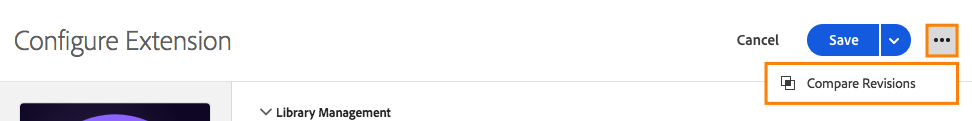

# Jämför resursrevisioner

>[!NOTE]
>
>Adobe Experience Platform Launch omdöms till en serie datainsamlingstekniker i Experience Platform. Som ett resultat av detta har flera terminologiska förändringar införts i produktdokumentationen. Se följande [dokument](../../term-updates.md) för en konsoliderad referens till terminologiska ändringar.

Jämför resursrevisioner för att se historiken för en enskild resurs.  Du kan jämföra resursens aktuella tillstånd med äldre versioner eller jämföra den publicerade versionen av en resurs med den senaste uppsättning ändringar som har sparats.

## Starta en jämförelse

Att starta en jämförelse är detsamma för alla resurstyper.  Öppna redigeringsvyn för en enskild resurs och leta sedan upp ikonen med tre punkter bredvid knappen **[!UICONTROL Save]** för att visa tillgängliga åtgärder för den resursen.  Välj **[!UICONTROL Compare Revisions]** i listan.

För tillägg öppnar du detaljvyn genom att klicka på knappen **[!UICONTROL Configure]** när du visar listan över installerade tillägg.  För dataelement och regler väljer du ett i listan.

## Använda Jämförelsevisning

När du startar en jämförelse visar standardvyn den senaste versionen till höger.  Den här versionen innehåller alla osparade ändringar som du har gjort i resursen i redigeringsvyn. (Lägg märke till etiketten&quot;Osparade ändringar&quot; till höger i bilden nedan.)

Till vänster kan du välja mellan alla befintliga versioner att jämföra med&quot;Senaste&quot;.

Välj **[!UICONTROL Use These Changes]** om du vill kopiera inställningarna från den valda revisionen (vänster) till den senaste versionen (höger).  Detta kopierar inställningarna från den gamla versionen till de senaste osparade ändringarna.  Om du vill att dessa ändringar ska fastna ska du se till att **[!UICONTROL Save]** är klar när du har avslutat jämförelsevyn.

>[!TIP]
>Enskilda resurser kan ha både attribut och inställningar.  Dessa inställningar lagras som ett JSON-block, som är ett strukturerat sätt att lagra data, men tillräckligt flexibelt så att tilläggsutvecklare kan placera det de behöver för att få sina tillägg att göra vad de vill.
>I den första versionen av jämförelsevyn visas inställningarna i Raw-format som JSON. Framtida förbättringar gör att du kan visa versioner på olika sätt, inklusive detaljerade kodjämförelser och använda tilläggsvyn från tilläggsutvecklarna.

## Jämföra tillägg

Tillägg har en enda skärm som visar skillnaderna mellan versionerna.

I Jämförelsevisning markeras skillnader mellan inställningsversioner.  Tillägg och borttagningar till enskilda inställningar indikeras av en expansion av en linje i båda riktningarna.

Ovanför ser du följande ändringar:

* Tillägget [!DNL Adobe Analytics] uppdateras till en ny version, vilket anges av de orange versionsnumren högst upp.
* `orgID` och `currencyCode` ändras till de inställningar som anges av utökningen av den orangefärgade delen i inställningarna.

## Jämföra dataelement

Dataelementen har en enda skärm för att visa skillnader, men eftersom dataelementen har ytterligare attribut utöver sina inställningar visas ytterligare information.  Attribut som har ändrats markeras med orange.

Ovanför ser du följande ändringar:

* Namnet har ändrats från &quot;Sidnamn 2&quot; till &quot;Mitt specialsidnamn&quot;, vilket anges av den orange listen.
* Typen har ändrats från JavaScript-variabel till Sidinformation.
* Standardvärdet för b har lagts till.
* &quot;Tvinga gemener&quot; har valts.
* &quot;Ren text&quot; har valts.
* Inställningarna har ändrats. (Inställningarna för JavaScript-variabeltypen skiljer sig från sidinformationstypen.)

Om inställningsblocket är stort kan du expandera inställningsavsnittet så att det syns bättre.

## Jämföra regler

Regler består av många regelkomponenter.  Om du vill förstå ändringarna av en regel måste du veta mer om hur du lägger till och tar bort komponenter samt om hur du ändrar en enskild komponent.  När du jämför olika versioner av en regel finns det alltså två skärmar.

På den första skärmen visas en högnivåvy, som markerar ändringar i ordningen för regelkomponenter.  Ändringarna markeras. Flera olika typer av ändringar visas.

Ovanför ser du följande ändringar:

* Regelnamnet har ändrats från Analytics (Analys) till Baseline Analytics (Baslinjeanalys), vilket anges av den orange raden med Name (Namn).
* Villkoret &quot;Core - Domain&quot; lades till, vilket anges av den orange &quot;+&quot;-ikonen och komponentens tillägg på den högra sidan.
* Åtgärden &quot;[!DNL Adobe Analytics] - Rensa variabler&quot; har tagits bort, vilket anges av den orangefärgade &quot;-&quot;-ikonen och komponentens frånvaro på den högra sidan.
* Åtgärden &quot;[!DNL Adobe Analytics] - Ange variabler&quot; ändrades, vilket anges av den orangefärgade linjen mellan komponentversionerna på vänster och höger sida. Den här linjen är rak om komponentordningen inte har ändrats.
* Åtgärden &quot;[!DNL Adobe Analytics] - Ange variabler&quot; och åtgärdsordningen &quot;[!DNL Adobe Analytics] - Skicka fyr&quot; har ändrats, vilket indikeras av de kurvor som förbinder de olika versionerna av komponenterna på vänster och höger sida

Om du vill visa specifika ändringar i en av regelkomponenterna markerar du den specifika komponent som du vill visa.  Linjen ändras till blå när du för musen över den.

Jämförelsen för en enskild regelkomponent fungerar på samma sätt som jämförelsen för ett dataelement.

Ovanför ser du följande ändring:

* Regelkomponenten har ändrats till add eVar2 med värdet &quot;1&quot;.

Om inställningsblocket är stort kan du expandera inställningsavsnittet så att det syns bättre.
