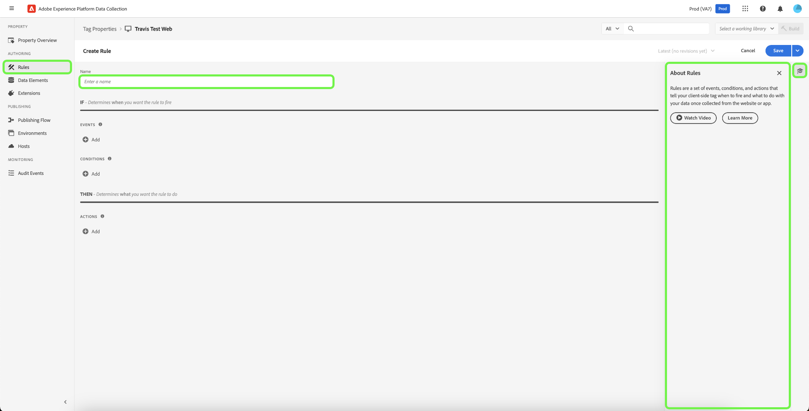

# Regler

>[!NOTE]
>
>Adobe Experience Platform Launch har omklassificerats som en serie datainsamlingstekniker i Adobe Experience Platform. Som ett resultat av detta har flera terminologiska förändringar införts i produktdokumentationen. I följande [dokument](../../term-updates.md) finns en konsoliderad referens till de ändrade terminologin.

Taggarna i Adobe Experience Platform följer ett regelbaserat system. De letar efter användarinteraktion och associerade data. När de kriterier som beskrivs i reglerna uppfylls utlöser regeln det tillägg, skript eller den kod på klientsidan som du har identifierat.

Skapa regler för att integrera data och funktioner i marknadsförings- och annonsteknik som förenar olika produkter i en enda lösning.

## Regelns struktur

**Händelser (om):** Händelsen är den händelse som du vill att regeln ska söka efter. Detta definieras genom att välja en händelse, tillämpliga villkor och eventuella undantag.

**Åtgärder (sedan):** Utlösare inträffar efter att en regel har inträffat och alla villkor är uppfyllda. En taggregel kan utlösa så många diskreta åtgärder som du vill och du kan styra i vilken ordning åtgärderna utförs. En enskild regel för en e-handelssida - Tack! kan till exempel utlösa analysverktyg och tredjepartstaggar från en enda regel. Du behöver inte skapa separata regler för varje tillägg eller tagg.

Du kan lägga till fler händelsetyper. Flera händelser förenas med en OR, så regelns villkor utvärderas om någon av händelserna uppfylls.

>[!IMPORTANT]
>
>Ändringarna börjar inte gälla förrän de [publiceras](../publishing/overview.md).

### Händelser och villkor (om)

Händelser med villkor är *If*-delen av en regel.

Om en angiven händelse inträffar utvärderas villkoren och de angivna åtgärderna utförs om det behövs.

* **Händelser**: Ange en eller flera händelser som måste äga rum för att aktivera regeln. Flera händelser förenas med en OR. Alla angivna händelser utlöser regeln.

* **Villkor**: Begränsa händelsen genom att konfigurera alla villkor som måste vara true för att en händelse ska aktivera regeln. Ett undantag definieras som ett NOT-villkor. Flera villkor förenas av ett AND.

Vilka händelser som är tillgängliga beror på vilka tillägg som är installerade. Mer information om händelserna i Core-tillägget finns i [Grundläggande tilläggshändelsetyper](../../extensions/client/core/overview.md#core-extension-event-types).

### Åtgärder (sedan)

Åtgärder är *Sedan*-delen av en regel. De definierar vad som ska hända när regeln körs. När en händelse aktiveras utförs åtgärderna om villkoren utvärderas till true och undantagen utvärderas till false. Du kan dra och släppa åtgärder för att ordna dem efter önskemål.

## Skapa en regel

Skapa en regel genom att ange vilka åtgärder som ska utföras om ett villkor uppfylls.

>[!TIP]
>
>Du kan visa ytterligare resurser som är tillgängliga för att lära dig mer om den här funktionen genom att välja  i den högra panelen.

1. [!UICONTROL Rules] Öppna fliken och välj **[!UICONTROL Create New Rule]** sedan .

   

1. Namnge regeln.
1. Välj ikonen Händelser **[!UICONTROL Add]**.
1. Välj ditt tillägg och en av de händelsetyper som är tillgängliga för det tillägget och konfigurera sedan inställningarna för händelsen.

   

   Vilka händelsetyper som är tillgängliga beror på vilket tillägg du har valt. Händelseinställningarna skiljer sig åt beroende på händelsetypen. Vissa händelser har inga inställningar som behöver konfigureras.

   >[!IMPORTANT]
   >
   >I en klientregel tokeniseras dataelement med `%` i början och slutet av dataelementnamnet. Exempel: `%viewportHeight%`. I en regel för vidarebefordran av händelser tokeniseras dataelement med `{{` i början och `}}` i slutet av dataelementnamnet. Exempel: `{{viewportHeight}}`.

   Om du vill referera till data från Edge-nätverket måste dataelementets sökväg vara `arc.event._<element>_`.

   `arc` står för Adobe Response Context.

   Till exempel: `arc.event.xdm.web.webPageDetails.URL`

   >[!IMPORTANT]
   >
   >Om den här sökvägen inte har angetts korrekt samlas inga data in.

1. Ange parametern Ordning och välj sedan **[!UICONTROL Keep Changes]**.

   Standardordningen för alla regelkomponenter är 50. Om du vill att en ska köras tidigare, ger du den en siffra som är lägre än 50.

   * Körningsordningen är nummerordning. 1 kommer före 3. 3 kommer före 10. 10 kommer före 100, osv.
   * Regler som har samma ordning körs i ingen speciell ordning.
   * Regler aktiveras i ordning, men avslutas inte nödvändigtvis i samma ordning. Om regel A och regel B delar en händelse och du tilldelar ordning så att regel A kommer först, så finns det ingen garanti för att regel A avslutas innan regel B börjar om regel A gör något asynkront.

     Om du vill att den ska köras senare ger du den ett tal som är högre än 50. Mer information om ordning finns i [Regelordning](rules.md#rule-ordering).

1. Välj ikonen Villkor **[!UICONTROL Add]** och välj sedan en logiktyp, ett tillägg, en villkorstyp och konfigurera inställningarna för villkoret. Välj sedan **[!UICONTROL Keep Changes]**.

   

   Vilka villkorstyper som är tillgängliga beror på vilket tillägg du har valt. Villkorsinställningarna varierar beroende på villkorstypen.

   Typ av logik:

   * Med en vanlig logiktyp kan åtgärder utföras om villkoret är uppfyllt
   * Undantagslogiktypen förhindrar att åtgärder körs om villkoret uppfylls

   (Avancerat) Timeout: Det här alternativet är tillgängligt när regelkomponentsekvensering är aktiverat på din egenskap. Det här attributet definierar den maximala tid som tillåts för villkoret att köras. Om tidsgränsen nås misslyckas villkoret och resten av regelns villkor och åtgärder tas bort från behandlingskön. Standardvärdet är 2 000 ms.

   Du kan lägga till så många villkor du vill. Flera villkor i samma regel förenas med AND.

1. Välj ikonen Åtgärder **[!UICONTROL Add]** och välj sedan tillägget och en av de åtgärdstyper som är tillgängliga för tillägget, konfigurera inställningarna för åtgärden och välj **[!UICONTROL Keep Changes]** sedan .

   

   Vilka åtgärdstyper som är tillgängliga beror på vilket tillägg du har valt. Åtgärdsinställningarna skiljer sig åt beroende på åtgärdstypen.

   (Avancerat) Vänta med att köra nästa åtgärd: Det här alternativet är tillgängligt när sekvensering av regelkomponenter är aktiverat på din egendom. När det här alternativet är markerat kommer taggarna inte att anropa nästa åtgärd förrän den här åtgärden är slutförd. När alternativet är avmarkerat börjar nästa åtgärd att utföras omedelbart. Standardvärdet är **[!UICONTROL Checked]**.

   (Avancerat) Timeout: Det här alternativet är tillgängligt när regelkomponentsekvensering är aktiverat på din egenskap. Den definierar den maximala tiden som åtgärden kan slutföras. Om tidsgränsen nås misslyckas åtgärden och alla efterföljande åtgärder för den här regeln tas bort från arbetskön. Standardvärdet är 2 000 ms.

1. Granska din regel och välj sedan **[!UICONTROL Save Rule]**.

   När du sedan [publicerar](../publishing/overview.md) lägger du till den här regeln i ett bibliotek och distribuerar den.

När du skapar eller redigerar regler kan du spara och skapa i ditt [aktiva bibliotek](../publishing/libraries.md#active-library). Ändringen sparas omedelbart i biblioteket och en bygge körs. Byggets status visas.

## Regelordning {#rule-ordering}

Med regelordning kan du styra körningsordningen för regler som delar en händelse. Varje regel innehåller ett heltal som bestämmer dess ordningsprioritet (standardvärdet är 50). Regler som innehåller lägre värden för deras ordning körs före regler med högre värden.

Ta en titt på fem regler som alla delar en händelse och som alla har standardprioritet:

* Om det finns en regel som du vill köra sist kan du redigera den regelkomponenten och ge den ett tal som är högre än 50 (till exempel 60).
* Om det finns en regel som du vill köra först kan du redigera den regelkomponenten och ge den ett tal som är lägre än 50 (till exempel 40).

>[!NOTE]
>
>I slutändan ligger ansvaret för att utföra åtgärder hos den utökade utvecklaren av den händelsetyp som du använder. Adobe-utvecklare ser till att deras tillägg fungerar som de ska. Adobe tillhandahåller vägledning till tredjepartsutvecklare för att göra detta på rätt sätt, men kan inte garantera hur dessa riktlinjer följs.

Vi rekommenderar att du ordnar reglerna med positiva tal mellan 1 och 100 (standardvärdet är 50). Eftersom regelordningen måste upprätthållas manuellt är det bäst att behålla beställningsschemat så enkelt som möjligt. Om det finns kantfall där begränsningen är för begränsad stöder taggarna ordningsnummer mellan +/- 2 147 483 648.

### Regelhantering på klientsidan

Inläsningsordningen för regler beror på om regelåtgärden är konfigurerad med JavaScript, HTML eller annan kod på klientsidan, och om reglerna använder en händelse längst ned eller högst ned på sidan eller en annan typ av händelse.

Du kan använda `document.write` i dina anpassade skript oavsett vilka händelser som konfigurerats för regeln.

Du kan beställa olika anpassade kodtyper sinsemellan. Nu kan du till exempel ha en åtgärd för anpassad JavaScript-kod, sedan en åtgärd för anpassad HTML-kod och sedan en åtgärd för anpassad JavaScript-kod. Taggar ser till att de körs i den ordningen.

## Regelbuntning

Regelhändelser och -villkor paketeras alltid i huvudtaggbiblioteket. Åtgärder kan paketeras i huvudbiblioteket eller läsas in sent som underresurser efter behov. Om åtgärderna är paketerade eller inte avgörs av regelns händelsetyp.

### Regler med händelserna &quot;Core - Library Loaded&quot; eller &quot;Core - Page Top&quot;

Dessa händelser måste nästan alltid köras (såvida inte villkoren utvärderas till false), så för effektivitet paketeras de i huvudbiblioteket, filen som refereras av din inbäddningskod.

* **Javascript:** JavaScript-koden är inbäddad i huvudtaggbiblioteket. Det anpassade skriptet kapslas i en skripttagg och skrivs till dokumentet med `document.write`. Om regeln har flera anpassade skript skrivs de i ordning.

* **HTML:** HTML-koden är inbäddad i huvudtaggbiblioteket. `document.write` används för att skriva HTML till dokumentet. Om regeln har flera anpassade skript skrivs de i ordning.

### Regler för alla andra händelser

Adobe kan inte garantera att andra regler verkligen kommer att aktiveras och att deras åtgärdskod kommer att behövas. Därför paketeras inte åtgärderna för alla händelsetyper som inte listas ovan i huvudbiblioteket. I stället lagras de som underresurser och refereras av huvudbiblioteket efter behov.

* **JavaScript:** JavaScript-koden läses in från servern som vanlig text, omsluts av en skripttagg och läggs till i dokumentet med hjälp av Postscribe. Om regeln har flera anpassade JavaScript-skript läses de in parallellt från servern, men körs i samma ordning som konfigurerades i regeln.
* **HTML:** HTML-koden läses in från servern och läggs till i dokumentet med hjälp av Postscribe. Om regeln har flera anpassade HTML-skript läses de in parallellt från servern, men körs i samma ordning som konfigurerades i regeln.

## Sekvensering av regelkomponenter {#sequencing}

Körningsmiljöns beteende beror på om **[!UICONTROL Run rule components in sequence]** den är på eller av för din egendom. Den här inställningen avgör om en regels komponenter kan utvärderas parallellt (asynkront) eller om de måste utvärderas sekventiellt.

>[!IMPORTANT]
>
>Den här inställningen avgör bara hur villkor och åtgärder utvärderas inom varje regel, och påverkar inte den sekvens i vilken reglerna körs på din egenskap. Mer information om hur du fastställer körningsordningen för flera regler finns i föregående avsnitt om [regelordning](#rule-ordering).
>
>I [egenskaper för vidarebefordran av händelser](../event-forwarding/overview.md) utförs regelåtgärder alltid sekventiellt och den här inställningen är inte tillgänglig. Kontrollera att ordningen är korrekt när du skapar regeln.

### Aktiverat

Om inställningen är aktiverad när en händelse utlöses vid körning läggs regelns villkor och åtgärder till i en bearbetningskö (baserat på den ordning du har definierat) och bearbetas en i taget enligt FIFO-principen (först in, först ut). Regeln väntar på att komponenten ska slutföras innan den går vidare till nästa.

Om ett villkor utvärderas som falskt eller når sin definierade tidsgräns tas regelns efterföljande villkor och åtgärder bort från kön.

Om en åtgärd misslyckas eller når sin definierade tidsgräns tas regelns efterföljande åtgärder bort från kön.

### Handikappade

Om det är inaktiverat utvärderas regelns villkor omedelbart när en händelse aktiveras vid körning. Flera villkor utvärderas parallellt.

Om alla villkor returnerar true (och undantagen returnerar false) körs regelns åtgärder omedelbart. Åtgärderna anropas i ordning, men taggarna väntar inte på att en ska slutföras innan nästa anropas. Om dina åtgärder är synkrona körs de fortfarande i rätt ordning. Om en eller flera åtgärder är asynkrona körs vissa åtgärder parallellt.
