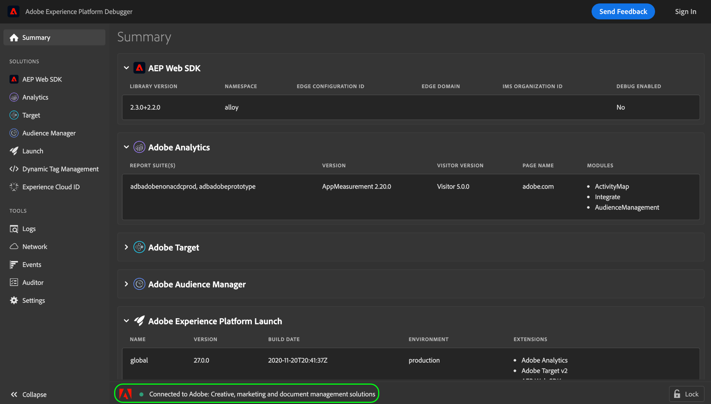
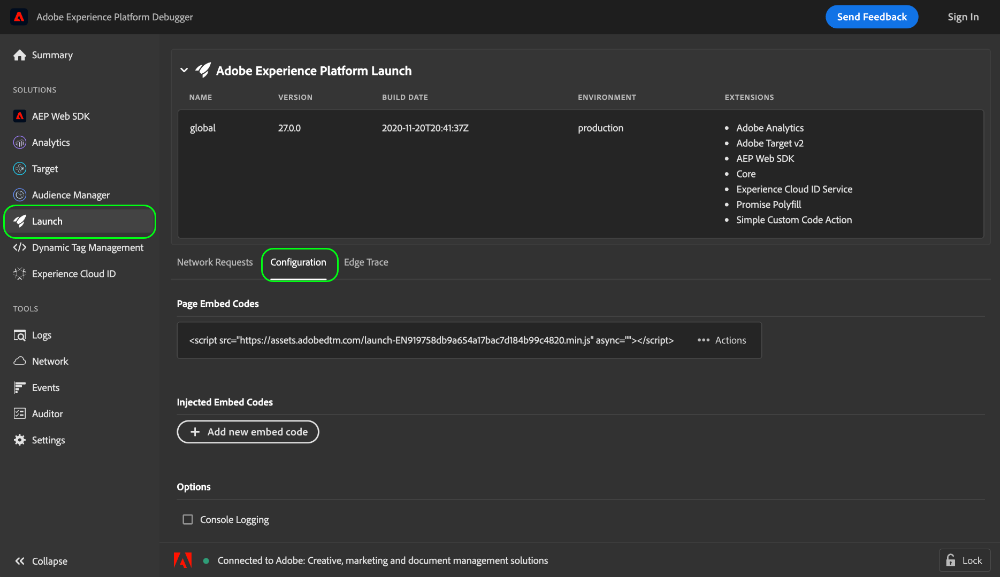

# Testa inbäddningskoder med Adobe Experience Platform Debugger

>[!NOTE]
>
>Adobe Experience Platform Launch har omprofilerats till en serie tekniker för datainsamling i Adobe Experience Platform. Som ett resultat av detta har flera terminologiska förändringar genomförts i produktdokumentationen. Se följande [dokument](../../term-updates.md) för en konsoliderad referens av terminologiändringarna.

När du gör ändringar i kodbiblioteksbyggen i Adobe Experience Platform bör du testa dessa ändringar innan du distribuerar bygget till din produktionsmiljö. Om du inte har någon dedikerad staging- eller utvecklingsmiljö för din webbplats kan du använda Adobe Experience Platform Debugger för att lokalt testa olika inbäddningskoder för din webbplats.

## Förhandskrav

Den här självstudiekursen kräver en fungerande förståelse för hur du använder miljöer och bäddar in koder för taggar. Mer information finns i [miljööversikten](./environments.md).

Den här självstudien kräver även att du har webbläsartillägget Experience Platform Debugger installerat. Experience Platform Debugger finns för Chrome webbläsare. Använd följande länk för att installera tillägget innan du startar självstudiekursen:

* [Experience Platform Debugger for Chrome](https://chrome.google.com/webstore/detail/adobe-experience-platform/bfnnokhpnncpkdmbokanobigaccjkpob)

## Öppna Experience Platform Debugger på din webbplats

Använd valfri webbläsare för att navigera till webbplatsen och öppna Experience Platform Debugger-tillägget. Den webbplats som Experience Platform Debugger är ansluten till visas längst ned i fönstret. Om taggar för närvarande körs på din plats visas den på fliken [!UICONTROL Summary].

>[!NOTE]
>
>Om Experience Platform Debugger inte ansluter från början kan du behöva läsa in webbläsarfliken som visar webbplatsen igen innan du försöker igen.

## Ersätt inbäddningskoder

När Experience Platform Debugger har anslutit till din webbplats väljer du **[!UICONTROL Launch]** i den vänstra navigeringen. Här kan du se information om den biblioteksbygge som för närvarande körs på din plats, inklusive dess miljö och tillhörande tillägg. Här väljer du **[!UICONTROL Configuration]** om du vill visa kontroller för att hantera inbäddningskoder.

Under [!UICONTROL Page Embed Codes] visas den inbäddningskod som används för din webbplats. Välj **[!UICONTROL Actions]** till höger om inbäddningskoden och välj sedan **[!UICONTROL Replace]**.

En pover visas som uppmanar dig att ange en inbäddningskod som ersätter den aktuella koden med. Observera att om du ersätter inbäddningskoden med Experience Platform Debugger ändras inte den inbäddningskod som distribueras på din webbplats. I stället ersätter den bara den inbäddade koden som körs lokalt så att du kan testa och felsöka implementeringen av den.

Klistra in den inbäddningskod som du vill testa i textrutan och välj sedan **[!UICONTROL Apply]**.

Fliken **[!UICONTROL Configuration]** visas igen och visar att den inbäddade koden har ersatts med den som du angav. Du kan nu använda webbläsaren för att se om den inbäddningskod som du testar fungerar som förväntat.

## Nästa steg

I den här självstudien beskrivs hur du lokalt byter inbäddningskoder för testning med Experience Platform Debugger. Mer information om de olika funktionerna finns i [Experience Platform Debugger-dokumentationen](../../../debugger/home.md).
