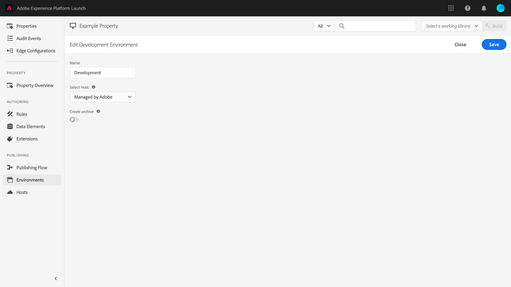
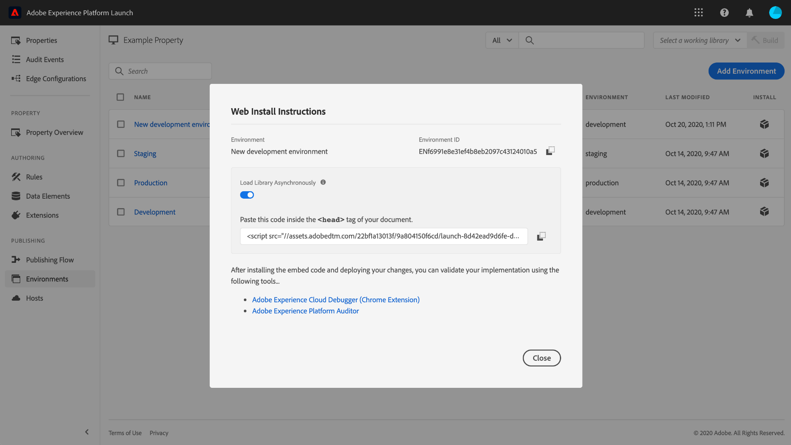

# Miljöer

>[!NOTE]
>
>Adobe Experience Platform Launch har omklassificerats som en serie datainsamlingstekniker i Adobe Experience Platform. Som ett resultat av detta har flera terminologiska förändringar införts i produktdokumentationen. I följande [dokument](../../term-updates.md) finns en konsoliderad referens till de ändrade terminologin.

Taggmiljöer definierar flera viktiga aspekter av de biblioteksbyggen som du distribuerar på din webbplats eller i din app:

* Budets filnamn.
* Domänen och sökvägen för bygget, beroende på miljöns tilldelade värd.
* Filformatet för bygget, beroende på vilket arkivalternativ som har valts.

När du skapar en biblioteksversion måste du tilldela den till en miljö. Byggnadens tillägg, regler och dataelement kompileras sedan och placeras i den tilldelade miljön. Varje miljö har en unik inbäddningskod som gör att du kan integrera den tilldelade inbäddningen på din plats.

Olika artefakter kan finnas i varje miljö. På så sätt kan du testa olika bibliotek i olika miljöer när du kör dem i ditt arbetsflöde.

Det här dokumentet innehåller anvisningar om hur du installerar, konfigurerar och skapar olika miljöer i användargränssnittet för datainsamling.

## Miljötyper

Taggar har stöd för tre olika miljötyper, som alla motsvarar olika lägen i [publiceringsarbetsflödet](./publishing-flow.md):

| Miljötyp | Beskrivning |
| --- | --- |
| Utveckling | Den här miljön motsvarar kolumnen **Utveckling** i publiceringsarbetsflödet. |
| Mellanlagring | Den här miljön motsvarar kolumnerna **Skickat** och **Godkänt** i publiceringsarbetsflödet. |
| Produktion | Den här miljön motsvarar kolumnen **Publicerad** i publiceringsarbetsflödet. |

Olika artefakter kan finnas i varje miljö. På så sätt kan du testa olika bibliotek i olika miljöer samtidigt som du använder dem i publiceringsarbetsflödet.

>[!NOTE]
>
>Varje miljö kan bara tilldelas en biblioteksversion åt gången. Men man förväntar sig att en enda miljö kommer att innehålla många olika byggen över tiden när man flyttar dem genom publiceringsarbetsflödet och vid behov omfördelar byggen mellan olika miljöer.

## Installation {#installation}

Varje miljö har en uppsättning instruktioner som används för att ansluta den till ditt program. För webbegenskaper innehåller dessa instruktioner inbäddningskoder. För mobila egenskaper innehåller dessa instruktioner den kod som krävs för att instansiera biblioteken som du använder och hämta konfigurationen vid körning.

>[!IMPORTANT]
>
>Varje miljötyp har sina egna motsvarande installationsanvisningar. Beroende på vilken miljö du använder måste du se till att du använder rätt inbäddningskoder och/eller beroenden.
>
>Produktionens inbäddningskod för en webbegenskap stöder webbläsarcachelagring, medan inbäddningskoderna för utveckling och staging inte gör det. Därför bör du inte använda utvecklingskoder eller mellanlagringsinbäddningskoder i hög trafik- eller produktionskontext.

Om du vill få tillgång till installationsinstruktionerna för en miljö går du till fliken **[!UICONTROL Environments]** för egenskapen och väljer sedan ikonen **[!UICONTROL Install]** för den miljön.

Om du använder en webbegenskap får du en inbäddningskod som ska användas i taggen `<head>` i dokumentet. Du får också möjlighet att distribuera biblioteksfiler synkront eller asynkront vid körning. Beroende på vilken inställning du väljer visas olika installationsanvisningar. Inbäddningskoder förklaras närmare senare i det här dokumentet.

Om du använder en mobil egenskap får du separata instruktioner för hur du installerar beroenden för Android (via [Gradle](https://gradle.org/)) och iOS (via [CocoaPods](https://cocoapods.org/)).

## Mobilkonfiguration

För mobila egenskaper kan du visa konfigurationsalternativen för en miljö genom att välja den i listan. Härifrån kan du ändra namnet på miljön. I mobilmiljöer kan för närvarande endast värdar som hanteras av Adobe användas.

Mer information finns i översikten på [värdar](./hosts/hosts-overview.md).

## Webbkonfiguration

Inställningarna från den tilldelade miljön avgör följande för webbegenskaper:

* **Värd**: Den serverplats där du vill att din version ska distribueras.
* **Arkivinställning**: Anger om systemet ska skapa en distributionsbar uppsättning filer eller låta dem komprimeras i ett arkivformat.
* **Bädda in kod**: Den `<script>`-kod som ska bäddas in HTML på webbplatsens sidor, som används för att distribuera biblioteksbygget vid körning.

På fliken [!UICONTROL Environments] väljer du en listad miljö för att visa dess konfigurationskontroller.

### Värd {#host}

Välj **[!UICONTROL Host]** om du vill välja en förkonfigurerad värd för miljön i listrutan.

När ett bygge skapas levereras det till den plats som du angav för den tilldelade värden. Mer information om hur du skapar och konfigurerar taggvärdar finns i [värdöversikten](./hosts/hosts-overview.md).

### Arkivinställning {#archive}

De flesta byggen består av flera filer. Flerfilsbyggen innehåller en huvudbiblioteksfil (länkad i inbäddningskoden) som innehåller interna referenser till andra filer som hämtas in efter behov.

Med knappen **[!UICONTROL Create archive]** kan du växla systemens arkivinställning. Som standard är arkivalternativet inaktiverat och bygget levereras i ett format som körs i befintligt skick (JavaScript för webbegenskaper och JSON för mobilegenskaper).

Om du aktiverar arkivinställningen visas ytterligare konfigurationsinställningar i användargränssnittet, vilket gör att du kan kryptera arkivfilen och definiera en sökväg till biblioteket om du använder självbetjäning.

Sökvägen kan vara antingen en fullständig URL eller en relativ sökväg som kan användas i flera domäner. Detta är viktigt eftersom de flesta byggen har flera filer som innehåller interna referenser till varandra.

Om du använder arkivalternativet levereras alla byggfiler som en ZIP-fil i stället. Detta kan vara användbart om:

1. Du är själv värd för biblioteket men vill inte konfigurera en SFTP-värd för leverans.
1. Du måste köra kodanalys på bygget före distributionen.
1. Du vill bara titta på bygginnehållet för att se vad det innehåller.

### Bädda in kod {#embed-code}

En inbäddningskod är en `<script>`-tagg som måste placeras i `<head>` -avsnitten på webbplatsens sidor för att koden som du skapar ska kunna läsas in och köras. Varje miljökonfiguration genererar automatiskt sin egen inbäddningskod, så du behöver bara kopiera och klistra in den på din plats på de sidor där du vill att taggar ska köras.

När du visar installationsinstruktionerna kan du välja att skriptet ska läsa in biblioteksfilerna synkront eller asynkront. Den här inställningen är inte beständig och återspeglar inte hur du har implementerat taggar på din plats. Istället är det bara tänkt att visa rätt sätt att installera miljön.

>[!WARNING]
>
>Beroende på innehållet i taggbiblioteket kan beteendet för reglerna och andra element ändras mellan synkron och asynkron distribution. Det är därför viktigt att noggrant testa eventuella ändringar du gör.

#### Asynkron distribution

Asynkron distribution gör att webbläsaren kan fortsätta läsa in resten av sidan medan biblioteket hämtas. Det finns bara en inbäddningskod när den här inställningen används, som måste placeras i dokumentet `<head>`.

Mer information om den här inställningen finns i guiden om [asynkron distribution](../client-side/asynchronous-deployment.md).

#### Synkron distribution

När webbläsaren läser en inbäddningskod med synkron distribution, hämtas taggbiblioteket och körs innan sidan läses in.

Synkrona inbäddningskoder består av två `<script>`-taggar som måste placeras HTML på webbplatsen. En `<script>`-tagg måste placeras i dokumentet `<head>`, medan den andra måste placeras precis före den avslutande `</body>`-taggen.

#### Bädda in koduppdateringar

Eftersom inbäddningskoder genereras baserat på dina miljökonfigurationer, kommer vissa konfigurationsändringar automatiskt att uppdatera inbäddningskoden för miljön i fråga. Bland dessa ändringar finns:

* Byta från en värddator som hanteras av Adobe till en SFTP-värd, eller vice versa.
* Ändra arkivinställningen.
* Uppdaterar sökvägsfältet om arkivinställningen är aktiverad.

>[!WARNING]
>
>När inbäddningskoden för en taggmiljö ändras måste du uppdatera inbäddningskoderna i HTML manuellt. För att undvika kostsamt underhåll bör du bara uppdatera inbäddningskoderna när det är absolut nödvändigt.

## Skapa en miljö

Tre miljöer tilldelas automatiskt till en egenskap när egenskapen skapas: utveckling, staging och produktion. Detta räcker för att köra publiceringsarbetsflödet. Om du vill kan du dock lägga till ytterligare utvecklingsmiljöer, eftersom detta kan vara användbart för större team där flera utvecklare arbetar med olika projekt samtidigt.

Välj **[!UICONTROL Add Environment]** på fliken [!UICONTROL Environments] för egenskapen.

På nästa skärm väljer du alternativet **[!UICONTROL Development]**.

På nästa skärm kan du namnge den nya miljön, välja en värd och välja en arkivinställning. När du är klar väljer du **[!UICONTROL Save]** för att skapa miljön.

Fliken [!UICONTROL Environments] visas igen och installationsanvisningarna för den nya miljön visas.

## Nästa steg

Genom att läsa det här dokumentet bör du ha en fungerande förståelse för hur du konfigurerar miljöer i användargränssnittet och installerar dem på din webbplats eller i din app. Nu kan du börja publicera dina biblioteksbyggen.

När du publicerar versioner av ditt bibliotek över tid kan du behöva spåra och arkivera tidigare versioner för felsökning och återställning. Mer information finns i guiden [Publicera om äldre bibliotek](./republish.md).
