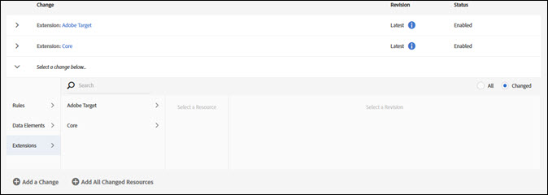

# Bibliotek

>[!NOTE]
>
>Adobe Experience Platform Launch har omklassificerats som en serie datainsamlingstekniker i Adobe Experience Platform. Som ett resultat av detta har flera terminologiska förändringar införts i produktdokumentationen. Se följande [dokument](../../term-updates.md) för en konsoliderad hänvisning till terminologiska förändringar.

Ett bibliotek är en uppsättning instruktioner för hur tillägg, dataelement och regler interagerar med varandra när de har distribuerats. När du skapar ett bibliotek anger du vilka ändringar du vill göra i biblioteket. Vid byggtillfället kombineras dessa ändringar med allt som har skickats, godkänts eller publicerats i tidigare bibliotek.

Biblioteken innehåller tillägg eller borttagning av:

* Regler
* Element
* Tilläggskonfiguration

Bibliotek måste tilldelas till en miljö innan de kan kompileras till ett bygge. Bibliotek godkänns eller refuseras som helhet. Du kan inte godkänna eller avvisa enskilda objekt i ett bibliotek. Ett bibliotek rör sig mellan flera miljöer när det går genom publiceringsarbetsflödet.

## Skapa ett bibliotek {#create-a-library}

Så här skapar du ett bibliotek:

1. Öppna [!UICONTROL Publishing] -fliken.

   The [!UICONTROL Publishing] På sidan visas Dev-biblioteken och du kan skicka in dem för godkännande, flytta dem till mellanlagring eller publicera dem i produktion.

1. Välj **[!UICONTROL Add New Library]**.

   

1. Namnge biblioteket.
1. Tilldela biblioteket till en Dev-miljö.
1. Lägg till en ändring i biblioteket.
Om du vill lägga till ett objekt väljer du **[!UICONTROL Add a Change]** väljer du sedan de objekt som du vill lägga till. Alla objekt som har redigerats eller tagits bort kan läggas till i det valda biblioteket.

   

   Du kan lägga till följande i ditt bibliotek:

   * Regler
   * Dataelement
   * Tilläggskonfigurationer

1. Om du vill lägga till resurser som har ändrats väljer du **[!UICONTROL Add All Changed Resources]**.
1. Välj **[!UICONTROL Save]** eller **[!UICONTROL Save and Build for Development]**.

   Distribuering kompilerar en bygge och distribuerar den till den tilldelade miljön.

När ett bibliotek har skapats använder du listrutan för det biblioteket för att välja något av följande alternativ:

* **Redigera**: Med det här alternativet kan du ändra bibliotekskonfigurationen.

* **Bygg för utveckling**: Det här alternativet kompilerar en bygge och distribuerar den till den tilldelade miljön.

* **Skicka för godkännande**: Med det här alternativet blir biblioteket tillgängligt för en godkännare så att det kan flyttas till nästa steg i publiceringsprocessen.

* **Ta bort**: Det här alternativet tar bort det markerade biblioteket från publiceringsprocessen.

## Lägg till i ett bibliotek {#add-to-a-library}

Om du vill lägga till i ett bibliotek utför du följande steg.

1. Installera [tillägg](../managing-resources/extensions/overview.md) du vill lägga till.
1. Skapa [dataelement](../managing-resources/data-elements.md) och regler som du vill lägga till.
1. Öppna **[!UICONTROL Publishing]** -fliken.
1. Välj [bibliotek](libraries.md) du vill ändra och sedan markera **[!UICONTROL Edit]**.
1. Använd knapparna för regler, dataelement och tillägg för att markera de objekt som du vill lägga till i biblioteket.
1. Spara ändringarna.

Ändringar i biblioteket visas i ändringsloggen för bibliotekets innehåll.

>[!NOTE]
>
>Dataelement kan vara beroende av tillägg. Regler kan vara beroende av både dataelement och tillägg. Om du inte inkluderar alla nödvändiga komponenter i biblioteket kommer bygget att misslyckas vid byggtillfället och du måste lägga till de nödvändiga komponenterna innan du slutför en lyckad version. En framtida version kontrollerar beroenden när du gör ändringar i ett bibliotek.

## Ta bort från ett bibliotek

Om du vill ta bort något från ett bibliotek måste du inaktivera det och sedan publicera det inaktiverade läget.

1. Inaktivera de tillägg som du vill ta bort, tillsammans med eventuella dataelement och regler som är beroende av dessa tillägg.
1. Inaktivera de dataelement och regler som du vill ta bort.
1. Öppna **[!UICONTROL Publishing]** -fliken.
1. Markera det bibliotek som du vill ändra.
1. Använd knapparna för regler, dataelement och tillägg för att markera de inaktiverade objekt som du vill ta bort från biblioteket.
1. Spara ändringarna.

## Hantera biblioteksändringar

Om du vill redigera biblioteksalternativen utför du följande steg.

1. Välj ett bibliotek och markera **[!UICONTROL Edit]** för att visa biblioteksändringar. Alla ändringar visas i [!UICONTROL Library Contents] lista.

   

1. Markera en ändring som du vill visa och markera en revision.

   

1. Välj om du vill visa **Alla** objekt eller **Ändrad** objekt.
1. Markera revisionen och välj sedan **[!UICONTROL Select Revision]**.
1. Välj antingen **[!UICONTROL Add a Change]** eller **[!UICONTROL Add All Changed Resources]**.

## Aktivt bibliotek {#active-library}

Biblioteken innehåller en uppsättning ändringar som du vill göra i din distribuerade kod. Active Library gör detta enklare så att du snabbt kan iterera igenom ändringarna och se effekten.

Tillägg, regler och dataelement kan nu sparas direkt i det bibliotek du arbetar i. Om det behövs kan en ny version också skapas eller till och med ett nytt bibliotek från [!UICONTROL Active Library] nedrullningsbar meny.

Följande lista innehåller mer information om hur du hanterar ett aktivt bibliotek.

1. [Skapa ett nytt bibliotek](libraries.md#create-a-library).
1. Gå till [Regler](../managing-resources/rules.md), [Dataelement](../managing-resources/data-elements.md), eller [Tillägg](../managing-resources/extensions/overview.md).
1. Välj ditt aktiva bibliotek.
1. Gör ändringarna och spara och bygg sedan biblioteket.
1. Testa ändringarna och upprepa stegen efter behov.
