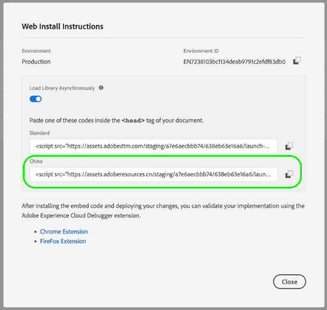

# Förstklassigt CDN-stöd för taggar (beta)

>[!IMPORTANT]
>
>Den premiumbaserade CDN-funktionen för taggar finns för närvarande i betaversionen och din organisation har kanske inte tillgång till den ännu. Dokumentationen kan komma att ändras.

När du använder en [värddator som hanteras av Adobe](./hosts/managed-by-adobe-host.md) för att kunna leverera dina Adobe Experience Platform-taggar på din webbplats, distribueras dessa resurser till olika leveransnätverk runt om i världen för att ge snabbast nedladdningshastighet. Det finns dock vissa regioner som kräver att alla webbplatsresurser ska replikeras och lagras på en server i den regionen.

För att ta hänsyn till detta har taggar i Experience Platform en premiumfunktion för CDN som gör att du kan leverera innehåll till dessa specialregioner.

Premium CDN-support är en betalfunktion och måste köpas av din organisation för att kunna aktivera och använda den. I den här guiden beskrivs hur du konfigurerar och använder funktionen i användargränssnittet för Experience Platform eller datainsamling när du har köpt den.

## Aktivera premium-CDN för din organisation

Premium-CDN är aktiverat på företagsnivå. När din organisation har köpt den premiumbaserade CDN-funktionen aktiverar en Adobe-administratör funktionen i användargränssnittet för ditt företag.

## Återskapa och installera taggbibliotek med uppdaterade inbäddningskoder

När du har aktiverat Premium CDN betyder det inte att dina taggresurser omedelbart replikeras och är klara att användas i de nya regionerna. Det betyder bara att du nu kan välja när du vill använda den här funktionen.

>[!IMPORTANT]
>
>Bibliotek som byggts innan CDN aktiveras fortsätter att fungera som de gör idag. Detta gäller även bibliotek som inte hanteras av Adobe, eftersom [arkiverade miljöer](./environments.md#archive) Använd bara relativa URL:er för sina resurssökvägar. Observera att när du har aktiverat Premium CDN fungerar alla bibliotek som du skapar och som inte hanteras av Adobe som om premiumfunktionen för CDN inte är aktiverad.

När du har aktiverat premium CDN och återskapat bibliotek som du vill använda från de nya värdregionerna kan du hämta de nya inbäddningskoderna för värdregioner som du vill lägga till på dina webbplatser.

>[!NOTE]
>
>Bibliotekets inbäddningskod som visas under [!UICONTROL Standard] Värdregionen kommer att fortsätta fungera som den är, liksom alla inbäddningskoder för Sidbörjan eller Sidslutet som redan finns på dina webbplatser.

Besök **[!UICONTROL Environments]** eller visa installationsanvisningarna för miljön från bibliotekets redigeringsskärm för att hitta de nya inbäddningskoderna. Varje nytt värdregion som stöds visas efter [!UICONTROL Standard] värdregion (används för områden i världen som stöds utan premiumCDN). På skärmbilden nedan visas en inbäddningskod för regionen Kina som använder `.cn` som toppnivådomän (TLD).

Välj lämplig inbäddningskod för webbsidan och klistra in den i `<head>` -taggen i dokumentet. Mer information om hur du använder inbäddningskoder för att installera taggbibliotek finns i [användargränssnittsguide för miljöer](./environments.md#installation).

## Nästa steg

I den här guiden beskrivs hur du aktiverar och installerar den premiumbaserade CDN-funktionen för taggimplementeringen. Mer information om hur du installerar och testar taggbibliotek på dina webb- och mobilegenskaper finns i [publicera översikt](./overview.md).
