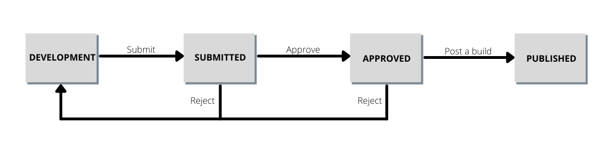

# Publiceringsflöde

>[!NOTE]
>
>Adobe Experience Platform Launch har omklassificerats som en serie datainsamlingstekniker i Adobe Experience Platform. Som ett resultat av detta har flera terminologiska förändringar införts i produktdokumentationen. Se följande [dokument](../../term-updates.md) för en konsoliderad hänvisning till terminologiska förändringar.

Taggpubliceringsflödet i Adobe Experience Platform avser processen att skapa bibliotek, testa byggen och godkänna dem för produktion.

Vilka åtgärder du kan utföra i ett bibliotek beror på bibliotekets tillstånd och vilken behörighetsnivå du har. Dessutom påverkar ett biblioteks tillstånd även de resurser som det innehåller (regler, dataelement och tillägg) beroende på vad som är uppströms i publiceringsflödet.

Avsnitten nedan innehåller information om behörigheter, bibliotekstillstånd och det överordnade flödet när det gäller publiceringsflödet.

## Behörigheter {#permissions}

Det finns olika behörighetsnivåer som är viktiga för publiceringsflödet. särskilt [!UICONTROL Develop], [!UICONTROL Approve]och [!UICONTROL Publish] egenskapsrättigheter:

* **[!UICONTROL Develop]**: Innehåller möjlighet att skapa bibliotek, bygga för utveckling och skicka in för godkännande.
* **[!UICONTROL Approve]**: Inkluderar möjligheten att bygga för mellanlagring och godkänna mellanlagrade byggen.
* **[!UICONTROL Publish]**: Innehåller möjlighet att publicera ett godkänt bibliotek.

Dessa rättigheter är inte inkluderande. För att en person ska kunna utföra arbetsflödet från början till slut måste den personen beviljas alla tre rättigheterna inom en viss egenskap.

Se [användarbehörighetshandbok](../administration/user-permissions.md) om du vill ha mer information om hur du hanterar behörigheter för taggar.

## Biblioteksläge {#state}

När det gäller publiceringsflödet finns det fyra grundläggande lägen för ett bibliotek:

* [[!UICONTROL Development]](#development)
* [[!UICONTROL Submitted]](#submitted)
* [[!UICONTROL Approved]](#approved)
* [[!UICONTROL Published]](#published)

Dessa fyra lägen representeras som kolumner i **[!UICONTROL Publishing Flow]** i användargränssnittet för datainsamling.

Specifika åtgärder måste vidtas för att flytta ett bibliotek mellan dessa lägen. I följande diagram visas varje åtgärd som flyttar ett bibliotek mellan lägen:

### [!UICONTROL Development] {#development}

När nya bibliotek skapas börjar de i [!UICONTROL Development] tillstånd. Alla ändringar i ett bibliotek måste göras medan biblioteket finns i [!UICONTROL Development]. När utveckling och testning är slutförda kan biblioteket skickas för godkännande.

Följande tabell visar de tillgängliga åtgärderna för ett bibliotek i [!UICONTROL Development] läge:

| Åtgärd | Beskrivning |
| --- | --- |
| [!UICONTROL Edit] | Använd [!UICONTROL Edit Library] för att lägga till eller ta bort komponenter från biblioteket. |
| [!UICONTROL Build to Development] | Skapa ett bygge för biblioteket. Bygget kompileras och distribueras till den miljö som biblioteket är tilldelat. Det här steget misslyckas om biblioteket inte har tilldelats en miljö eller innehåller en ändring som redan har definierats i det överordnade flödet. |
| [!UICONTROL Submit for Approval] | Ta bort tilldelningen av biblioteket från utvecklingsmiljön och flytta biblioteket till [!UICONTROL Submitted] -kolumn för en användare med godkännandebehörigheter att arbeta med. Den senaste versionen av biblioteket måste slutföras för att det här alternativet ska kunna aktiveras. |
| [!UICONTROL Submit & Build to Staging] | Detta kan bara utföras av en användare med både utvecklings- och godkännanderättigheter. Den här åtgärden tar bort tilldelningen av biblioteket från utvecklingsmiljön och flyttar biblioteket till [!UICONTROL Submitted] och skapar biblioteket i staging-miljön. Den senaste versionen av biblioteket måste slutföras för att det här alternativet ska kunna aktiveras. |
| [!UICONTROL Approve for Publishing] | Detta kan bara utföras av en användare med både utvecklings- och godkännanderättigheter. Den här åtgärden tar bort tilldelningen av biblioteket från utvecklingsmiljön och flyttar det till [!UICONTROL Approved] tillstånd - hoppa över mellanlagringsmiljön och [!UICONTROL Submitted] anges helt. Den senaste versionen av biblioteket måste slutföras för att det här alternativet ska kunna aktiveras. |
| [!UICONTROL Approve & Publish to Production] | Detta kan bara utföras av en användare med behörigheterna Framkalla, Godkänn och Publicera. Den här åtgärden tar bort tilldelningen av biblioteket från utvecklingsmiljön och flyttar det till [!UICONTROL Approved] och publicerar i produktion. När produktionen är klar går biblioteket vidare till [!UICONTROL Published] tillstånd. Den senaste versionen av biblioteket måste slutföras för att det här alternativet ska kunna aktiveras. |
| [!UICONTROL Delete] | Ta bort biblioteket från systemet. Detta tar inte bort bygget från miljön. |

### [!UICONTROL Submitted] {#submitted}

När ett bibliotek finns i [!UICONTROL Submitted] kan en användare med godkännandebehörighet testa biblioteket i mellanlagringsmiljön. När testningen är klar kan biblioteket godkännas eller avvisas. Avvisade byggen går tillbaka till [!UICONTROL Development] så att ytterligare ändringar kan göras innan publiceringsflödet startas om.

Följande tabell visar de tillgängliga åtgärderna för ett bibliotek i [!UICONTROL Submitted] läge:

| Åtgärd | Beskrivning |
| --- | --- |
| [!UICONTROL Open] | Visa innehållet i biblioteket. Ändringar tillåts inte för bibliotek utanför [!UICONTROL Development] kolumn. Om ändringar behövs bör biblioteket avvisas så att ändringar kan göras i [!UICONTROL Development]. |
| [!UICONTROL Build for Staging] | Bygg biblioteket i testmiljön för distribution. |
| [!UICONTROL Approve for Publishing] | Flytta biblioteket till [!UICONTROL Approved] -kolumn för en användare med publiceringsbehörigheter att arbeta med. |
| [!UICONTROL Approve & Publish to Production] | Detta kan bara utföras av en användare med både behörigheten Godkänn och Publicera. Den här åtgärden tar bort tilldelningen av biblioteket från mellanlagringsmiljön och flyttar det till [!UICONTROL Approved] och publicerar i produktion. När produktionen är klar går biblioteket vidare till [!UICONTROL Published] tillstånd. Detta kan utföras med vår utan att du lyckas bygga i testmiljön. |
| [!UICONTROL Reject] | Ta bort tilldelningen av biblioteket från mellanlagringsmiljön och flytta tillbaka biblioteket till [!UICONTROL Development] kolumn för ytterligare ändringar. |

### [!UICONTROL Approved] {#approved}

När ett bibliotek har godkänts kan en användare med publiceringsbehörighet publicera eller avvisa biblioteket. Avvisade byggen går tillbaka till [!UICONTROL Development] så att ytterligare ändringar kan göras innan publiceringsflödet börjar om.

Följande tabell visar de tillgängliga åtgärderna för ett bibliotek i [!UICONTROL Approved] läge:

| Åtgärd | Beskrivning |
| --- | --- |
| [!UICONTROL Open] | Visa innehållet i biblioteket. Ändringar tillåts inte för bibliotek utanför [!UICONTROL Development] kolumn. Om ändringar behövs bör biblioteket avvisas så att ändringar kan göras i [!UICONTROL Development]. |
| [!UICONTROL Build and Publish to Production] | Ta bort tilldelningen av biblioteket från mellanlagringsmiljön, tilldela biblioteket till produktionsmiljön och distribuera det.  **Viktigt**: När det här alternativet är markerat blir biblioteket levande i produktionsmiljön. Kontrollera att biblioteket innehåller de ändringar du vill ha innan du väljer det här alternativet. |
| [!UICONTROL Reject] | Ta bort tilldelningen av biblioteket från mellanlagringsmiljön och flytta biblioteket till [!UICONTROL Development] kolumn för ytterligare ändringar. |

### [!UICONTROL Published] {#published}

The [!UICONTROL Published] -kolumnen visar vilka bibliotek som har publicerats och deras publiceringsdatum. Det publicerade biblioteket visas med en grön punkt bredvid sig. Om du inte har publicerat om ett tidigare bibliotek visas alltid biblioteket överst i kolumnen.

| Åtgärd | Beskrivning |
| --- | --- |
| [!UICONTROL Open] | Visa innehållet i biblioteket. Ändringar tillåts inte för bibliotek utanför [!UICONTROL Development] kolumn. Om du vill ändra vad som finns i produktionsmiljön måste du skapa ett nytt bibliotek och flytta det genom hela publiceringsprocessen. |
| [!UICONTROL Republish] | Den här åtgärden är endast tillgänglig i de fem senast publicerade biblioteken och endast om produktionsmiljön (A) har konfigurerats med alternativet Arkiv inaktiverat och (b) använder en [!UICONTROL Managed by Adobe] värddator vid tidpunkten för bygget. |
| [!UICONTROL Download] | Den här åtgärden är endast tillgänglig i de fem senast publicerade biblioteken och endast om produktionsmiljön (A) har konfigurerats med alternativet Arkiv aktiverat och (b) använder en [!UICONTROL Managed by Adobe] värddator vid tidpunkten för bygget. |

## Uppströms {#upstream}

När du har publicerat ditt första bibliotek blir det viktigt att förstå den överordnade strömmens roll när du flyttar nyare bibliotek genom publiceringsflödet.

Om ett bibliotek finns på [!UICONTROL Development], [!UICONTROL Submitted], eller [!UICONTROL Approved] på scenen ärver biblioteket reglerna, dataelementen och tilläggen för alla bibliotek som är uppströms. Dessa ärvda resurser utgör en&quot;baslinje&quot; för varje bibliotek när de rör sig genom publiceringsflödet. I grund och botten kan du tänka på varje nytt bibliotek som en serie ändringar av baslinjen som upprättas av det överordnade biblioteket. Detta garanterar att inget oväntat skrivs över från ett tidigare bibliotek när en ny upprepning publiceras.

Vad som ingår i det överordnade flödet beror på bibliotekets aktuella stadium. Bibliotek i [!UICONTROL Approved] ärver endast resurser från [!UICONTROL Published] bibliotek, medan bibliotek under [!UICONTROL Development] ärver resurser från alla andra kolumner.

När du redigerar ett bibliotek i användargränssnittet för datainsamling visas alla resurser som ärvs från det överordnade flödet i **[!UICONTROL Resources Upstream]** -avsnitt. Om du vill visa resurserna väljer du fliken Expandera under avsnittsrubriken.

Avsnittet expanderas och visar de enskilda resurser som ärvs från det överordnade flödet. Du kan använda den vänstra listen för att filtrera mellan [!UICONTROL Rules], [!UICONTROL Data Elements]och [!UICONTROL Extensions]eller använd sökfältet för att söka efter en specifik resurs efter namn.

## Nästa steg

Den här guiden ger en översikt över publiceringsflödet för bibliotek i Adobe Experience Platform. Mer information om hur du publicerar dina bibliotek finns i [publicera översikt](./overview.md).
