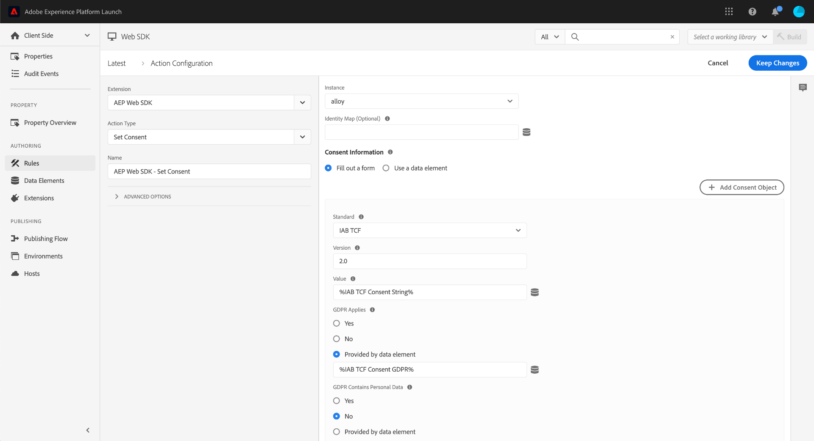

# Integrera stödet för IAB TCF 2.0 med taggar och Experience Platform Web SDK-tillägget

Adobe Experience Platform Web SDK stöder Interactive Advertising Bureau Transparency &amp; Consent Framework, version 2.0 (IAB TCF 2.0). Den här guiden visar hur du ställer in en taggegenskap för att skicka IAB TCF 2.0-medgivandeinformation till Adobe med taggtillägget Adobe Experience Platform Web SDK.

Om du inte vill använda taggar läser du i guiden för [att använda IAB TCF 2.0 utan taggar](./without-tags.md).

## Komma igång

Om du vill använda IAB TCF 2.0 med taggar och Experience Platform Web SDK-tillägget måste du ha ett XDM-schema och en datauppsättning tillgänglig.

Dessutom krävs det att du har en fungerande förståelse för Adobe Experience Platform Web SDK. Läs [Adobe Experience Platform Web SDK overview](../../home.md) och [Vanliga frågor och svar](../../faq.md) om du vill få en snabb uppdatering.

## Ange standardsamtycke

I tilläggskonfigurationen finns en inställning för standardsamtycke. Detta styr beteendet för kunder som inte har någon cookie för samtycke. Om du vill placera Experience Events i kö för kunder som inte har någon cookie för samtycke anger du det här till `pending`. Om du vill ignorera Experience Events för kunder som inte har någon medgivandecookie anger du värdet `out`. Du kan också använda ett dataelement för att dynamiskt ange standardvärdet för samtycke. Mer information finns i [`defaultConsent`](/help/web-sdk/commands/configure/defaultconsent.md).

## Uppdatera profil med medgivandeinformation {#consent-code-1}

Om du vill anropa åtgärden [`setConsent`](/help/web-sdk/commands/setconsent.md) när dina kunders medgivandeinställningar har ändrats skapar du en taggregel. Börja med att lägga till en ny händelse och välj händelsetypen för Core-tillägget&quot;Custom Code&quot;.

Använd följande kodexempel för den nya händelsen:

```javascript
// Wait for window.__tcfapi to be defined, then trigger when the customer has completed their consent and preferences.
function addEventListener() {
  if (window.__tcfapi) {
    window.__tcfapi("addEventListener", 2, function (tcData, success) {
      if (success && tcData.eventStatus === "useractioncomplete") {
        // save the tcData.tcString in a data element
        _satellite.setVar("IAB TCF Consent String", tcData.tcString);
        _satellite.setVar("IAB TCF Consent GDPR", tcData.gdprApplies);
        trigger();
      }
    });
  } else {
    // window.__tcfapi wasn't defined. Check again in 100 milliseconds
    setTimeout(addEventListener, 100);
  }
}
addEventListener();
```

Den här anpassade koden gör två saker:

* Ställer in två dataelement, ett med medgivandesträngen och ett med flaggan `gdprApplies`. Detta är användbart senare när du fyller i åtgärden Ange samtycke.

* Startar regeln när medgivandeinställningarna har ändrats. Åtgärden Ange samtycke ska användas när medgivandeinställningarna har ändrats. Lägg till åtgärden &quot;Ange samtycke&quot; i tillägget och fyll i formuläret enligt följande:

* Standard: &quot;IAB TCF&quot;
* Version: &quot;2.0&quot;
* Värde: &quot;%IAB TCF Consent String%&quot;
* GDPR gäller: &quot;%IAB TCF-samtycke GDPR%&quot;



>[!IMPORTANT]
>
>Du kan inte välja dessa dataelement med hjälp av dataelementväljaren eftersom de skapades med anpassad kod. Du måste ange ett procenttecken i dataelementnamnet. Den här koden uppdaterar kundens profil med de nya medgivandeinställningarna så snart de ändras. Dessutom returnerar servern ett cookie-värde som kan förhindra att Adobe Experience Platform Web SDK spelar in Experience Events.

## Skapa ett XDM-dataelement för Experience Events

Medgivandesträngen ska inkluderas i XDM Experience Event. Använd XDM-objektets dataelement för att göra detta. Börja med att skapa ett nytt XDM-objektdataelement, eller använd ett som du redan har skapat för att skicka händelser. Om du har lagt till fältgruppen Experience Event Privacy i ditt schema bör du ha en `consentStrings`-nyckel i XDM-objektet.

1. Välj **[!UICONTROL consentStrings]**.

1. Välj **[!UICONTROL Provide individual items]** och välj **[!UICONTROL Add Item]**.

1. Expandera rubriken **[!UICONTROL consentString]**, expandera det första objektet och fyll sedan i följande värden:

* `consentStandard`: IAB TCF
* `consentStandardVersion`: 2.0
* `consentStringValue`: %IAB TCF Consent String%
* `gdprApplies`: %IAB TCF Consent GDPR%

>[!IMPORTANT]
>
>Du kan inte välja dessa dataelement med hjälp av dataelementväljaren eftersom de skapades med anpassad kod. Du måste ange ett procenttecken i dataelementnamnet.

## Skicka en inledande Experience Event med IAB TCF 2.0-medgivandeinformation

Om den inledande Experience Event-händelsen på sidan utlöses med en sidinläsningshändelse, har medgivandesträngen kanske inte lästs in ännu. Den här regeln är avsedd att ersätta den aktuella sidans inläsningshändelse. Om du vill vara säker på att godkännandeinformationen först läses in skapar du en ny regel och lägger till följande kod som en anpassad kodhändelse:

```javascript
// Wait for window.__tcfapi to be defined, then trigger when there is a consent string
function addEventListener() {
  if (window.__tcfapi) {
    window.__tcfapi("addEventListener", 2, function (tcData, success) {
      if (success && (tcData.eventStatus === "useractioncomplete" || tcData.eventStatus === "tcloaded")) {
        // save the tcData.tcString in a data element
        _satellite.setVar("IAB TCF Consent String", tcData.tcString);
        _satellite.setVar("IAB TCF GDPR Applies", tcData.gdprApplies);
        trigger();
      }
    });
  } else {
    // window.__tcfapi wasn"t defined. Check again in 100 milliseconds
    setTimeout(addEventListener, 100);
  }
}
addEventListener();
```

Den här koden är identisk med den tidigare anpassade koden, förutom att både `useractioncomplete`- och `tcloaded`-händelser hanteras. Den [föregående anpassade koden](#consent-code-1) utlöses bara när kunden väljer sina inställningar för första gången. Den här koden utlöses också när kunden redan har valt sina inställningar. På den andra sidan läses till exempel in.

Lägg till en&quot;Skicka händelse&quot;-åtgärd från tillägget Experience Platform Web SDK. I XDM-fältet väljer du XDM-dataelementet som du skapade i föregående avsnitt.

## Skicka andra händelser med IAB TCF 2.0-medgivandeinformation

När händelser utlöses efter den första Experience Event-händelsen definieras de två dataelementen fortfarande och kan användas för att skicka IAB:s medgivandeinformation. Använd samma XDM-dataelement för att skicka framtida händelser. Information om IAB TCF 2.0 ingår.

## Nästa steg

Nu när du har lärt dig att använda IAB TCF 2.0 med Experience Platform Web SDK kan du även integrera med andra Adobe-lösningar som Adobe Analytics och Adobe Real-Time Customer Data Platform. Mer information finns i [Översikt över IAB Transparency &amp; Consent Framework 2.0](./overview.md).
