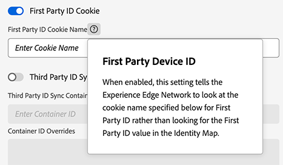

# Använda enhets-ID:n från första part i Web SDK

Adobe Experience Platform Web SDK tilldelar [Adobe Experience Cloud ID:n (ECID:n)](https://experienceleague.adobe.com/docs/experience-platform/identity/ecid.html?lang=sv-SE) till webbplatsbesökare som använder cookies för att spåra användarbeteende. Om du vill åtgärda webbläsarbegränsningar för cookie-livscykler kan du ange och hantera egna enhetsidentifierare, som kallas FPID (First-party device ID).

>[!NOTE]
>
>Stöd för första parts enhets-ID är endast tillgängligt när du skickar data till Experience Platform Edge Network via Web SDK.

>[!IMPORTANT]
>
>Första parts enhets-ID är inte kompatibelt med funktionen [cookies](../../tags/extensions/client/web-sdk/web-sdk-extension-configuration.md#identity) från tredje part i Web SDK. Du kan använda antingen enhets-ID:n från första part eller cookies från tredje part, men inte båda samtidigt.

## Förhandskrav {#prerequisites}

Innan du börjar bör du kontrollera att du är bekant med hur identitetsdata fungerar i Web SDK, inklusive ECID:n och `identityMap`. Mer information finns i översikten över [identitetsdata i Web SDK](./overview.md).

## Krav för formatering av enhets-ID från första part {#formatting-requirements}

Edge Network godkänner endast ID:n som är kompatibla med formatet [UIDv4](https://datatracker.ietf.org/doc/html/rfc4122). Enhets-ID:n som inte är i UUIDv4-format kommer att avvisas.

* [!DNL UUIDs] är unika och slumpmässiga, med en försumbar sannolikhet för kollision.
* [!DNL UUIDv4] kan inte dirigeras med IP-adresser eller annan personligt identifierbar information (PII).
* Bibliotek för att generera [!DNL UUIDs] är tillgängliga för alla programmeringsspråk.

## Ange cookien [!DNL FPID] med din egen server {#set-cookie-server}

När du ställer in en cookie via din egen server kan du använda olika metoder för att förhindra att cookien begränsas på grund av webbläsarprinciper:

* Generera cookies med serverskriptspråk
* Ange cookies som svar på en API-begäran som görs till en underdomän eller annan slutpunkt på webbplatsen
* Generera cookies med en [!DNL CMS]
* Generera cookies med en [!DNL CDN]

Dessutom bör du alltid ange FPID-cookie under domänens `A`-post.

>[!IMPORTANT]
>
>Cookies som anges med JavaScript `document.cookie`-metod kommer nästan aldrig att skyddas från webbläsarprinciper som begränsar cookie-varaktighet.

### När cookien ska ställas in {#when-to-set-cookie}

Cookien [!DNL FPID] bör helst anges innan någon begäran görs till Edge Network. I scenarier där detta inte är möjligt genereras dock [!DNL ECID] fortfarande med befintliga metoder och fungerar som primär identifierare så länge som cookien finns.

Om [!DNL ECID] så småningom påverkas av en princip för borttagning av webbläsare, men [!DNL FPID] inte gör det, kommer [!DNL FPID] att bli den primära identifieraren vid nästa besök och kommer att användas för att dirigera [!DNL ECID] vid varje efterföljande besök.

### Ange förfallodatum för cookien {#set-expiration}

Att ange förfallodatum för en cookie är något som du bör tänka på noga när du implementerar funktionen [!DNL FPID]. När du beslutar om detta bör du ta hänsyn till de länder eller regioner där organisationen arbetar tillsammans med lagstiftningen och policyn i var och en av dessa regioner.

Som en del av det här beslutet kanske du vill anta en företagsomfattande policy för cookie-inställningar eller en som varierar för användare på de olika språkområden där du arbetar.

Oavsett vilken inställning du väljer för den första förfallodagen för en cookie måste du se till att du inkluderar logik som förlänger förfallotiden för cookien varje gång ett nytt besök på webbplatsen inträffar.

## Påverkan av cookie-flaggor {#cookie-flag-impact}

Det finns olika cookie-flaggor som påverkar hur cookies hanteras i olika webbläsare:

* [`HTTPOnly`](#http-only)
* [&quot;Säker&quot;](#secure)
* [&quot;SameSite&quot;](#same-site)

### `HTTPOnly` {#http-only}

Det går inte att komma åt cookies som har angetts med flaggan `HTTPOnly` med skript på klientsidan. Det innebär att om du anger en `HTTPOnly`-flagga när du anger [!DNL FPID] måste du använda ett skriptspråk på serversidan för att läsa cookie-värdet som ska inkluderas i `identityMap`.

Om du väljer att Edge Network ska läsa värdet för cookien [!DNL FPID] kan du genom att ange flaggan `HTTPOnly` se till att värdet inte är tillgängligt för klientskript, men inte har någon negativ inverkan på Edge Network förmåga att läsa cookien.

>[!NOTE]
>
>Användning av flaggan `HTTPOnly` påverkar inte cookie-principerna som kan begränsa cookie-livstiden. Men det är fortfarande något du bör tänka på när du anger och läser värdet för [!DNL FPID].

### `Secure` {#secure}

Cookies som angetts med attributet `Secure` skickas bara till servern med en krypterad begäran via protokollet [!DNL HTTPS]. Om du använder den här flaggan kan du se till att angripare i mitten inte lätt kommer åt värdet på cookien. När det är möjligt är det alltid en bra idé att ange flaggan `Secure`.

### `SameSite` {#same-site}

Med attributet `SameSite` kan servrar avgöra om cookies skickas med förfrågningar mellan webbplatser. Attributet ger visst skydd mot attacker med förfalskning över flera webbplatser. Det finns tre möjliga värden: `Strict`, `Lax` och `None`. Kontakta ditt interna team för att ta reda på vilken inställning som är rätt för din organisation.

Om inget `SameSite`-attribut anges är standardinställningen för vissa webbläsare nu `SameSite=Lax`.

## ID-hierarki {#id-hierarchy}

När både [!DNL ECID] och [!DNL FPID] finns med prioriteras [!DNL ECID] när användaren identifieras. Detta garanterar att när en befintlig [!DNL ECID] finns i webbläsar-cookie-arkivet förblir den primära identifieraren och befintligt antal besökare riskerar inte att påverkas. För befintliga användare blir [!DNL FPID] inte den primära identiteten förrän [!DNL ECID] förfaller eller tas bort som ett resultat av en webbläsarprincip eller manuell process.

Identiteter prioriteras i följande ordning:

1. [!DNL ECID] ingår i `identityMap`
1. [!DNL ECID] lagras i en cookie
1. [!DNL FPID] ingår i `identityMap`
1. [!DNL FPID] lagras i en cookie


## Migrera till enhets-ID:n från första part {#migrating-to-fpid}

Om du migrerar till enhets-ID:n från en tidigare implementering kan det vara svårt att se hur övergången kan se ut på en låg nivå.

För att illustrera den här processen bör du överväga ett scenario där en kund som tidigare besökt din webbplats deltar och vilken inverkan en [!DNL FPID]-migrering skulle ha på hur kunden identifieras i Adobe-lösningar.


>[!IMPORTANT]
>
>Cookien `ECID` prioriteras alltid framför `FPID`.

| Besök | Beskrivning |
| --- | --- |
| Första besök | Anta att du ännu inte har börjat ange cookien [!DNL FPID]. [!DNL ECID] i [AMCV-cookien](https://experienceleague.adobe.com/docs/id-service/using/intro/cookies.html?lang=sv-SE#section-c55af54828dc4cce89f6118655d694c8) är den identifierare som används för att identifiera besökaren. |
| Andra besöket | Rollout of the [!DNL FPID] solution has started. Befintlig [!DNL ECID] finns fortfarande och är fortfarande den primära identifieraren för besökaridentifiering. |
| Tredje besök | Mellan det andra och tredje besöket har det gått tillräckligt lång tid att ta bort [!DNL ECID] på grund av webbläsarprincipen. Eftersom [!DNL FPID] angavs med en [!DNL DNS] [!DNL A]-post kvarstår [!DNL FPID]. [!DNL FPID] betraktas nu som primärt ID och används för att skapa startvärde för [!DNL ECID], som skrivs till slutanvändarens enhet. Användaren skulle nu betraktas som en ny besökare i lösningarna Adobe Experience Platform och Experience Cloud. |
| Fjärde besöket | Mellan det tredje och fjärde besöket har det gått tillräckligt lång tid att ta bort [!DNL ECID] på grund av webbläsarprincipen. Precis som vid det föregående besöket beror [!DNL FPID] fortfarande på hur det var inställt. Den här gången genereras samma [!DNL ECID] som det föregående besöket. Användaren uppträder som samma användare i alla lösningar från Experience Platform och Experience Cloud som vid föregående besök. |
| Femte besöket | Mellan den fjärde och femte besöken rensade slutanvändaren alla cookies i sin webbläsare. En ny [!DNL FPID] genereras och används för att skapa en ny [!DNL ECID]. Användaren skulle nu betraktas som en ny besökare i lösningarna Adobe Experience Platform och Experience Cloud. |

{style="table-layout:auto"}

## Använda FPID (First-party device ID) {#using-fpid}

Första parts enhets-ID ([!DNL FPIDs]) spårar besökare med hjälp av cookies från första part. Första parts-cookies är mest effektiva när de ställs in med en server som använder en DNS [A-post](https://datatracker.ietf.org/doc/html/rfc1035) (för IPv4) eller [AAAA-post](https://datatracker.ietf.org/doc/html/rfc3596) (för IPv6), i motsats till en DNS [!DNL CNAME] - eller [!DNL JavaScript] -kod.

>[!IMPORTANT]
>
>[!DNL A]- eller [!DNL AAAA]-poster stöds bara för att ange och spåra cookies. Den primära metoden för datainsamling är via en [!DNL DNS CNAME]. [!DNL FPIDs] anges med en [!DNL A]- eller [!DNL AAAA]-post och skickas till Adobe med en [!DNL CNAME].
>
>[Adobe-hanterat certifikatprogram](https://experienceleague.adobe.com/docs/core-services/interface/administration/ec-cookies/cookies-first-party.html?lang=sv-SE#adobe-managed-certificate-program) stöds även för datainsamling från första part.

När en [!DNL FPID]-cookie har angetts kan dess värde hämtas och skickas till Adobe när händelsedata samlas in. Insamlade [!DNL FPIDs] används för att generera [!DNL ECIDs], som är de primära identifierarna i Adobe Experience Cloud-program.

Du kan använda [!DNL FPIDs] på två sätt:

* **[Metod 1](#setting-cookie-datastreams)**: Konfigurera en [!DNL CNAME] för dina SDK-webbanrop och inkludera namnet på din [!DNL FPID]-cookie i din datastream-konfiguration.
* **[Metod 2](#identityMap)**: Inkludera [!DNL FPID] i identitetskartan. Mer information finns i avsnittet längre ned i det här dokumentet om [att använda FPID:n i `identityMap`](#identityMap).

### Metod 1: Konfigurera en CNAME-fil för dina SDK-webbsamtal och ange en cookie-fil för första parts-ID i ditt datastam {#setting-cookie-datastreams}

Om du vill ange en [!DNL FPID]-cookie från din egen domän måste du konfigurera din egen [!DNL CNAME] (kanoniskt namn) för dina SDK-webbanrop och sedan aktivera [!DNL First Party ID Cookie]-funktionen i din datastream-konfiguration.

**Steg 1. Konfigurera en CNAME för din SDK-distributionsdomän**

Med en [!DNL CNAME]-post i din DNS kan du skapa ett alias från ett domännamn till ett annat. Detta kan få tredjepartstjänster att se ut som om de är en del av din egen domän, vilket gör att deras cookies ser ut som cookies från första part.

**Exempel**

Tänk på att du vill implementera Web SDK på din webbplats `mywebsite.com`. SDK skickar data till Edge Network till domänen `edge.adobedc.net`.

| Utan [!DNL CNAME] | Med [!DNL CNAME] |
|---------|----------|
| <ul><li>Webbplatsen `mywebsite.com` använder SDK-domänen `edge.adobedc.net` för att skicka data till Edge Network.</li><li>Cookies som anges av `edge.adobedc.net` betraktas som cookies från tredje part eftersom de inte kommer från din `mywebsite.com`-domän. Beroende på vilka webbläsare du använder kan cookies från tredje part blockeras och dina data når inte Edge Network.</li></ul> | <ul><li>Du skapar en underdomän där du distribuerar Web SDK, till exempel `metrics.mywebsite.com`.</li><li>Du anger en [!DNL CNAME]-post i DNS-systemet så att `metrics.mywebsite.com` pekar på `edge.adobedc.net`.</li><li>När din webbplats ställer in cookies via `metrics.mywebsite.com` ser det ut som om de kommer från `mywebsite.com` (första part) i stället för `edge.adobedc.net` (tredje part). Detta gör det mindre sannolikt att cookie-filen för första parts-ID blockeras, vilket ger en mer korrekt datainsamling.</li></ul> |

När datainsamling från första part aktiveras med en [!DNL CNAME] skickas alla cookies för din domän på begäranden som görs till datainsamlingsslutpunkten.

Om du vill använda den här funktionen måste du ange cookien [!DNL FPID] på den översta nivån i din domän i stället för en specifik underdomän. Om du anger värdet för en underdomän skickas inte cookie-värdet till Edge Network och lösningen [!DNL FPID] fungerar inte som den ska.

>[!IMPORTANT]
>
>Den här funktionen kräver att du har [Första part-datainsamling](https://experienceleague.adobe.com/docs/core-services/interface/administration/ec-cookies/cookies-first-party.html?lang=sv-SE) aktiverad.

**Steg 2. Aktivera funktionen &#x200B;** [!UICONTROL First Party ID Cookie]&#x200B;**för din datastream**

När du har konfigurerat CNAME måste du aktivera alternativet **[!UICONTROL First Party ID Cookie]** för ditt datastream. Den här inställningen anger för Edge Network att referera till en angiven cookie när du söker efter ett enhets-ID från en annan leverantör, i stället för att leta upp det här värdet i [identitetskartan](#identityMap).

Läs [dokumentationen för datastream-konfigurationen](../../datastreams/configure.md#advanced-options) om du vill veta mer om hur du konfigurerar datastream.

Mer information om hur de fungerar med Adobe Experience Cloud finns i dokumentationen om [cookies från första part](https://experienceleague.adobe.com/docs/core-services/interface/administration/ec-cookies/cookies-first-party.html?lang=sv-SE).



När du aktiverar den här inställningen måste du ange namnet på den cookie där [!DNL FPID] förväntas lagras.

>[!NOTE]
>
>När du använder ID:n från första part kan du inte synkronisera ID:n från tredje part. Synkronisering av tredjeparts-ID är beroende av tjänsten [!DNL Visitor ID] och den `UUID` som genereras av den tjänsten. När du använder funktionen för första parts-ID genereras [!DNL ECID] utan att tjänsten [!DNL Visitor ID] används, vilket gör det omöjligt att synkronisera tredje parts-ID.
><br> När du använder egna ID:n stöds inte [Audience Manager](https://experienceleague.adobe.com/sv/docs/audience-manager)-funktioner som är avsedda för aktivering på partnerplattformar, eftersom synkroniseringen av Audience Manager partner-ID oftast baseras på `UUIDs` eller `DIDs`. [!DNL ECID] som härleds från ett första part-ID är inte länkat till en `UUID`, vilket gör den oadresserbar.

## Metod 2: Använd FPID i `identityMap` {#identityMap}

Som ett alternativ till att lagra [!DNL FPID] i din egen cookie kan du skicka [!DNL FPID] till Edge Network via identitetskartan.

Nedan visas ett exempel på hur du skulle ange en [!DNL FPID] i `identityMap`:

```json
{
  "identityMap": {
    "FPID": [
      {
        "id": "123e4567-e89b-42d3-9456-426614174000",
        "authenticatedState": "ambiguous",
        "primary": true
      }
    ]
  }
}
```

Precis som med andra identitetstyper kan du inkludera [!DNL FPID] med andra identiteter i `identityMap`. Följande är ett exempel på [!DNL FPID] som ingår i en autentiserad [!DNL CRM ID]:

```json
{
  "identityMap": {
    "FPID": [
      {
        "id": "123e4567-e89b-42d3-9456-426614174000",
        "authenticatedState": "ambiguous",
        "primary": false
      }
    ],
    "EMAIL": [
      {
        "id": "email@mail.com",
        "authenticatedState": "authenticated",
        "primary": true
      }
    ]
  }
}
```

Om [!DNL FPID] finns i en cookie som läses av Edge Network när datainsamling från första part aktiveras, bör du endast hämta den autentiserade [!DNL CRM ID]:

```json
{
  "identityMap": {
    "EMAIL": [
      {
        "id": "email@mail.com",
        "authenticatedState": "authenticated",
        "primary": true
      }
    ]
  }
}
```

Följande `identityMap` skulle resultera i ett felsvar från Edge Network eftersom `primary`-indikatorn för [!DNL FPID] saknas. Minst ett av ID:n i `identityMap` måste markeras som `primary`.

```json
{
  "identityMap": {
    "FPID": [
      {
        "id": "123e4567-e89b-12d3-a456-426614174000",
        "authenticatedState": "ambiguous"
      }
    ],
    "EMAIL": [
      {
        "id": "email@mail.com",
        "authenticatedState": "authenticated"
      }
    ]
  }
}
```

Felsvaret som returnerades av Edge Network i det här fallet liknar följande:

```json
{
    "type": "https://ns.adobe.com/aep/errors/EXEG-0306-400",
    "status": 400,
    "title": "No primary identity set in request (event)",
    "detail": "No primary identity found in the input event. Update the request accordingly to your schema and try again.",
    "report": {
        "requestId": "{REQUEST_ID}",
        "configId": "{CONFIG_ID}",
        "orgId": "{ORG_ID}"
    }
}
```

## Vanliga frågor och svar {#faq}

Nedan följer en lista med svar på vanliga frågor om enhets-ID:n från första part.

### Hur skickar jag ett ID annorlunda än att bara generera ett ID?

Begreppet dirigering är unikt i och med att [!DNL FPID] som skickas till Adobe Experience Cloud konverteras till [!DNL ECID] med hjälp av en deterministisk algoritm. Varje gång samma [!DNL FPID] skickas till Edge Network dirigeras samma [!DNL ECID] från [!DNL FPID].

### När ska det första parts enhets-ID genereras?

För att minska potentiell besökarökning bör [!DNL FPID] genereras innan du gör din första begäran via Web SDK. Om du inte kan göra detta kommer dock [!DNL ECID] fortfarande att genereras för den användaren och kommer att användas som primär identifierare. [!DNL FPID] som skapades blir inte primär identifierare förrän [!DNL ECID] inte längre finns.

### Vilka datainsamlingsmetoder stöder enhets-ID:n från första part?

För närvarande stöder endast Web SDK enhets-ID:n från första part.

### Lagras förstahandsenhets-ID:n på någon plattforms- eller Experience Cloud-lösning?

När [!DNL FPID] har använts för att skapa startvärdet för en [!DNL ECID] tas den bort från `identityMap` och ersätts med [!DNL ECID] som har genererats. [!DNL FPID] lagras inte i några Adobe Experience Platform- eller Experience Cloud-lösningar.
