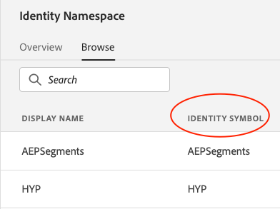

# Synkronisera identiteter mellan Audience Manager och Experience Platform

Adobe Experience Platform Web SDK har stöd för att deklarera kund-ID:n och deras autentiseringstillstånd via kommandot [sendEvent](./overview.md#syncing-identities).

Välj dina namnutrymmen från [Identitetstjänstens namnutrymmen](../../identity/../identity-service/features/namespaces.md) för att ange kontexten som en identitet relaterar till genom att använda värdena i kolumnen Identitetssymbol:

Som Audience Manager-kund har alla befintliga datakällor som använder ID-typ: Enhetsöverskridande har automatiskt ett motsvarande identitetsnamnutrymme. Om du vill hitta motsvarande Identity Namespace för din Audience Manager Data Source loggar du in på Adobe Experience Platform och navigerar till avsnittet Identiteter.

Alla nya [!DNL Audience Manager]-data-Source som använder ID-typ: Enhetsövergripande genererar ett motsvarande identitetsnamnområde. Source-ID-typerna Cookie och Advertising-ID för enhet stöds för närvarande inte. Dessutom kommer alla Identity Namespace som skapas i Adobe Experience Platform att generera motsvarande [!DNL Audience Manager] Data Source, men observera att syncIdentity-metoden bara stöder Namespace Identity Symbols.
