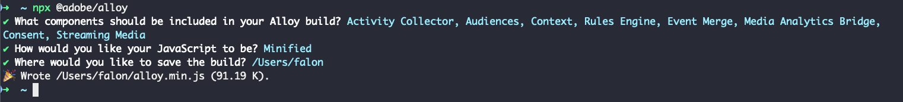

# Skapa en egen SDK-version för webben

Experience Platform Web SDK-biblioteket innehåller flera moduler för olika funktioner som personalisering, identitet, länkspårning med mera. Beroende på hur du använder dem kanske du bara behöver specifika funktioner i stället för hela biblioteket. Om du skapar en anpassad Web SDK-version kan du bara välja de moduler du behöver, vilket minskar biblioteksstorleken och förbättrar prestandan.

## Användningsfall {#use-case}

Genom att skapa en anpassad Web SDK-version minskar du bibliotekets storlek och får bättre prestanda. Här är några exempel:

### Borttagning av Media Analytics {#media-analytics-removal}

Om webbplatsen inte har mediainnehåll kan du utesluta modulerna [!DNL Media Analytics] och [!DNL Streaming Media] från bygget. Detta kan minska SDK webbbyggstorlek med upp till 50 % och öka inläsningshastigheten.

### Borttagning av Personalization {#personalization}

Om du bara behöver samla in användarstatistik och inte tänker använda Adobe Target eller Journey Optimizer för personalisering, kan du utesluta modulen [!DNL Personalization]. På så sätt minskas biblioteksstorleken samtidigt som du kan samla in nödvändiga mått.

## Förhandskrav {#prerequisites}

Om du vill skapa en anpassad Web SDK-version behöver du Web SDK NPM-paketet. Kontrollera att [Node.js](https://nodejs.org/en/download/package-manager/all) är installerat på datorn. Mer information finns i dokumentationen om hur du [installerar Web SDK med NPM-paketet](npm.md).

## Komponenter och beroenden {#components-dependencies}

Innan du skapar en anpassad Web SDK-version måste du definiera de Web SDK-komponenter och -kommandon som du tänker använda. Vissa kommandon är beroende av att specifika moduler inkluderas i bygget.

Tabellen nedan visar relationen mellan Web SDK-moduler och de kommandon de innehåller:

| Modulberoende | Konfigurationsparametrar | Kommandon | Storlekskategori |
|---------|----------|---------|---------|
| Aktivitetsinsamlare | [`clickCollectionEnabled`](../commands/configure/clickcollectionenabled.md) | N/A | Medium |
| Målgrupper | N/A | N/A | Liten |
| Kontext | [`context`](../commands/configure/context.md) | N/A | Liten |
| Regelmotor | `personalizationStorageEnabled` | | <ul><li>`evaluateRulesets`</li><li>[`subscribeRulesetItems`](../commands/subscriberulesetitems.md)</li></ul> | Medium |
| Händelsemarkering | N/A | `createEventMergeId` | Liten |
| Media Analytics Bridge | N/A | [`getMediaAnalyticsTracker`](../commands/getmediaanalyticstracker.md) | Stor |
| Personalisering | <ul><li>[`prehidingStyle`](../commands/configure/prehidingstyle.md)</li><li>[`targetMigrationEnabled`](../commands/configure/targetmigrationenabled.md)</li><li>[`autoCollectPropositionInteractions`](../commands/configure/autocollectpropositioninteractions.md)</li></ul> | N/A | Stor |
| Godkännande | [`defaultConsent`](../commands/configure/defaultconsent.md) | [`setConsent`](../commands/setconsent.md) | Liten |
| Direktuppspelningsmedia | [`streamingMedia`](../commands/configure/streamingmedia.md) | <ul><li>[`createMediaSession`](../commands/createmediasession.md)</li><li>[`sendMediaEvent`](../commands/sendmediaevent.md)</li></ul> | Stor |

## Skapa en anpassad Web SDK-version med NPM-paketet {#create-custom-build}

1. Öppna terminalen och kör `npx @adobe/alloy`. Du ombeds att välja de Web SDK-komponenter som du vill att din anpassade version ska innehålla.

   

   Använd piltangenterna för att flytta uppåt och nedåt i modullistan.

   * Tryck på **Space** om du vill aktivera eller inaktivera den valda modulen.
   * Tryck på `A` om du vill aktivera eller inaktivera alla moduler.
   * Tryck på `I` om du vill invertera markeringen.
   * Tryck på `Enter` för att bekräfta ditt val och gå till nästa steg.

1. När du har valt vilka moduler som ska ingå i ditt anpassade bygge kan du välja mellan att spara en minifierad eller ominifierad version av ditt anpassade Web SDK-bibliotek. Välj önskat alternativ och tryck på `Enter`.

   

1. Därefter får du en fråga om var du vill spara bygget på den lokala datorn. Tryck på `Enter` för att bekräfta den förvalda platsen eller ange en ny plats.

   

1. När du har bekräftat platsen genereras och sparas din anpassade version.

   

