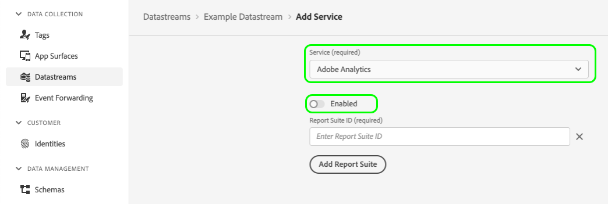

# Loggning på klientsidan för A4T-data i Platform Web SDK

## Översikt {#overview}

Med Adobe Experience Platform Web SDK kan du samla in [Adobe Analytics for Target-data (A4T)](https://experienceleague.adobe.com/docs/target/using/integrate/a4t/a4t.html) på klientsidan av webbprogrammet.

Loggning på klientsidan innebär att relevanta [!DNL Target]-data returneras på klientsidan, vilket gör att du kan samla in dem och dela dem med Analytics. Det här alternativet bör vara aktiverat om du tänker skicka data manuellt till Analytics med [API:t för datainfogning](https://experienceleague.adobe.com/docs/analytics/import/c-data-insertion-api.html).

>[!NOTE]
>
>En metod för att utföra detta med [AppMeasurement.js](https://experienceleague.adobe.com/docs/analytics/implementation/js/overview.html) håller på att utvecklas och kommer att vara tillgänglig inom den närmaste framtiden.

Det här dokumentet innehåller steg för hur du konfigurerar A4T-loggning på klientsidan för Web SDK och några exempel på implementering för vanliga användningsområden.

## Förhandskrav {#prerequisites}

I den här självstudiekursen förutsätts att du är bekant med de grundläggande begreppen och processerna för att använda Web SDK i personaliseringssyfte. Läs följande dokumentation om du behöver en introduktion:

* [Konfigurera Web SDK](/help/web-sdk/commands/configure/overview.md)
* [Skicka händelser](/help/web-sdk/commands/sendevent/overview.md)
* [Återger innehåll för personalisering](../../rendering-personalization-content.md)

## Konfigurera loggning på klientsidan för Analytics {#set-up-client-side-logging}

I följande underavsnitt beskrivs hur du aktiverar loggning på klientsidan för Analytics för din Web SDK-implementering.

### Aktivera loggning på klientsidan för Analytics {#enable-analytics-client-side-logging}

Om du vill att Analytics-loggning på klientsidan ska vara aktiverad för implementeringen måste du inaktivera Adobe Analytics-konfigurationen i [datastream](../../../../datastreams/overview.md).



### Hämta [!DNL A4T]-data från SDK och skicka dem till Analytics {#a4t-to-analytics}

För att den här rapporteringsmetoden ska fungera på rätt sätt måste du skicka [!DNL A4T]-relaterade data som hämtats från kommandot [`sendEvent`](/help/web-sdk/commands/sendevent/overview.md) i Analytics-träffen.

När Target Edge beräknar ett svar på en offert kontrollerar det om Analytics-loggning på klientsidan är aktiverad (dvs om Analytics är inaktiverat i din datastream). Om loggning på klientsidan är aktiverat lägger systemet till en analystoken till varje erbjudande i svaret.

Flödet ser ut ungefär så här:


Följande är ett exempel på ett `interact`-svar när loggning på klientsidan för Analytics är aktiverat. Om förslaget gäller en aktivitet som har Analytics-rapportering har det en `scopeDetails.characteristics.analyticsToken`-egenskap.

```json
{
  "requestId": "1234",
  "handle": [
    {
      "payload": [
        {
          "id": "AT:eyJhY3Rpdml0eUlkIjoiNDM0Njg5IiwiZXhwZXJpZW5jZUlkIjoiMCJ9",
          "scope": "a4t-test",
          "scopeDetails": {
            "decisionProvider": "TGT",
            "activity": {
              "id": "434689"
            },
            "experience": {
              "id": "0"
            },
            "strategies": [
              {
                "algorithmID": "0",
                "trafficType": "0"
              }
            ],
            "characteristics": {
              "eventToken": "2lTS5KA6gj4JuSjOdhqUhGqipfsIHvVzTQxHolz2IpTMromRrB5ztP5VMxjHbs7c6qPG9UF4rvQTJZniWgqbOw==",
              "analyticsToken": "434689:0:0|2,434689:0:0|1"
            }
          },
          "items": [
            {
              "id": "1184844",
              "schema": "https://ns.adobe.com/personalization/html-content-item",
              "meta": {
                "geo.state": "bucuresti",
                "activity.id": "434689",
                "experience.id": "0",
                "activity.name": "a4t test form based activity",
                "offer.id": "1184844",
                "profile.tntId": "04608610399599289452943468926942466370-pybgfJ"
              },
              "data": {
                "id": "1184844",
                "format": "text/html",
                "content": "<div> analytics impressions </div>"
              }
            }
          ]
        },
        {
          "id": "AT:eyJhY3Rpdml0eUlkIjoiNDM0Njg5IiwiZXhwZXJpZW5jZUlkIjoiMCJ9",
          "scope": "a4t-test",
          "scopeDetails": {
            "decisionProvider": "TGT",
            "activity": {
              "id": "434689"
            },
            "characteristics": {
              "eventToken": "E0gb6q1+WyFW3FMbbQJmrg==",
              "analyticsToken": "434689:0:0|32767"
            }
          },
          "items": [
            {
              "id": "434689",
              "schema": "https://ns.adobe.com/personalization/measurement",
              "data": {
                "type": "click",
                "format": "application/vnd.adobe.target.metric"
              }
            }
          ]
        }
      ],
      "type": "personalization:decisions",
      "eventIndex": 0
    }
  ]
}
```

Förslag för formulärbaserade Experience Composer-aktiviteter kan innehålla både innehåll och klickmätningsobjekt under samma förslag. I stället för att ha en enda analystoken för visning av innehåll i egenskapen `scopeDetails.characteristics.analyticsToken` kan de därför ha både en visnings- och en klickanalystoken angiven i egenskaperna `scopeDetails.characteristics.analyticsDisplayToken` och `scopeDetails.characteristics.analyticsClickToken`.

```json
{
  "requestId": "1234",
  "handle": [
    {
      "payload": [
        {
          "id": "AT:eyJhY3Rpdml0eUlkIjoiNDM0Njg5IiwiZXhwZXJpZW5jZUlkIjoiMCJ9",
          "scope": "a4t-test",
          "scopeDetails": {
            "decisionProvider": "TGT",
            "activity": {
              "id": "434689"
            },
            "experience": {
              "id": "0"
            },
            "strategies": [
              {
                "algorithmID": "0",
                "trafficType": "0"
              }
            ],
            "characteristics": {
               "displayToken": "2lTS5KA6gj4JuSjOdhqUhGqipfsIHvVzTQxHolz2IpTMromRrB5ztP5VMxjHbs7c6qPG9UF4rvQTJZniWgqbOw==",
               "clickToken": "E0gb6q1+WyFW3FMbbQJmrg==",
               "analyticsDisplayToken": "434689:0:0|2,434689:0:0|1", 
               "analyticsClickToken": "434689:0:0|32767"
            }
          },
          "items": [
            {
              "id": "1184844",
              "schema": "https://ns.adobe.com/personalization/html-content-item",
              "meta": {
                "geo.state": "bucuresti",
                "activity.id": "434689",
                "experience.id": "0",
                "activity.name": "a4t test form based activity",
                "offer.id": "1184844",
                "profile.tntId": "04608610399599289452943468926942466370-pybgfJ"
              },
              "data": {
                "id": "1184844",
                "format": "text/html",
                "content": "<div> analytics impressions </div>"
              }
            },
            {
              "id": "434689",
              "schema": "https://ns.adobe.com/personalization/measurement",
              "data": {
                "type": "click",
                "format": "application/vnd.adobe.target.metric"
              }
            }
          ]
        }
      ],
      "type": "personalization:decisions",
      "eventIndex": 0
    }
  ]
}
```

Alla värden från `scopeDetails.characteristics.analyticsToken` samt `scopeDetails.characteristics.analyticsDisplayToken` (för visat innehåll) och `scopeDetails.characteristics.analyticsClickToken` (för klickvärden) är de A4T-nyttolaster som måste samlas in och inkluderas som `tnta` -tagg i [API-anropet för datainmatning](https://github.com/AdobeDocs/analytics-1.4-apis/blob/master/docs/data-insertion-api/index.md).

>[!IMPORTANT]
>
>Egenskaperna `analyticsToken`, `analyticsDisplayToken`, `analyticsClickToken` kan innehålla flera tokens, sammanfogade som en kommaavgränsad sträng.
>
>I implementeringsexemplen i nästa avsnitt samlas flera analystoken in iterativt. Om du vill sammanfoga en array med analystoken använder du en funktion som ser ut så här:
>
>```javascript
>var concatenateAnalyticsPayloads = function concatenateAnalyticsPayloads(analyticsPayloads) {
>   if (analyticsPayloads.size > 1) {
>       return [].concat(analyticsPayloads).join(',');
>   }
>   return [].concat(analyticsPayloads).join();
>};
>```

## Exempel på implementering {#implementation-examples}

I följande underavsnitt visas hur du implementerar loggning på klientsidan för Analytics för vanliga användningsområden.

### Formulärbaserade Experience Composer-aktiviteter {#form-based-composer}

Du kan använda Web SDK för att styra körningen av förslag från [Adobe Target Form-Based Experience Composer](https://experienceleague.adobe.com/docs/target/using/experiences/form-experience-composer.html) -aktiviteter.

När du begär förslag för ett specifikt beslutsomfång innehåller det returnerade förslaget en lämplig analystoken. Det bästa sättet är att kedja på Platform Web SDK `sendEvent`-kommandot och iterera genom de returnerade förslagen för att köra dem samtidigt som Analytics-tokens samlas in.

Du kan utlösa ett `sendEvent`-kommando för en formulärbaserad Experience Composer-aktivitetsomfattning som den här:

```javascript
alloy("sendEvent", {
    "decisionScopes": ["a4t-test"],
    "xdm": {
      "web": {
        "webPageDetails": {
          "name": "Home Page"
        }
      }
    }
  }
).then(function(results) {
  for (var i = 0; i < results.propositions.length; i++) {
    //Execute the propositions and collect the Analytics payload
  }
});
```

Härifrån måste ni implementera kod för att genomföra förslagen och skapa en nyttolast som slutligen skickas till Analytics. Detta är ett exempel på vad `results.propositions` kan innehålla:

```json
[
  {
    "id": "AT:eyJhY3Rpdml0eUlkIjoiNDM0Njg5IiwiZXhwZXJpZW5jZUlkIjoiMCJ9",
    "scope": "a4t-test",
    "scopeDetails": {
      "decisionProvider": "TGT",
      "activity": {
        "id": "434689"
      },
      "experience": {
        "id": "0"
      },
      "strategies": [
        {
          "algorithmID": "0",
          "trafficType": "0"
        }
      ],
      "characteristics": {
        "eventToken": "2lTS5KA6gj4JuSjOdhqUhGqipfsIHvVzTQxHolz2IpTMromRrB5ztP5VMxjHbs7c6qPG9UF4rvQTJZniWgqbOw==",
        "analyticsToken": "434689:0:0|2,434689:0:0|1"
      }
    },
    "items": [
      {
        "id": "1184844",
        "schema": "https://ns.adobe.com/personalization/html-content-item",
        "meta": {
          "geo.state": "bucuresti",
          "activity.id": "434689",
          "experience.id": "0",
          "activity.name": "a4t test form based activity",
          "offer.id": "1184844",
          "profile.tntId": "04608610399599289452943468926942466370-pybgfJ"
        },
        "data": {
          "id": "1184844",
          "format": "text/html",
          "content": "<div> analytics impressions </div>"
        }
      }
    ]
  },
  {
    "id": "AT:eyJhY3Rpdml0eUlkIjoiNDM0Njg5IiwiZXhwZXJpZW5jZUlkIjoiMCJ9",
    "scope": "a4t-test",
    "scopeDetails": {
      "decisionProvider": "TGT",
      "activity": {
        "id": "434689"
      },
      "characteristics": {
        "eventToken": "E0gb6q1+WyFW3FMbbQJmrg==",
        "analyticsToken": "434689:0:0|32767"
      }
    },
    "items": [
      {
        "id": "434689",
        "schema": "https://ns.adobe.com/personalization/measurement",
        "data": {
          "type": "click",
          "format": "application/vnd.adobe.target.metric"
        }
      }
    ]
  },
  {
    "id": "AT:eyJhY3Rpdml0eUlkIjoiNDM0Njg5IiwiZXhwZXJpZW5jZUlkIjoiMCJ9",
    "scope": "a4t-test",
    "scopeDetails": {
      "decisionProvider": "TGT",
      "activity": {
        "id": "434688"
      },
      "experience": {
        "id": "0"
      },
      "strategies": [
        {
          "algorithmID": "0",
          "trafficType": "0"
        }
      ],
      "characteristics": {
          "displayToken": "91TS5KA6gj4JuSjOdhqUhGqipfsIHvVzTQxHolz2IpTMromRrB5ztP5VMxjHbs7c6qPG9UF4rvQTJZniWgqgEt==",
          "clickToken": "Tagb6q1+WyFW3FMbbQJrtg==",
          "analyticsDisplayTokens": "434688:0:0|2,434688:0:0|1",
          "analyticsClickTokens": "434688:0:0|32767"
        }
      }
    },
    "items": [
      {
        "id": "1184845",
        "schema": "https://ns.adobe.com/personalization/html-content-item",
        "meta": {
          "geo.state": "bucuresti",
          "activity.id": "434688",
          "experience.id": "0",
          "activity.name": "a4t test form based activity 1",
          "offer.id": "1184845"
        },
        "data": {
          "id": "1184845",
          "format": "text/html",
          "content": "<div> analytics impressions 1</div>"
        }
      },
      {
        "id": "434688",
        "schema": "https://ns.adobe.com/personalization/measurement",
        "data": {
          "type": "click",
          "format": "application/vnd.adobe.target.metric"
        }
      }
    ]
  }
]
```

Om du vill extrahera analystoken från ett förslag med innehållsobjekt kan du implementera en funktion som liknar den här:

```javascript
function getDisplayAnalyticsPayload(proposition) {
  if (!proposition || !proposition.scopeDetails || !proposition.scopeDetails.characteristics) {
    return;
  }
  var characteristics = proposition.scopeDetails.characteristics;
  if (characteristics.analyticsDisplayToken) {
    return characteristics.analyticsDisplayToken;
  }
  return characteristics.analyticsToken;
}
```

Ett förslag kan ha olika typer av objekt, vilket anges av egenskapen `schema` för det aktuella objektet. Det finns fyra objektscheman för förslag som stöds för formulärbaserade Experience Composer-aktiviteter:

```javascript
var HTML_SCHEMA = "https://ns.adobe.com/personalization/html-content-item";
var MEASUREMENT_SCHEMA = "https://ns.adobe.com/personalization/measurement";
var JSON_SCHEMA = "https://ns.adobe.com/personalization/json-content-item";
var REDIRECT_SCHEMA = "https://ns.adobe.com/personalization/redirect-item";
```

`HTML_SCHEMA` och `JSON_SCHEMA` är de scheman som återspeglar erbjudandets typ, medan `MEASUREMENT_SCHEMA` speglar de mått som ska bifogas till ett DOM-element.

Analysnyttolaster för klickvärden ska samlas in och skickas till Analytics separat från innehållsobjekten, när besökaren faktiskt klickar på det tidigare visade innehållet.

Följande hjälpfunktion för att hämta A4T-nyttolasterna för klickmätningen kommer att vara användbar i det här fallet:

```javascript
function getClickAnalyticsPayload(proposition) {
  if (!proposition || !proposition.scopeDetails || !proposition.scopeDetails.characteristics) {
    return;
  }
  var characteristics = proposition.scopeDetails.characteristics;
  if (characteristics.analyticsClickToken) {
    return characteristics.analyticsClickToken;
  }
  return characteristics.analyticsToken;
}
```

#### Sammanfattning av implementering {#implementation-summary}

Sammanfattningsvis måste följande steg utföras när formulärbaserade Experience Composer-aktiviteter används med Platform Web SDK:

1. Skicka en händelse som hämtar aktivitetserbjudanden för formulärbaserad Experience Composer.
1. Använda innehållsändringarna på sidan;
1. Skicka meddelandehändelsen `decisioning.propositionDisplay`;
1. Samla in analytiska visningstoken från SDK-svaret och konstruera en nyttolast för Analytics-träffen.
1. Skicka nyttolasten till Analytics med [API för datainmatning](https://github.com/AdobeDocs/analytics-1.4-apis/blob/master/docs/data-insertion-api/index.md);
1. Om det finns klickvärden i levererade offerter bör klickavlyssnare konfigureras så att när klickningen utförs skickas meddelandehändelsen `decisioning.propositionInteract`. Hanteraren `onBeforeEventSend` bör konfigureras så att följande åtgärder inträffar när `decisioning.propositionInteract`-händelser fångas upp:
   1. Samlar in klickanalystoken från `xdm._experience.decisioning.propositions`
   1. Skickar klickanalysen med den insamlade analysnyttolasten via [API för datainmatning](https://github.com/AdobeDocs/analytics-1.4-apis/blob/master/docs/data-insertion-api/index.md);

```javascript
alloy("sendEvent", {
    "decisionScopes": ["a4t-test"],
    "xdm": {
      "web": {
        "webPageDetails": {
          "name": "Home Page"
        }
      }
    }
  }
).then(function(results) {
  var analyticsPayload = new Set();
  results.propositions.forEach(function (proposition) {
    proposition.items.forEach(function (item) {
      if (item.schema === HTML_SCHEMA) {
        // 1. Apply offer
        // 2. Collect executed propositions and send the decisioning.propositionDisplay notification event
        // 3. Collect the display Analytics tokens
      }
      if (item.schema === MEASUREMENT_SCHEMA) {
        // Setup click listener, so that when clicked:
        // 1. Collect clicked propositions and send the decisioning.propositionInteract notification event
        // Note: onBeforeEventSend handler should be configured, so that when intercepting decisioning.propositionInteract events:
        //   1. Collect the click Analytics tokens from xdm._experience.decisioning.propositions
        //   2. Send the click Analytics hit with the collected Analytics payload via Data Insertion API
      }
    });
  });
  // Send the page view Analytics hit with the collected display Analytics payload via Data Insertion API
});
```

### Visual Experience Composer-aktiviteter {#visual-experience-composer-acitivties}

Med Web SDK kan du hantera erbjudanden som har skapats med [Visual Experience Composer (VEC)](https://experienceleague.adobe.com/docs/target/using/experiences/vec/visual-experience-composer.html).

>[!NOTE]
>
>Stegen för implementering av det här användningsexemplet liknar mycket stegen för [formulärbaserade Experience Composer-aktiviteter](#form-based-composer). Mer information finns i föregående avsnitt.

När automatisk återgivning är aktiverat kan du samla in analystoken från de förslag som kördes på sidan. Bästa sättet är att kedja på Platform Web SDK `sendEvent`-kommandot och iterera genom de returnerade förslagen för att filtrera dem som Web SDK har försökt återge.

**Exempel**

```javascript
alloy("sendEvent", {
    "renderDecisions": true,
    "xdm": {
      "web": {
        "webPageDetails": {
          "name": "Home Page"
        }
      }
    }
  }
).then(function (results) {
  var analyticsPayloads = new Set();
  
  for (var i = 0; i < results.propositions.length; i++) {
  
    var proposition = propositions[i];
    var renderAttempted = proposition.renderAttempted;

    if (renderAttempted === true) {
      var analyticsPayload = getDisplayAnalyticsPayload(proposition);
      
      if (analyticsPayload !== undefined) {
        analyticsPayloads.add(analyticsPayload);
      }
    }
  }
  var analyticsPayloadsToken = concatenateAnalyticsPayloads(analyticsPayloads);
  // Send the page view Analytics hit with collected Analytics payload via Data Insertion API
});
```

### Använder `onBeforeEventSend` för att hantera sidmått {#using-onbeforeeventsend}

Med hjälp av Adobe Target-aktiviteter kan du ställa in olika mått på sidan, antingen manuellt kopplade till DOM eller automatiskt kopplade till DOM (VEC-skapade aktiviteter). Båda typerna är en fördröjd användarinteraktion på webbsidan.

För att ta hänsyn till detta är det bästa sättet att samla in Analytics-nyttolaster med hjälp av Adobe Experience Platform Web SDK-kroken `onBeforeEventSend`. Koppeln `onBeforeEventSend` bör konfigureras med kommandot `configure` och återspeglas i alla händelser som skickas via datastream.

Följande är ett exempel på hur `onBeforeEventSent` kan konfigureras för att utlösa Analytics-träffar:

```javascript
alloy("configure", {
  edgeConfigId: "datastream configuration ID",
  orgId: "adobe ORG ID",
  onBeforeEventSend: function(options) {
    const xdm = options.xdm;
    const eventType = xdm.eventType;
    if (eventType === "decisioning.propositionInteract") {
      const analyticsPayloads = new Set();
      const propositions = xdm._experience.decisioning.propositions;

      for (var i = 0; i < propositions.length; i++) {
        var proposition = propositions[i];
        analyticsPayloads.add(getClickAnalyticsPayload(proposition));
      }
      // Trigger the Analytics hit
    }
  }
});
```

## Nästa steg {#next-steps}

Den här guiden täcker loggning på klientsidan för A4T-data i Web SDK. Mer information om hur du hanterar A4T-data på Edge Network finns i handboken om [serverloggning](server-side.md).
