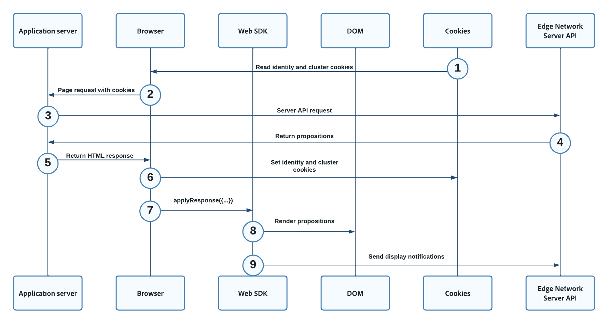

# Hybrid-personalisering med Web SDK och Edge Network Server API

## Översikt {#overview}

Hybridpersonalisering beskriver processen att hämta innehåll på serversidan för personalisering med hjälp av [API för Edge Network Server](../../server-api/overview.md)och återge den på klientsidan med [Web SDK](../home.md).

Ni kan använda hybridpersonalisering med personaliseringslösningar som Adobe Target, Adobe Journey Optimizer eller Offer decisioning. Skillnaden är innehållet i [!UICONTROL Server API] nyttolast.

## Förutsättningar {#prerequisites}

Innan du implementerar hybridanpassning på dina webbegenskaper måste du se till att du uppfyller följande villkor:

* Ni har bestämt vilken personaliseringslösning ni vill använda. Detta påverkar innehållet i [!UICONTROL Server API] nyttolast.
* Du har tillgång till en programserver som du kan använda för att skapa [!UICONTROL Server API] samtal.
* Du har tillgång till [API för Edge Network Server](../../server-api/authentication.md).
* Du har rätt [konfigurerad](/help/web-sdk/commands/configure/overview.md) och distribuerade Web SDK på de sidor som du vill personalisera.

## Flödesdiagram {#flow-diagram}

Flödesdiagrammet nedan beskriver ordningen för de steg som vidtas för att leverera hybridpersonalisering.



1. Alla befintliga cookies som tidigare lagrats av webbläsaren, prefixerade med `kndctr_`, ingår i webbläsarbegäran.
1. Klientens webbläsare begär webbsidan från programservern.
1. När programservern tar emot sidbegäran skapas en `POST` begäran till [Slutpunkt för interaktiv datainsamling i Server API](../../server-api/interactive-data-collection.md) för att hämta personaliseringsinnehåll. The `POST` begäran innehåller `event` och `query`. Cookies från föregående steg, om sådana finns, ingår i `meta>state>entries` array.
1. Server-API:t returnerar personaliseringsinnehållet till programservern.
1. Programservern returnerar ett HTML-svar till klientwebbläsaren med [identitets- och klustercookies](#cookies).
1. På klientsidan visas [!DNL Web SDK] `applyResponse` anropas och skickas i sidhuvuden och brödtexten i [!UICONTROL Server API] svar från föregående steg.
1. The [!DNL Web SDK] återger mål [[!DNL Visual Experience Composer (VEC)]](https://experienceleague.adobe.com/docs/target/using/experiences/vec/visual-experience-composer.html) erbjudanden och Journey Optimizer Web Channel-objekt automatiskt, eftersom `renderDecisions` flaggan är inställd på `true`.
1. Målformulärsbaserad [!DNL HTML]/[!DNL JSON] erbjudanden och Journey Optimizer kodbaserade upplevelser tillämpas manuellt via `applyProposition` metod, för att uppdatera [!DNL DOM] baserat på personaliseringsinnehållet i förslaget.
1. För målformulärsbaserad [!DNL HTML]/[!DNL JSON] erbjudanden och Journey Optimizer kodbaserade upplevelser, måste webbannonseringshändelser skickas manuellt för att ange när det returnerade innehållet har visats. Detta görs via `sendEvent` -kommando.

## Cookies {#cookies}

Cookies används för att bevara användaridentitet och klusterinformation.  När du använder en hybridimplementering hanterar webbprogramservern lagringen och sändningen av dessa cookies under livscykeln för begäran.

| Cookie | Syfte | Lagrad av | Skickat av |
|---|---|---|---|
| `kndctr_AdobeOrg_identity` | Innehåller information om användaridentitet. | Programserver | Programserver |
| `kndctr_AdobeOrg_cluster` | Anger vilket Edge Network-kluster som ska användas för att slutföra begäranden. | Programserver | Programserver |

## Begär placering {#request-placement}

Server-API-begäranden krävs för att hämta förslag och skicka ett visningsmeddelande. När du använder en hybridimplementering skickar programservern dessa begäranden till Server-API:t.

| Begäran | Skapad av |
|---|---|
| Interagera begäran om att hämta förslag | Programserver |
| Interagera begäran om att skicka visningsmeddelanden | Programserver |

## Analysens konsekvenser {#analytics}

När ni implementerar hybridpersonalisering måste ni vara särskilt uppmärksamma på att sidträffar inte räknas flera gånger i Analytics.

När du [konfigurera ett datastream](../../datastreams/overview.md) För Analytics vidarebefordras händelser automatiskt så att sidträffar hämtas.

Exemplet från den här implementeringen använder två olika datastreams:

* En datastream har konfigurerats för Analytics. Datastream används för Web SDK-interaktioner.
* En andra datastream utan någon Analytics-konfiguration. Den här datastream används för Server-API-begäranden. Du måste konfigurera denna datastream med samma målkonfiguration som den datastream som du konfigurerade för Analytics.

På så sätt registreras inga Analytics-händelser i serversidans begäran, men det gör klientsidans begäranden. Detta leder till att Analytics-förfrågningar räknas korrekt.


## Serverbegäran {#server-side-request}

Exemplet nedan visar en Server API-begäran som din programserver kan använda för att hämta personaliseringsinnehållet.

>[!IMPORTANT]
>
>Denna exempelbegäran använder Adobe Target som en personaliseringslösning. Din begäran kan variera beroende på vilken personaliseringslösning du har valt.


**API-format**

```http
POST /ee/v2/interact
```

### Begäran {#request}

```shell
curl -X POST "https://edge.adobedc.net/ee/v2/interact?dataStreamId={DATASTREAM_ID}" 
-H "Content-Type: text/plain" 
-d '{
   "event":{
      "xdm":{
         "web":{
            "webPageDetails":{
               "URL":"http://localhost/"
            },
            "webReferrer":{
               "URL":""
            }
         },
         "identityMap":{
            "FPID":[
               {
                  "id":"xyz",
                  "authenticatedState":"ambiguous",
                  "primary":true
               }
            ]
         },
         "timestamp":"2022-06-23T22:21:00.878Z"
      },
      "data":{
         
      }
   },
   "query":{
      "identity":{
         "fetch":[
            "ECID"
         ]
      },
      "personalization":{
         "schemas":[
            "https://ns.adobe.com/personalization/default-content-item",
            "https://ns.adobe.com/personalization/html-content-item",
            "https://ns.adobe.com/personalization/json-content-item",
            "https://ns.adobe.com/personalization/redirect-item",
            "https://ns.adobe.com/personalization/dom-action"
         ],
         "decisionScopes":[
            "__view__",
            "sample-json-offer"
         ]
      }
   },
   "meta":{
      "state":{
         "domain":"localhost",
         "cookiesEnabled":true,
         "entries":[
            {
               "key":"kndctr_XXX_AdobeOrg_identity",
               "value":"abc123"
            },
            {
               "key":"kndctr_XXX_AdobeOrg_cluster",
               "value":"or2"
            }
         ]
      }
   }
}'
```

| Parameter | Typ | Obligatoriskt | Beskrivning |
| --- | --- | --- | --- |
| `dataStreamId` | `String` | Ja. | ID:t för den datastream som du använder för att skicka interaktionerna till Edge Network. Se [datastreams - översikt](../../datastreams/overview.md) för att lära dig hur du konfigurerar ett datastream. |
| `requestId` | `String` | Nej | Ett slumpmässigt ID för korrelering av interna serverförfrågningar. Om inget anges genereras ett Edge-nätverk och returneras som svar. |

### Serversidans svar {#server-response}

Exemplet nedan visar hur Server-API-svaret kan se ut.


```json
{
   "requestId":"5c539bd0-33bf-43b6-a054-2924ac58038b",
   "handle":[
      {
         "payload":[
            {
               "id":"XXX",
               "namespace":{
                  "code":"ECID"
               }
            }
         ],
         "type":"identity:result"
      },
      {
         "payload":[
            {
               "..."
            },
            {
               "..."
            }
         ],
         "type":"personalization:decisions",
         "eventIndex":0
      }
   ]
}
```

## Begäran på klientsidan {#client-request}

På klientsidan visas [!DNL Web SDK] `applyResponse` anropas och skickar sidhuvuden och brödtext för svaret på serversidan.

```js
   alloy("applyResponse", {
      "renderDecisions": true,
      "responseHeaders": {
         "cache-control": "no-cache, no-store, max-age=0, no-transform, private",
         "connection": "close",
         "content-encoding": "deflate",
         "content-type": "application/json;charset=utf-8",
         "date": "Mon, 11 Jul 2022 19:42:01 GMT",
         "server": "jag",
         "strict-transport-security": "max-age=31536000; includeSubDomains",
         "transfer-encoding": "chunked",
         "vary": "Origin",
         "x-adobe-edge": "OR2;9",
         "x-content-type-options": "nosniff",
         "x-konductor": "22.6.78-BLACKOUTSERVERDOMAINS:7fa23f82",
         "x-rate-limit-remaining": "599",
         "x-request-id": "5c539bd0-33bf-43b6-a054-2924ac58038b",
         "x-xss-protection": "1; mode=block"
      },
      "responseBody": {
         "requestId": "5c539bd0-33bf-43b6-a054-2924ac58038b",
         "handle": [
         {
            "payload": [
               {
               "id": "XXX",
               "namespace": {
                  "code": "ECID"
               }
               }
            ],
            "type": "identity:result"
         },
         {
            "payload": [
               {...}, 
               {...}
            ],
            "type": "personalization:decisions",
            "eventIndex": 0
         }
         ]
      }
   }
   ).then(applyPersonalization("sample-json-offer"));
```

Formulärbaserad [!DNL JSON] erbjudandena tillämpas manuellt via `applyPersonalization` metod, för att uppdatera [!DNL DOM] baserat på personaliseringserbjudandet. För formulärbaserade aktiviteter måste visningshändelser skickas manuellt för att ange när erbjudandet har visats. Detta görs via `sendEvent` -kommando.

```js
function sendDisplayEvent(decision) {
    const { id, scope, scopeDetails = {} } = decision;

    alloy("sendEvent", {
        xdm: {
            eventType: "decisioning.propositionDisplay",
            _experience: {
                decisioning: {
                    propositions: [
                        {
                            id: id,
                            scope: scope,
                            scopeDetails: scopeDetails,
                        },
                    ],
                },
            },
        },
    });
}
```

## Exempelprogram {#sample-app}

För att du ska kunna experimentera och lära dig mer om den här typen av personalisering tillhandahåller vi ett exempelprogram som du kan hämta och använda för testning. Du kan hämta programmet tillsammans med detaljerade anvisningar om hur du använder det här [GitHub-databas](https://github.com/adobe/alloy-samples).
