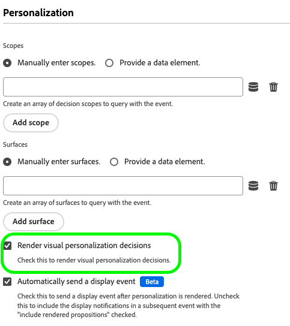

# Konfigurera stöd för webb-meddelanden i appen i SDK

Meddelanden i appen är meddelanden som du kan skicka till användare i ditt webbprogram och vägleda dem till specifika intressepunkter.

Du kan använda de här meddelandena för olika syften, till exempel för att marknadsföra nya funktioner, presentera specialerbjudanden eller för att underlätta användarnas introduktion.

Genom att använda meddelanden i appen kan ni effektivt interagera med era målgrupper och styra dem mot viktiga aspekter av er applikation.

>[!IMPORTANT]
>
>Web In-App Messaging är en [Adobe Journey Optimizer](https://experienceleague.adobe.com/docs/journey-optimizer/using/ajo-home.html?lang=sv-SE)-funktion som använder Web SDK för att leverera det anpassade innehållet.
>
>Detaljerade instruktioner om hur du konfigurerar din kampanj för webb-meddelanden i appen finns i [Adobe Journey Optimizer-dokumentationen](https://experienceleague.adobe.com/docs/journey-optimizer/using/in-app/create-in-app-web.html?lang=sv-SE).


## Förhandskrav {#prerequisites}

### Tilläggsversion för SDK {#extension-version}

Meddelandefunktionen i appen Web In-app kräver den senaste versionen av taggtillägget Web SDK.

### Konfigurera en CSP för webbmeddelanden i appen {#csp}

När du konfigurerar [Web In-App Messaging](../personalization/web-in-app-messaging.md) måste du inkludera följande direktiv i din CSP:

```
default-src  blob:;
```

Mer information om hur du konfigurerar en CSP finns i [dedikerad dokumentation](../use-cases/configuring-a-csp.md).

## Konfigurera webb-meddelanden i appen med hjälp av taggtillägget Web SDK {#tag-extension}

Gå till konfigurationssidan för [webbtillägget för SDK ](../../tags/extensions/client/web-sdk/web-sdk-extension-configuration.md) om du vill veta var du hittar de inställningar som beskrivs nedan.

När du har [installerat](../../tags/extensions/client/web-sdk/web-sdk-extension-configuration.md#install-the-web-sdk-tag-extension) SDK-taggtillägget för webben följer du stegen nedan för att konfigurera tillägget för meddelanden i webben.

Markera alternativet **[!UICONTROL Personalization]** i avsnittet **[!UICONTROL Enable personalization storage]**. Med det här alternativet kan Web SDK hålla reda på vilka upplevelser användaren har sett över sidinläsningar.


Meddelanden i appen stöder två typer av utlösare:

* [Skicka data till Experience Platform](#send-data-platform)
* [Manuellt utlösa meddelandena](#manual-trigger)

Se följande avsnitt för att konfigurera Web SDK-taggtillägget enligt de utlösare som du vill använda.

### Konfigurationssteg för **[!UICONTROL Send data to Experience Platform]**-utlösaren {#send-data-platform}

Markera taggegenskapen som innehåller ditt Web SDK-tillägg och [skapa en ny regel](../../tags/ui/managing-resources/rules.md##create-a-rule) med följande inställningar:

1. **[!UICONTROL Extension]**: [!UICONTROL Core]
2. **[!UICONTROL Event Type]**: [!UICONTROL Library Loaded (Page Top)]

   

3. Välj **[!UICONTROL Keep Changes]** om du vill spara händelsekonfigurationen.

Sedan måste du lägga till en åtgärd i regeln som du skapade.

1. Välj [!DNL Actions] i avsnittet **[!UICONTROL Add]**.
   

2. Använd följande **[!UICONTROL Action]**-inställningar:
   * **[!UICONTROL Extension]**: [!UICONTROL Adobe Experience Platform Web SDK]
   * **[!UICONTROL Action Type]**: [!UICONTROL Send event]

     

3. Aktivera alternativet **[!UICONTROL Personalization]** i avsnittet **[!UICONTROL Render visual personalization decisions]** till höger på skärmen.
   

4. Till höger på skärmen definierar du de **[!UICONTROL Decision context]**/**[!UICONTROL Key]**-par som du använde i kampanjkonfigurationen i avsnittet **[!UICONTROL Value]** för att kvalificera dig för meddelandet i appen.
   

5. Välj **[!UICONTROL Keep Changes]** om du vill spara konfigurationen.


Sedan måste du lägga till den nyligen skapade regeln i taggegenskapsbiblioteket. Om du vill göra det går du till **[!UICONTROL Publishing Flow]** och väljer regeln som du skapade tidigare.


När du har lagt till regeln i biblioteket väljer du **[!UICONTROL Save & Build to Development]**.


Konfigurationsprocessen är nu slutförd och meddelandet är klart att visas för användarna.

### Konfigurationssteg för att använda manuella utlösare {#manual-trigger}

Markera taggegenskapen som innehåller ditt Web SDK-tillägg och [skapa en ny regel](../../tags/ui/managing-resources/rules.md##create-a-rule) med följande inställningar:

1. **[!UICONTROL Extension]**: [!UICONTROL Core]
2. **[!UICONTROL Event Type]**: [!UICONTROL Click]
3. Ange utlösaren för ett specifikt element på sidan, som identifieras av en CSS-väljare som du väljer.

   


Sedan måste du lägga till en åtgärd i regeln som du skapade.

1. Välj [!DNL Actions] i avsnittet **[!UICONTROL Add]**.
   

2. Använd följande **[!UICONTROL Action]**-inställningar:
   * **[!UICONTROL Extension]**: [!UICONTROL Adobe Experience Platform Web SDK]
   * **[!UICONTROL Action Type]**: [!UICONTROL Evaluate rulesets]

     

3. Aktivera alternativet **[!UICONTROL Render visual personalization decisions]** till höger på skärmen.
   


4. Till höger på skärmen definierar du de **[!UICONTROL Decision context]**/**[!UICONTROL Key]**-par som du använde i kampanjkonfigurationen i avsnittet **[!UICONTROL Value]** för att kvalificera dig för meddelandet i appen.
   

5. Välj **[!UICONTROL Keep Changes]** om du vill spara konfigurationen.

Sedan måste du lägga till den nyligen skapade regeln i taggegenskapsbiblioteket. Om du vill göra det går du till **[!UICONTROL Publishing Flow]** och väljer regeln som du skapade tidigare.


När du har lagt till regeln i biblioteket väljer du **[!UICONTROL Save & Build to Development]**.


Konfigurationsprocessen är nu slutförd och meddelandet är klart att visas för användarna.

## Konfigurera Web In-App Messaging med Web SDK JavaScript-biblioteket {#js-library}

Som ett alternativ till att använda taggtillägget Web SDK kan du även konfigurera Web In-App Messaging direkt från Web SDK JavaScript-biblioteket.


Du kan visa webb-i-app-meddelanden från Adobe Journey Optimizer på två sätt.

### Metod 1: Hämta personaliseringsinnehåll automatiskt {#automatic}

Om du vill att Web SDK automatiskt ska hämta personaliseringsinnehållet på sidan ska du använda kommandot `sendEvent`, vilket visas i exemplet nedan.

```js
  alloy("sendEvent", {
      renderDecisions: true,
      personalization: {
          surfaces: ['#welcome']
      }
  });
```

### Metod 2: Hämta personaliseringsinnehållet manuellt baserat på användaråtgärd {#manual}

Om du bara vill visa personaliseringsinnehållet efter att användaren har utfört en viss åtgärd använder du kommandot `evaluateRulesets` enligt exemplet nedan.

I det här exemplet visas personaliseringsinnehållet när en användare klickar på knappen **[!UICONTROL Buy Now]** på webbplatsen.

```js
 alloy("evaluateRulesets", {
     renderDecisions: true,
     personalization: {
         decisionContext: {
             "userAction": "buy_now"
         }
     }
 });
```

### Konfigurera personaliseringslagring {#personalization-storage}

Du kan välja att visa meddelanden i appen för användarna ett visst antal gånger, eller varje gång de besöker en sida, via konfigurationsalternativet `personalizationStorageEnabled`.

I [Web SDK-konfigurationen](../commands/configure/overview.md) anger du alternativet `personalizationStorageEnabled` efter dina behov:

* `personalizationStorageEnabled: true` utlöser meddelandet i appen med den frekvens som du definierade i [Adobe Journey Optimizer-kampanjen](https://experienceleague.adobe.com/docs/journey-optimizer/using/in-app/create-in-app-web.html?lang=sv-SE#configure-inapp).
* `personalizationStorageEnabled: false` utlöser meddelandet i appen på varje sida som läses in.
