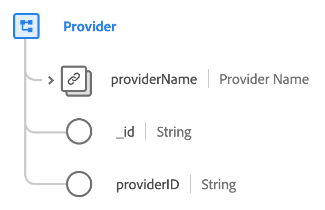

# klassen [!UICONTROL Provider]

I Experience Data Model (XDM) fångar klassen [!UICONTROL Provider] den minsta uppsättningen egenskaper som definierar en leverantörs affärsenhet (till exempel en vårdleverantör eller försäkringsleverantör).

| Egenskap | Datatyp | Beskrivning |
| --- | --- | --- |
| `providerName` | [[!UICONTROL Person name]](../data-types/person-name.md) | Namnet på providern. |
| `_id` | [!UICONTROL String] | En unik systemgenererad strängidentifierare för posten. Det här fältet används för att spåra en enskild posts unika karaktär, förhindra dubblering av data och för att söka efter posten i underordnade tjänster.  Eftersom det här fältet är systemgenererat anges inget explicit värde vid datainmatning. Du kan dock välja att ange egna unika ID-värden om du vill. |
| `providerId` | [!UICONTROL String] | En unik identifierare för providern. |

{style="table-layout:auto"}

Klassen kan utökas med fältgruppen [[!UICONTROL Healthcare Provider] ](../field-groups/provider/healthcare-provider.md) för att beskriva mer information om en vårdleverantör.
