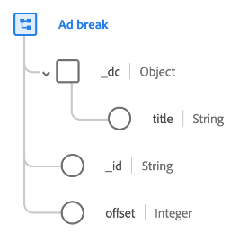

# [!UICONTROL Ad break] datatyp

[!UICONTROL Ad break] är en XDM-datatyp (Standard Experience Data Model) som beskriver hur en tidsbestämd annons infogas i ett tidsbestämt medium.

| Egenskap | Datatyp | Beskrivning |
| --- | --- | --- |
| `_dc.title` | Sträng | Ett eget namn för annonsbrytningen. |
| `_id` | Sträng | En unik identifierare för annonsbrytningen. |
| `offset` | Heltal | Förskjutningen i sekunder för annonsbrytningen från början av det primära innehållet. |

{style=&quot;table-layout:auto&quot;}

Mer information om datatypen finns i den offentliga XDM-databasen:

* [Populerat exempel](https://github.com/adobe/xdm/blob/master/components/datatypes/marketing/advertising-break.example.1.json)
* [Fullständigt schema](https://github.com/adobe/xdm/blob/master/components/datatypes/marketing/advertising-break.schema.json)
