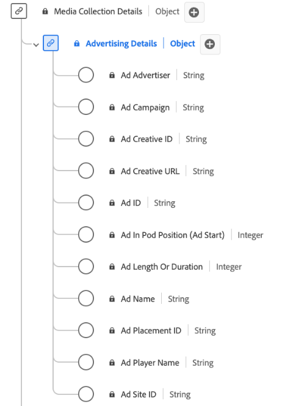

# [!UICONTROL Advertising Details] Samlingsdatatyp

[!UICONTROL Advertising Details] Samlingen är en XDM-datatyp (Standard Experience Data Model) som samlar in viktiga attribut som är relaterade till annonser. Det innehåller information som annons-ID, annons- och kampanj-ID:n, längd, position i en sekvens, information om spelaren som återger annonsen och så vidare. Ni kan använda den här datatypen för att spåra och analysera olika aspekter av annonsresultat och engagemang, och ge insikter om hur målgrupperna interagerar med och svarar på olika annonser. Den här informationen som du anger används för att spåra dina strömmande data.

+++Välj om du vill visa ett diagram över datatypen Advertising Details Collection.

+++

>[!NOTE]
>
>Varje visningsnamn innehåller en länk med mer information om dess ljud- och videoparametrar. De länkade sidorna innehåller information om videoannonser som samlats in av Adobe, implementeringsvärden, nätverksparametrar, rapporter och viktiga överväganden.

| Visningsnamn | Egenskap | Datatyp | Obligatoriskt | Beskrivning |
|-----------------------------------------------------------------------------------------------------------------------------------------------------------------|-----------------|-----------|----------------------------------------------------------------------------------------------------------------------------------|
| [[!UICONTROL Ad Advertiser]](https://experienceleague.adobe.com/docs/media-analytics/using/implementation/variables/ad-parameters.html#advertiser) | `advertiser` | string | Nej | Det företag eller varumärke vars produkt visas i annonsen. |
| [[!UICONTROL Ad Campaign]](https://experienceleague.adobe.com/docs/media-analytics/using/implementation/variables/ad-parameters.html#campaign-id) | `campaignID` | string | Nej | ID för annonskampanjen. |
| [[!UICONTROL Ad Creative ID]](https://experienceleague.adobe.com/docs/media-analytics/using/implementation/variables/ad-parameters.html#creative-id) | `creativeID` | string | Nej | Annonspersonalens ID. |
| [[!UICONTROL Ad Creative URL]](https://experienceleague.adobe.com/docs/media-analytics/using/implementation/variables/ad-parameters.html#creative-url) | `creativeURL` | string | Nej | Webbadressen till annonsskaparen. |
| [[!UICONTROL Ad In Pod Position (Ad Start)]](https://experienceleague.adobe.com/docs/media-analytics/using/implementation/variables/ad-parameters.html#ad-start) | `podPosition` | heltal | Ja | Indexvärdet för annonsen inuti den överordnade annonsen startar, till exempel har den första annonsen indexvärdet 0 och den andra annonsen indexvärdet 1. |
| [[!UICONTROL Ad Length Or Duration]](https://experienceleague.adobe.com/docs/media-analytics/using/implementation/variables/ad-parameters.html#ad-length) | `length` | heltal | Ja | Längden på videoannonsen i sekunder. |
| [[!UICONTROL Ad Name]](https://experienceleague.adobe.com/docs/media-analytics/using/implementation/variables/ad-parameters.html#ad-name) | `friendlyName` | string | Ja | Annonsens läsbara namn. I rapporter är&quot;annonsnamn&quot; klassificeringen och&quot;annonsnamn (variabel)&quot; eVarna. |
| [[!UICONTROL Ad Placement ID]](https://experienceleague.adobe.com/docs/media-analytics/using/implementation/variables/ad-parameters.html#placement-id) | `placementID` | string | Nej | Annonsens placerings-ID. |
| [[!UICONTROL Ad Player Name]](https://experienceleague.adobe.com/docs/media-analytics/using/implementation/variables/ad-parameters.html#ad-player-name) | `playerName` | string | Ja | Namnet på spelaren som ansvarar för att återge annonsen. |
| [[!UICONTROL Ad Site ID]](https://experienceleague.adobe.com/docs/media-analytics/using/implementation/variables/ad-parameters.html#site-id) | `siteID` | string | Nej | ID för annonsplatsen. |
