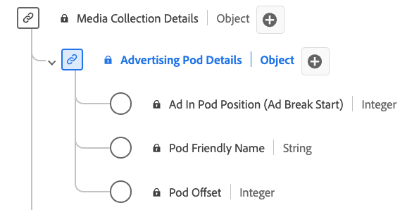

# [!UICONTROL Advertising Pod Details] Samlingsdatatyp

[!UICONTROL Advertising Pod Details]-samlingen är en XDM-datatyp (Standard Experience Data Model). Den definierar en sekvens eller en grupp annonser som vanligtvis spelas upp i följd under innehållsbrytningar. Använd datatypen [!UICONTROL Advertising Pod Details] Collection för att hämta information som annonsbrytnings-ID, ett eget namn för annonsbrytningen, indexet för annonserna inom brytningen och förskjutningen för annonsbrytningen inom innehållets tidslinje på några sekunder.

| Visningsnamn | Egenskap | Datatyp | Obligatoriskt | Beskrivning |
|-----------------------------------------|-----------------|-----------|--------------------------------------------------------------------|
| [!UICONTROL Ad In Pod Position] | `index` | heltal | Ja | Indexvärdet för annonsen inuti den överordnade annonsradbrytningen. |
| [!UICONTROL Pod Friendly Name] | `friendlyName` | string | Nej | Det lättbegripliga namnet på annonsbrytningen. |
| [!UICONTROL Pod Offset] | `offset` | heltal | Ja | Annonsens förskjutning i innehållet, i sekunder. |
