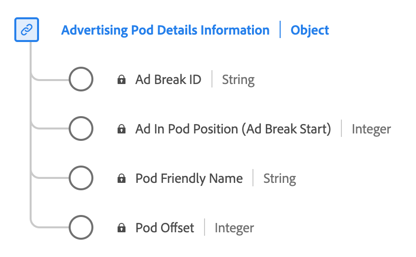

# Datatypen [!UICONTROL Advertising Pod Details Reporting]

[!UICONTROL Advertising Pod Details Reporting] är en XDM-datatyp (Standard Experience Data Model). Den definierar en sekvens eller en grupp annonser som vanligtvis spelas upp i följd under innehållsbrytningar. Använd datatypen [!UICONTROL Advertising Pod Details Reporting] för att hämta information som annonsbrytnings-ID, ett eget namn för annonsbrytningen, indexet för annonserna inom brytningen och förskjutningen för annonsbrytningen inom innehållets tidslinje på några sekunder.

| Visningsnamn | Egenskap | Datatyp | Beskrivning |
|----------------------------|------------------------|-----------|-------------------------------------------------------|
| [!UICONTROL Ad Break ID] | `ID` | string | ID för annonsbrytningen. |
| [!UICONTROL Pod Friendly Name] | `friendlyName` | string | Det lättbegripliga namnet på annonsbrytningen. |
| [!UICONTROL Ad In Pod Position] | `index` | heltal | Indexvärdet för annonsen inuti den överordnade annonsradbrytningen. |
| [!UICONTROL Pod Offset] | `offset` | heltal | **Obligatoriskt** Annonsbrytningens förskjutning inuti innehållet, i sekunder. |

{style="table-layout:auto"}

Mer information om fältgruppen finns i [den offentliga XDM-databasen](https://github.com/adobe/xdm/blob/master/components/datatypes/advertisingpoddetails.schema.json)
