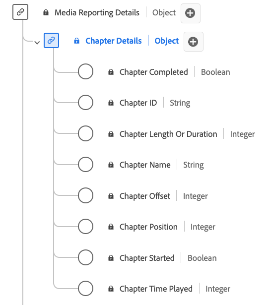

# Datatypen [!UICONTROL Chapter Details] för rapportering

[!UICONTROL Chapter Details]-rapportering är en XDM-datatyp (Standard Experience Data Model) som beskriver olika attribut som relaterar till kapitel eller segment i medieinnehåll. Använd datatypen [!UICONTROL Chapter Details] Reporting för att samla in information som kapitelnamn, varaktighet, position, ID, uppspelningsstatus (start/slutförd) och hur lång tid som har ägnats åt varje kapitel. Medierapporteringsfält används av Adobe-tjänster för att analysera de Media Collection-fält som skickas av användarna. Dessa data, tillsammans med andra specifika användarvärden, beräknas och rapporteras utifrån.

>[!NOTE]
>
>Varje visningsnamn innehåller en länk med mer information om dess ljud- och videoparametrar. De länkade sidorna innehåller information om videoannonser som samlats in av Adobe, implementeringsvärden, nätverksparametrar, rapporter och viktiga överväganden.

| Visningsnamn | Egenskap | Datatyp | Beskrivning |
|-------------------------------------------------------------------------------------------------------------------------------------------------------------------------|---------------|-----------|--------------------------------------------------------------|
| [[!UICONTROL Chapter Completed]](https://experienceleague.adobe.com/docs/media-analytics/using/implementation/variables/chapter-parameters.html?lang=sv-SE#chapter-complete) | `isCompleted` | boolesk | Anger om kapitlet har slutförts eller inte. |
| [[!UICONTROL Chapter ID]](https://experienceleague.adobe.com/docs/media-analytics/using/implementation/variables/chapter-parameters.html?lang=sv-SE#chapter) | `ID` | string | Kapitelets automatiskt genererade ID. |
| [[!UICONTROL Chapter Length Or Duration]](https://experienceleague.adobe.com/docs/media-analytics/using/implementation/variables/chapter-parameters.html?lang=sv-SE#chapter-length) | `length` | heltal | Kapitelns längd i sekunder. |
| [[!UICONTROL Chapter Name]](https://experienceleague.adobe.com/docs/media-analytics/using/implementation/variables/chapter-parameters.html?lang=sv-SE#chapter-name) | `friendlyName` | string | Namnet på kapitlet och/eller segmentet. |
| [[!UICONTROL Chapter Offset]](https://experienceleague.adobe.com/docs/media-analytics/using/implementation/variables/chapter-parameters.html?lang=sv-SE#chapter-offset) | `offset` | heltal | Kapitelns förskjutning i innehållet (i sekunder) från början. |
| [[!UICONTROL Chapter Position]](https://experienceleague.adobe.com/docs/media-analytics/using/implementation/variables/chapter-parameters.html?lang=sv-SE#chapter-position) | `index` | heltal | Placeringen (index, heltal) av kapitlet inuti innehållet. |
| [[!UICONTROL Chapter Started]](https://experienceleague.adobe.com/docs/media-analytics/using/implementation/variables/chapter-parameters.html?lang=sv-SE#chapter-start) | `isStarted` | boolesk | Anger om kapitlet har startats eller inte. |
| [[!UICONTROL Chapter Time Played]](https://experienceleague.adobe.com/docs/media-analytics/using/implementation/variables/chapter-parameters.html?lang=sv-SE#chapter-time-spent) | `timePlayed` | heltal | Den tid som har ägnats åt kapitlet, i sekunder. |
