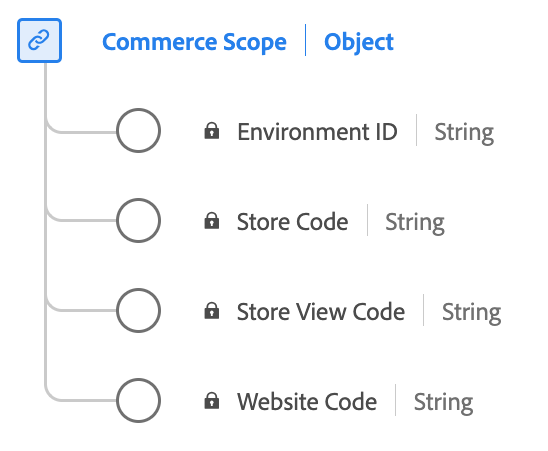

# [!UICONTROL Commerce Scope] datatyp

[!UICONTROL Commerce Scope] är en XDM-datatyp (Standard Experience Data Model) som definierar identifierare för var en händelse inträffade i ett e-handelssystem. Det skiljer ut miljöer, webbplatser, butiker och butiksvyer.

| Visningsnamn | Egenskap | Datatyp | Beskrivning |
|---------------------------------|-------------------|-----------|-------------------------------------------------------|
| [!UICONTROL Environment ID] | `environmentID` | string | Händelse-ID. Ett 32-siffrigt alfanumeriskt ID. |
| [!UICONTROL Website Code] | `websiteCode` | string | Den unika webbplatskoden i en miljö. |
| [!UICONTROL Store Code] | `storeCode` | string | Den unika butikskoden på en webbplats. |
| [!UICONTROL Store View Code] | `storeViewCode` | string | Den unika butiksvykoden i en butik. |

{style="table-layout:auto"}

Mer information om datatypen finns i den offentliga XDM-databasen:

* [Populerat exempel](https://github.com/adobe/xdm/blob/master/components/datatypes/commercescope.example.1.json)
* [Fullständigt schema](https://github.com/adobe/xdm/blob/master/components/datatypes/commercescope.schema.json)
