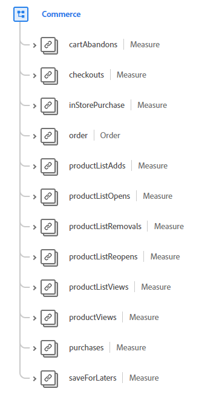

# [!UICONTROL Commerce] datatyp

[!UICONTROL Commerce] är en XDM-datatyp (Standard Experience Data Model) som beskriver posterna för köp- och säljaktiviteter.

 

| Egenskap | Datatyp | Beskrivning |
| --- | --- | --- |
| `order` | [[!UICONTROL Order]](./order.md) | Beskriver den monterade ordern för en eller flera produkter. |
| `cartAbandons` | [[!UICONTROL Measure]](./measure.md) | Används för att beskriva när en produktlista har identifierats som oåtkomlig eller köpbar av användaren. |
| `checkouts` | [[!UICONTROL Measure]](./measure.md) | En åtgärd under utcheckningen av en produktlista. Det kan finnas mer än en utcheckningshändelse om det finns flera steg i en utcheckningsprocess. Om det finns flera steg används händelsetidsinformationen och sidan eller upplevelsen som refereras till för att identifiera steget och enskilda händelser som visas i ordning. |
| `inStorePurchase` | [[!UICONTROL Measure]](./measure.md) | Beskriver ett värde som är associerat med ett butiksköp för analysanvändning. |
| `productListAdds` | [[!UICONTROL Measure]](./measure.md) | En produkt läggs till i produktlistan, t.ex. en produkt som läggs till i en kundvagn. |
| `productListOpens` | [[!UICONTROL Measure]](./measure.md) | Initieringar av en ny produktlista, till exempel en kundvagn som skapas. |
| `productListRemovals` | [[!UICONTROL Measure]](./measure.md) | Borttagning eller borttagning av en produktpost från en produktlista, t.ex. en produkt som tas bort från en kundvagn. |
| `productListReopens` | [[!UICONTROL Measure]](./measure.md) | En produktlista som tidigare har övergetts och som har återaktiverats av användaren. |
| `productListViews` | [[!UICONTROL Measure]](./measure.md) | Beskriver när en vy eller vyer av en produktlista har inträffat. |
| `productViews` | [[!UICONTROL Measure]](./measure.md) | Beskriver när en vy eller vyer av en enskild produkt har inträffat. |
| `purchases` | [[!UICONTROL Measure]](./measure.md) | Används för att spåra när en order har godkänts. Inköpshändelsen är den enda nödvändiga åtgärden i en handelskonvertering. Inköpshändelsen måste ha en produktlista som refereras. |
| `saveForLaters` | [[!UICONTROL Measure]](./measure.md) | En produktlista sparas för framtida bruk, till exempel önskelista. |

Mer information om datatypen finns i den offentliga XDM-databasen:

* [Populerat exempel](https://github.com/adobe/xdm/blob/master/components/datatypes/marketing/commerce.example.1.json)
* [Fullständigt schema](https://github.com/adobe/xdm/blob/master/components/datatypes/marketing/commerce.schema.json)