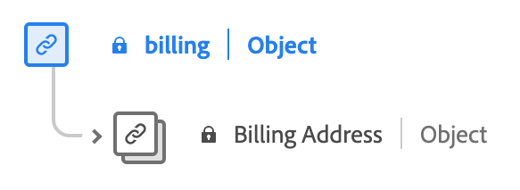

# Datatypen [!UICONTROL Commerce]

[!UICONTROL Commerce] är en XDM-datatyp (Standard Experience Data Model) som beskriver posterna som rör inköp och försäljning.

![Ett diagram över datatypen [!UICONTROL Commerce].](../images/data-types/commerce.png)

| Visningsnamn | Egenskap | Datatyp | Beskrivning |
|------------------------------------------|-----------------------|------------------------------------|----------------------------------------------------------------------------------------------------------|
| [!UICONTROL Order] | `order` | [[!UICONTROL Order]](./order.md) | Beskriver den monterade ordern för en eller flera produkter. |
| [!UICONTROL Promotion ID] | `promotionID` | [!UICONTROL string] | En kampanjidentifierare för den placerade ordern, om det finns en. |
| [!UICONTROL Cart Abandons] | `cartAbandons` | [[!UICONTROL Measure]](./measure.md) | Beskriver när en produktlista har identifierats som oåtkomlig eller köpbar av användaren. |
| [!UICONTROL Checkouts] | `checkouts` | [[!UICONTROL Measure]](./measure.md) | En åtgärd under utcheckningen av en produktlista. Det kan finnas mer än en utcheckningshändelse om det finns flera steg i en utcheckningsprocess. Om det finns flera steg används händelsetidsinformationen och sidan eller upplevelsen som refereras till för att identifiera steget och enskilda händelser som visas i ordning. |
| [!UICONTROL Product List (Cart) Adds] | `productListAdds` | [[!UICONTROL Measure]](./measure.md) | En produkt läggs till i produktlistan, t.ex. en produkt som läggs till i en kundvagn. |
| [!UICONTROL Product List (Cart) Opens] | `productListOpens` | [[!UICONTROL Measure]](./measure.md) | Initieringar av en ny produktlista, till exempel en kundvagn som skapas. |
| [!UICONTROL Product List (Cart) Removals] | `productListRemovals` | [[!UICONTROL Measure]](./measure.md) | Borttagning eller borttagning av en produktpost från en produktlista, till exempel en produkt som tas bort från en kundvagn. |
| [!UICONTROL Product List (Cart) Reopens] | `productListReopens` | [[!UICONTROL Measure]](./measure.md) | En produktlista som tidigare har övergetts och som har återaktiverats av användaren. |
| [!UICONTROL Product List (Cart) Views] | `productListViews` | [[!UICONTROL Measure]](./measure.md) | Beskriver när en eller flera vyer av en produktlista har inträffat.Vy eller vyer av en produktlista har skapats. |
| [!UICONTROL Product Views] | `productViews` | [[!UICONTROL Measure]](./measure.md) | Beskriver när en vy eller vyer av en enskild produkt har inträffat. |
| [!UICONTROL Purchases] | `purchases` | [[!UICONTROL Measure]](./measure.md) | Används för att spåra när en order har godkänts. Inköpshändelsen är den enda nödvändiga åtgärden i en handelskonvertering. Inköpshändelsen måste ha en produktlista som refereras. |
| [!UICONTROL Save For Laters] | `saveForLaters` | [[!UICONTROL Measure]](./measure.md) | Beskriver när en produktlista sparas för framtida bruk, till exempel en önskelista. |
| [!UICONTROL In Store Purchase] | `inStorePurchase` | [[!UICONTROL Measure]](./measure.md) | Anger ett inStore-köp. Den här informationen sparas för analysanvändning. |
| [!UICONTROL Cart] | `cart` | [[!UICONTROL cart]](./cart.md) | Egenskaperna för vagnen som innehåller en eller flera produkter. |
| [!UICONTROL Shipping] | `shipping` | [[!UICONTROL shipping]](./shipping.md) | Leveransinformation för en eller flera produkter. |
| [!UICONTROL Billing] | `billing` | [[!UICONTROL billing]](#billing) | Faktureringsinformation för en eller flera betalningar. |
| [!UICONTROL Instant Purchase] | `instantPurchase` | [[!UICONTROL Measure]](./measure.md) | Beskriver när en produkt har köpts direkt, vilket kan leda till att kundvagnen eller kassan hoppas över. |
| [!UICONTROL Requisition List Opens] | `requisitionListOpens` | [[!UICONTROL Measure]](./measure.md) | Anger initieringen av en ny rekvisitionslista. |
| [!UICONTROL Requisition List Deletes] | `requisitionListDeletes` | [[!UICONTROL Measure]](./measure.md) | Anger borttagning av rekvisitionslista. |
| [!UICONTROL Requisition List Adds] | `requisitionListAdds` | [[!UICONTROL Measure]](./measure.md) | Anger att en eller flera produkter läggs till i en rekvisitionslista. |
| [!UICONTROL Requisition List Removals] | `requisitionListRemovals` | [[!UICONTROL Measure]](./measure.md) | Anger borttagning av en eller flera produkter från en produktlista för rekvisition. |
| [!UICONTROL Requisition List] | `requisitionList` | [[!UICONTROL requisitionlist]](./requisition-list.md) | Egenskaperna för den rekvisitionslista som har skapats av kunden. |
| [!UICONTROL Scope] | `commerceScope` | [[!UICONTROL commercescope]](./commerce-scope.md) | Omfattningen för e-handel identifierar var en händelse inträffade (butiksvy, butik, webbplats osv.). |

{style="table-layout:auto"}

## Datatypen [!UICONTROL billing] {#billing}

[!UICONTROL billing] är en XDM-datatyp (Standard Experience Data Model) som innehåller information om faktureringsinformation. Fokuseringen fokuserar på faktureringsadressen.

| Visningsnamn | Egenskap | Datatyp | Beskrivning |
|-------------------------------|-----------------|-----------------|--------------------------|
| [!UICONTROL Billing Address] | `address` | [[!UICONTROL Postal Address]](./postal-address.md) | Faktureringsadressen. |

{style="table-layout:auto"}

Mer information om datatypen [!UICONTROL Commerce] finns i den offentliga XDM-databasen:

* [Populerat exempel](https://github.com/adobe/xdm/blob/master/components/datatypes/marketing/commerce.example.1.json)
* [Fullständigt schema](https://github.com/adobe/xdm/blob/master/components/datatypes/marketing/commerce.schema.json)
