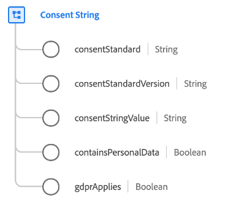

# Datatypen [!UICONTROL Consent String]

[!UICONTROL Consent String] är en standard-XDM-datatyp som beskriver ett strängvärde som representerar en kunds samtycke. Den innehåller sammanhangsbaserad information som standard för medgivandesträngen (till exempel [IAB Transparency och Consent Framework (TCF) 2.0](../field-groups/profile/iab.md)).

| Egenskap | Datatyp | Beskrivning |
| --- | --- | --- |
| `consentStandard` | Sträng | Standardvärdet för medgivandesträngen. Detta hjälper till att fastställa formatet för medgivandesträngen enligt de olika tjänsterna för hantering av samtycke. |
| `consentStandardVersion` | Sträng | Den version av medgivandestandarden som används för att korrekt definiera formatet för medgivandesträngen enligt de tjänster som tillhandahålls av samtyckeshantering. |
| `consentStringValue` | Sträng | Den fullständiga medgivandesträngen som tillhandahålls av tjänsten för hantering av samtycke. `consentStandard` och `consentStandardVersion` hjälper till att definiera hur den här strängen ska tolkas. |
| `containsPersonalData` | Boolean | När det här fältet är sant betyder det att den här medgivandesträngen måste bearbetas för att medgivandet ska kunna verkställas. |
| `gdprApplies` | Boolean | När det här fältet är sant innebär det att samtycke kommer med personuppgifter. |

{style="table-layout:auto"}

Mer information om datatypen finns i den offentliga XDM-databasen:

* [Populerat exempel](https://github.com/adobe/xdm/blob/master/components/datatypes/consent/consentstring.example.1.json)
* [Fullständigt schema](https://github.com/adobe/xdm/blob/master/components/datatypes/consent/consentstring.schema.json)
