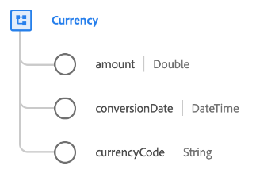

# [!UICONTROL Currency] datatyp

[!UICONTROL Currency] är en standard-XDM-datatyp som beskriver ett valutabelopp, inklusive valutatyp och konverteringsdatum.

| Egenskap | Datatyp | Beskrivning |
| --- | --- | --- |
| `amount` | Dubbel | Valutabeloppet som definieras av `currencyCode`. |
| `conversionDate` | DateTime | En tidsstämpel som anger när valutakonverteringen gjordes. |
| `currencyCode` | Sträng | En ISO 4217-kod som anger vilken typ av valuta som `amount` representerar. |

{style="table-layout:auto"}

Mer information om fältgruppen finns i den offentliga XDM-databasen:

* [Populerat exempel](https://github.com/adobe/xdm/blob/master/components/datatypes/currency.example.1.json)
* [Fullständigt schema](https://github.com/adobe/xdm/blob/master/components/datatypes/currency.schema.json)
