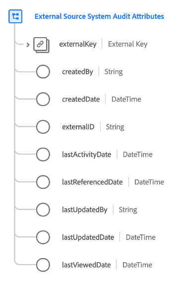

# [!UICONTROL External Source System Audit Attributes] datatyp

[!UICONTROL External Source System Audit Attributes] är en XDM-datatyp (Standard Experience Data Model) som samlar in granskningsinformation om ett externt källsystem.

| Egenskap | Datatyp | Beskrivning |
| --- | --- | --- |
| `externalKey` | [[!UICONTROL B2B Source]](./b2b-source.md) | En sammansatt identifierare för källan som används för granskning. |
| `createdBy` | Sträng | Namnet på den användare som skapade den här posten. |
| `createdDate` | DateTime | Datumet då posten skapades. |
| `externalID` | Sträng | Extern unik identifierare för källan. Det här värdet används för att identifiera och deduplicera vid behov. |
| `lastActivityDate` | DateTime | Det senaste aktivitetsdatumet för källsystemet. |
| `lastReferencedDate` | DateTime | Det senaste referensdatumet för källsystemet. |
| `lastUpdatedBy` | Sträng | Namnet på den person som senast uppdaterade den här posten. |
| `lastUpdatedDate` | DateTime | Det senaste uppdateringsdatumet för källsystemet. |
| `lastViewedDate` | DateTime | Det senast visade datumet för källsystemet. |

{style="table-layout:auto"}

Mer information om datatypen finns i den offentliga XDM-databasen:

* [Populerat exempel](https://github.com/adobe/xdm/blob/master/components/datatypes/auditing/external-source-system-audit.example.1.json)
* [Fullständigt schema](https://github.com/adobe/xdm/blob/master/components/datatypes/auditing/external-source-system-audit.schema.json)
