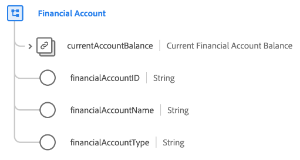

# Datatypen [!UICONTROL Financial Account]

[!UICONTROL Financial Account] är en standard-XDM-datatyp som beskriver informationen för ett finansiellt konto, inklusive typ, ägare och aktuellt saldo.

| Egenskap | Datatyp | Beskrivning |
| --- | --- | --- |
| `currentAccountBalance` | [[!UICONTROL Currency]](./currency.md) | Kontots aktuella saldo. |
| `financialAccountId` | [!UICONTROL String] | Ett unikt ID för kontot. |
| `financialAccountName` | [!UICONTROL String] | Namnet som tilldelats kontot. |
| `financialAccountType` | [!UICONTROL String] | Typ av konto, t.ex. kontroll, sparande eller återlösen. |

{style="table-layout:auto"}

Mer information om datatypen finns i [den offentliga XDM-databasen](https://github.com/adobe/xdm/blob/master/docs/reference/datatypes/financial-account.schema.json).
