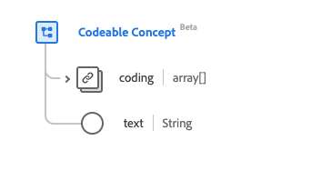

# Datatypen [!UICONTROL Codeable Concept]

[!UICONTROL Codeable Concept] är en XDM-datatyp (Standard Experience Data Model) som beskriver en referens från en resurs till en annan. Den här datatypen skapas enligt specifikationerna för HL7 FHIR version 5.

| Visningsnamn | Egenskap | Datatyp | Beskrivning |
| --- | --- | --- | --- |
| [!UICONTROL Coding] | `coding` | Array med [[!UICONTROL Coding]](../healthcare/coding.md) | Kod definierad av ett terminologiskt system. |
| [!UICONTROL Text] | `text` | Sträng | Konceptets rena textbeteckning. |

Mer information om datatypen finns i den offentliga XDM-databasen:

* [Populerat exempel](https://github.com/adobe/xdm/blob/master/extensions/industry/healthcare/fhir/datatypes/codeablereference.example.1.json)
* [Fullständigt schema](https://github.com/adobe/xdm/blob/master/extensions/industry/healthcare/fhir/datatypes/codeableconcept.schema.json)
