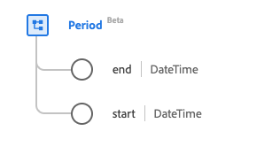

# Datatypen [!UICONTROL Period]

[!UICONTROL Period] är en XDM-datatyp (Standard Experience Data Model) som tillhandahåller en tidsperiod som definieras av ett start- och slutdatum/tid. Den här datatypen skapas enligt specifikationerna för HL7 FHIR version 5.

| Visningsnamn | Egenskap | Datatyp | Beskrivning |
| --- | --- | --- | --- |
| [!UICONTROL End] | `end` | DateTime | Slutdatum och sluttid. |
| [!UICONTROL Start] | `start` | DateTime | Startdatum och starttid. |

Mer information om datatypen finns i den offentliga XDM-databasen:

* [Populerat exempel](https://github.com/adobe/xdm/blob/master/extensions/industry/healthcare/fhir/datatypes/period.example.1.json)
* [Fullständigt schema](https://github.com/adobe/xdm/blob/master/extensions/industry/healthcare/fhir/datatypes/period.schema.json)
