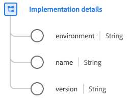

# Datatypen [!UICONTROL Implementation details]

[!UICONTROL Implementation details] är en XDM-datatyp (Standard Experience Data Model) som beskriver en teknikimplementering, till exempel ett API eller en SDK.

| Egenskap | Datatyp | Beskrivning |
| --- | --- | --- |
| `environment` | Sträng | Implementeringens miljö. |
| `name` | Sträng | Identifieraren för SDK eller slutpunkten. Alla SDK:er eller slutpunkter identifieras via en URI, inklusive tillägg. |
| `version` | Sträng | Versionen av API eller SDK. |

{style="table-layout:auto"}

Mer information om datatypen finns i den offentliga XDM-databasen:

* [Populerat exempel](https://github.com/adobe/xdm/blob/master/components/datatypes/industry-verticals/implementationdetails.example.1.json)
* [Fullständigt schema](https://github.com/adobe/xdm/blob/master/components/datatypes/industry-verticals/implementationdetails.schema.json)
