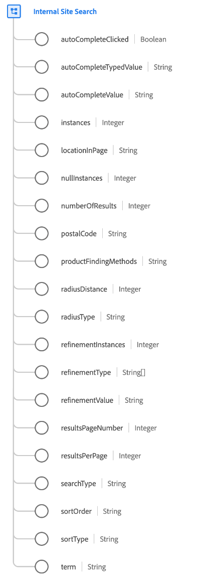

# [!UICONTROL Internal Site Search] datatyp

[!UICONTROL Internal Site Search] är en standard-XDM-datatyp som beskriver en intern webbplatssökning, inklusive alla relaterade sökbeteenden och detaljer.

| Egenskap | Datatyp | Beskrivning |
| --- | --- | --- |
| `autoCompleteClicked` | [!UICONTROL Boolean] | Anger om en besökare använde ett föreslaget eller automatiskt ifyllt sökvärde för att köra sökningen. |
| `autoCompleteTypedValue` | [!UICONTROL String] | I scenarier där användaren fyller i automatiskt kan det hända att användaren avbryter sökningen och väljer en specifik term i listrutan. Det här värdet spårar vad användaren har börjat skriva för att kunna generera den specifika uppsättningen föreslagna söktermer. |
| `autoCompleteValue` | [!UICONTROL String] | I scenarier där användaren fyller i automatiskt kan det hända att användaren avbryter sökningen och väljer en specifik term i listrutan. Det här värdet används för att spåra de specifika termer som valts. |
| `instances` | [!UICONTROL Integer] | Antalet gånger som den interna webbplatssökningen gjordes. |
| `locationInPage` | [!UICONTROL String] | När det finns flera sökrutor på sidan bör det här värdet användas för att identifiera den plats som användaren använde för att söka. |
| `nullInstances` | [!UICONTROL Integer] | Antalet gånger som den interna webbplatssökningen gjordes som gav noll resultat. |
| `numberOfResults` | [!UICONTROL Integer] | Det totala antalet returnerade sökresultat. |
| `postalCode` | [!UICONTROL String] | Postnummer som används för sökningen, om tillämpligt. |
| `productFindingMethods` | [!UICONTROL String] | Det interna söktermvärdet för webbplatsen med försäljningsbindning. Det här värdet anger vilken term som sökdes efter omedelbart innan en produkt visades. |
| `radiusDistance` | [!UICONTROL Integer] | Kombinerat med `radiusType`anger det markerade avståndet för sökradien. |
| `radiusType` | [!UICONTROL Integer] | Den valda avståndstypen för `radiusDistance`, antingen engelska mil eller kilometer. |
| `refinementInstances` | [!UICONTROL Integer] | Antalet gånger som den interna webbplatssökningen har förfinats. |
| `refinementType` | Array med strängar | Visar de förfiningstyper som använts på sökresultaten. Exempel är avdelning, varumärke, pris, butiker, recensioner, färg, material och så vidare. |
| `refinementValue` | [!UICONTROL String] | Värdet som sökningen förfinades till. |
| `resultsPageNumber` | [!UICONTROL Integer] | För sidnumrerade sökresultat spårar det här värdet den resultatsida som besökaren visar. |
| `resultsPerPage` | [!UICONTROL Integer] | För sidnumrerade sökresultat spårar det här värdet antalet sökresultat som visas per sida. |
| `searchType` | [!UICONTROL String] | Hämtar den sökmetod som körs, om tillämpligt. Exempel kan vara typsnittssökning, direkttypsökning eller någon annan typ av anpassad sökfunktion som en webbplats kan ha. |
| `sortOrder` | [!UICONTROL String] | Kombinerat med `sortType`, anger sorteringsordningen för sökresultaten, antingen stigande eller fallande. |
| `term` | [!UICONTROL String] | Den interna sökterm som anges av besökaren. |

{style="table-layout:auto"}

Mer information om datatypen finns i [publik XDM-databas](https://github.com/adobe/xdm/blob/master/docs/reference/datatypes/internal-site-search.schema.json).
