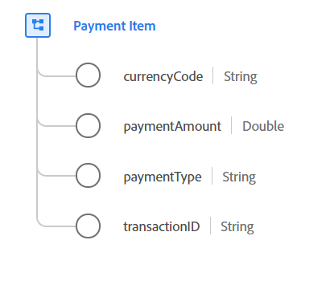

# [!UICONTROL Payment Item] datatyp

[!UICONTROL Payment Item] är en XDM-datatyp (Standard Experience Data Model) som beskriver en betalning som är associerad med en order som definierar betalningstypen, beloppet och den associerade valutan.

 

| Egenskap | Datatyp | Beskrivning |
| --- | --- | --- |
| `currencyCode` | Sträng | ISO 4217-valutakoden som används för ordersummor. Alla instanser måste överensstämma med det reguljära uttrycket `^[A-Z]{3}$`. Exempel är `USD` och `EUR`. |
| `paymentAmount` | Dubbel | Betalningens värde. |
| `paymentType` | Sträng | Betalningsmetoden för den här ordern. Godkända uppräkningsvärden är: <li> `cash` </li> <li> `credit_card` </li> <li> `debit_card` </li> <li> `gift_card` </li> <li> `check` </li> <li> `paypal` </li> <li> `wire_transfer` </li> <li> `credit_card_reference` </li> <li> `other` </li> |
| `transactionID` | Sträng | Den unika transaktionsidentifieraren för den här betalningsartikeln. |

Mer information om datatypen finns i den offentliga XDM-databasen:

* [Populerat exempel](https://github.com/adobe/xdm/blob/master/components/datatypes/data/paymentitem.example.1.json)
* [Fullständigt schema](https://github.com/adobe/xdm/blob/master/components/datatypes/data/paymentitem.schema.json)
