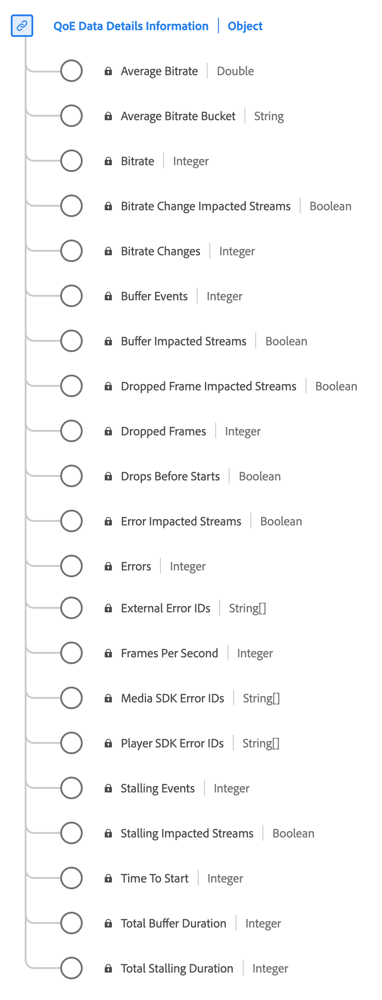

# QoE (Quality of Experience), datatyp för datainformation

[!UICONTROL QoE Data Details Information] är en XDM-datatyp (Standard Experience Data Model) som ger detaljerade mått för upplevelsekvaliteten (QoE) under medieuppspelningen. Använd [!UICONTROL QoE Data Details Information] datatyp för att samla in information som bithastighetsinformation, bildrutehastigheter, buffringshändelser, uteslutna bildrutor och så vidare. Den här datatypen gör det möjligt att analysera uppspelningskvaliteten, vilket ger insikter i direktuppspelningsprestanda, användarupplevelse och eventuella problem som uppstår under uppspelningssessioner.

+++Välj för att visa datatypen QoE Data Details.

+++

| Visningsnamn | Egenskap | Datatyp | Beskrivning |
|----------------------------------------|----------------------------|-----------|--------------------------------------------------------------------------------------------------|
| [!UICONTROL Average Bitrate Bucket] | `bitrateAverageBucket` | string | Den genomsnittliga bithastigheten (i kbit/s) som kategoriseras i fördefinierade intervall med 100 kbit/s intervall. |
| [!UICONTROL Bitrate] | `bitrate` | heltal | Bithastighetsvärdet (i kbit/s). |
| [!UICONTROL Average Bitrate] | `bitrateAverage` | tal | Genomsnittlig bithastighet (i kbit/s, heltal). Beräknas som ett vägt medelvärde av bithastighetsvärden. |
| [!UICONTROL Bitrate Change Impacted Streams] | `hasBitrateChangeImpactedStreams` | boolesk | Anger om strömmar påverkades av bithastighetsändringar under uppspelning. |
| [!UICONTROL Bitrate Changes] | `bitrateChangeCount` | heltal | Det totala antalet bithastighetsändringar under uppspelning. |
| [!UICONTROL Dropped Frame Impacted Streams] | `hasDroppedFrameImpactedStreams` | boolesk | Anger om strömmar påverkades av uteslutna bildrutor under uppspelningen. |
| [!UICONTROL Dropped Frames] | `droppedFrames` | heltal | Det totala antalet bildrutor som utelämnas under uppspelningen. |
| [!UICONTROL Drops Before Starts] | `isDroppedBeforeStart` | boolesk | Anger om användare stänger av videon innan den börjar, oavsett annonser. |
| [!UICONTROL Frames Per Second] | `framesPerSecond` | heltal | Aktuell flödeshastighet (i bildrutor per sekund). |
| [!UICONTROL Time To Start] | `timeToStart` | heltal | Varaktighet (i sekunder) mellan inläsning av video och start. |
| [!UICONTROL Buffer Impacted Streams] | `hasBufferImpactedStreams` | boolesk | Anger om strömmar påverkades av buffring under uppspelning. |
| [!UICONTROL Buffer Events] | `bufferCount` | heltal | Antalet olika buffertlägen under uppspelning. |
| [!UICONTROL Total Buffer Duration] | `bufferTime` | heltal | Sammanlagd tid (i sekunder) för buffring under uppspelning. |
| [!UICONTROL Error Impacted Streams] | `hasErrorImpactedStreams` | boolesk | Anger om strömmar råkade ut för fel under uppspelning. |
| [!UICONTROL Errors] | `errorCount` | heltal | Det totala antalet fel som uppstod under uppspelningen. |
| [!UICONTROL Stalling Impacted Streams] | `hasStallImpactedStreams` | boolesk | Anger om strömmar upplevde fördröjning under uppspelning. |
| [!UICONTROL Stalling Events] | `stallCount` | heltal | Antalet förhalande händelser under uppspelning. |
| [!UICONTROL Total Stalling Duration] | `stallTime` | heltal | Den totala tiden (i sekunder) som uppspelningen stoppades under uppspelningen. |
| [!UICONTROL Player SDK Error IDs] | `playerSdkErrors` | array med strängar | Unika fel-ID:n som genereras av spelarens SDK under uppspelning. |
| [!UICONTROL External Error IDs] | `externalErrors` | array med strängar | Unika fel-ID från externa källor, t.ex. CDN-fel. |
| [!UICONTROL Media SDK Error IDs] | `mediaSdkErrors` | array med strängar | Unika fel-ID:n som genereras av Media SDK under uppspelning. |

{style="table-layout:auto"}

Mer information om fältgruppen finns i [publik XDM-databas](https://github.com/adobe/xdm/blob/master/components/datatypes/qoedatadetails.schema.json).

