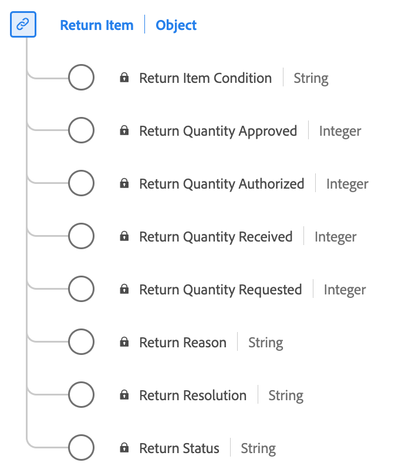

# [!UICONTROL Return Item] datatyp

[!UICONTROL Return Item] är en XDM-datatyp (Experience Data Model) som används som standard för att hämta viktig information om returprocessen för ett köpt objekt.

| Visningsnamn | Egenskap | Datatyp | Beskrivning |
|-----------------------------|------------------------------|-----------|--------------------------------------------------------|
| [!UICONTROL Return Status] | `returnStatus` | string | Status för returnerat objekt (till exempel Väntande eller Godkänd). |
| [!UICONTROL Return Reason] | `returnReason` | string | Orsaken till varför returen begärdes för artikeln. |
| [!UICONTROL Return Item Condition] | `returnItemCondition` | string | Villkoret för artikeln som returen begärs för. |
| [!UICONTROL Return Resolution] | `returnResolution` | string | Den önskade upplösningen eller det förväntade resultatet från returen (till exempel Återbetalning eller Exchange). |
| [!UICONTROL Return Quantity Requested] | `returnQuantityRequested` | heltal | Kvantiteten av artikeln som kunden begärde att få returnera. |
| [!UICONTROL Return Quantity Authorized] | `returnQuantityAuthorized` | heltal | Kvantiteten av artikeln som är godkänd för retur. |
| [!UICONTROL Return Quantity Received] | `returnQuantityReceived` | heltal | Kvantiteten returnerade artiklar som har tagits emot. |
| [!UICONTROL Return Quantity Approved] | `returnQuantityApproved` | heltal | Kvantiteten för artikeln med en fullständig och godkänd retur. |

{style="table-layout:auto"}

Mer information om datatypen finns i den offentliga XDM-databasen:

* [Populerat exempel](https://github.com/adobe/xdm/blob/master/components/datatypes/returnitem.example.1.json)
* [Fullständigt schema](https://github.com/adobe/xdm/blob/master/components/datatypes/returnitem.schema.json)
