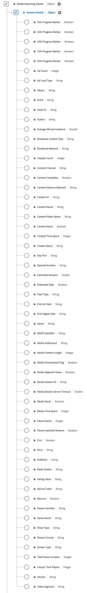

# Datatypen [!UICONTROL Session Details] för rapportering

[!UICONTROL Session Details]-rapportering är en XDM-datatyp (Standard Experience Data Model) som spårar data som relaterar till mediespelningssessioner.
Medierapporteringsfält används av Adobe-tjänster för att analysera de mediesamlingsfält som skickas av användarna. Dessa data, tillsammans med andra specifika användarvärden, beräknas och rapporteras utifrån. Schemat omfattar ett brett urval av egenskaper som ger insikter om användarbeteenden och mönster för innehållskonsumtion. Använd datatypen [!UICONTROL Session Details] Reporting för att samla in användarinteraktion genom att logga uppspelningshändelser, annonsinteraktioner, förloppsmarkörer, pauser och andra mätvärden.

+++Välj om du vill visa ett diagram över datatypen Sessionsinformationsrapportering.

+++

>[!NOTE]
>
>Varje visningsnamn innehåller en länk med mer information om dess ljud- och videoparametrar. De länkade sidorna innehåller information om videoannonser som samlats in av Adobe, implementeringsvärden, nätverksparametrar, rapporter och viktiga överväganden.

| Visningsnamn | Egenskap | Datatyp | Beskrivning |
|-------------------------------------------------------------------------------------------------------------------------------------------------------------------------------------|------------------|-----------|--------------------------------------------------------------------------------------------------|
| [[!UICONTROL 10% Progress Marker]](https://experienceleague.adobe.com/docs/media-analytics/using/implementation/variables/audio-video-parameters.html#ten-%25-progress-marker) | `hasProgress10` | Boolean | Anger att spelhuvudet passerade 10 %-markören för media baserat på strömmens längd. Markören räknas bara en gång, även om du söker bakåt. Om du söker framåt räknas inte markörer som hoppas över. |
| [[!UICONTROL 25% Progress Marker]](https://experienceleague.adobe.com/docs/media-analytics/using/implementation/variables/audio-video-parameters.html#twenty-five-%25-progress-marker) | `hasProgress25` | Boolean | Anger att spelhuvudet passerade mediemarkeringen på 25 % baserat på strömmens längd. Markören räknades bara en gång, även om den söker bakåt. Om du söker framåt räknas inte markörer som hoppas över. |
| [[!UICONTROL 50% Progress Marker]](https://experienceleague.adobe.com/docs/media-analytics/using/implementation/variables/audio-video-parameters.html#50%25-progress-marker) | `hasProgress50` | Boolean | Anger att spelhuvudet passerade 50 %-markören för media baserat på strömmens längd. Markören räknades bara en gång, även om den söker bakåt. Om du söker framåt räknas inte markörer som hoppas över. |
| [[!UICONTROL 75% Progress Marker]](https://experienceleague.adobe.com/docs/media-analytics/using/implementation/variables/audio-video-parameters.html#seventy-five-%25-progress-marker) | `hasProgress75` | Boolean | Anger att spelhuvudet passerade 75 %-markören för media baserat på strömmens längd. Markören räknades bara en gång, även om den söker bakåt. Om du söker framåt räknas inte markörer som hoppas över. |
| [[!UICONTROL 95% Progress Marker]](https://experienceleague.adobe.com/docs/media-analytics/using/implementation/variables/audio-video-parameters.html#ninety-five-%25-progress-marker) | `hasProgress95` | Boolean | Anger att spelhuvudet passerade 95 %-markören för media baserat på strömmens längd. Markören räknades bara en gång, även om den söker bakåt. Om du söker framåt räknas inte markörer som hoppas över. |
| [[!UICONTROL Ad Count]](https://experienceleague.adobe.com/docs/media-analytics/using/implementation/variables/audio-video-parameters.html#ad-count) | `adCount` | Heltal | Antalet annonser som har startats under uppspelningen. |
| [!UICONTROL Ad Load Type] | `adLoad` | Sträng | Den typ av annons som läses in enligt varje kunds interna representation. |
| [[!UICONTROL Album]](https://experienceleague.adobe.com/docs/media-analytics/using/implementation/variables/audio-video-parameters.html#album) | `album` | Sträng | Namnet på det album som musikinspelningen eller videon tillhör. |
| [[!UICONTROL Artist]](https://experienceleague.adobe.com/docs/media-analytics/using/implementation/variables/audio-video-parameters.html#artist) | `artist` | Sträng | Namnet på den albumartist eller grupp som utför musikinspelningen eller videon. |
| [[!UICONTROL Asset ID]](https://experienceleague.adobe.com/docs/media-analytics/using/implementation/variables/audio-video-parameters.html#asset-id) | `assetID` | Sträng | [!UICONTROL Asset ID] är den unika identifieraren för innehållet i medieresursen, till exempel TV-seriens avsnittsidentifierare, filmresursidentifierare eller live-händelseidentifierare. Vanligtvis härleds dessa ID:n från metadatautfärdare som EIDR, TMS/Gracenote eller Rovi. Dessa identifierare kan också komma från andra egenutvecklade eller interna system. |
| [[!UICONTROL Author]](https://experienceleague.adobe.com/docs/media-analytics/using/implementation/variables/audio-video-parameters.html#author) | `author` | Sträng | Namnet på mediets författare. |
| [[!UICONTROL Average Minute Audience]](https://experienceleague.adobe.com/docs/media-analytics/using/implementation/variables/audio-video-parameters.html#average-minute-audience) | `averageMinuteAudience` | Nummer Anger den genomsnittliga innehållstiden för ett visst medieobjekt, det vill säga den totala innehållstiden dividerad med längden på alla uppspelningssessioner. |
| [[!UICONTROL Broadcast Content Type]](https://experienceleague.adobe.com/docs/media-analytics/using/implementation/variables/audio-video-parameters.html#content-type) | `contentType` | Sträng | [!UICONTROL Broadcast Content Type] för strömleveransen. Tillgängliga värden per [!UICONTROL Stream Type] är: Ljud: &quot;låt&quot;, &quot;poddsändning&quot;, &quot;ljudbok&quot; och &quot;radio&quot;; Video: &quot;VoD&quot;, &quot;Live&quot;, &quot;Linjär&quot;, &quot;UGC&quot; och &quot;DVoD&quot;. Kunder kan ange anpassade värden för den här parametern. |
| [[!UICONTROL Broadcast Network]](https://experienceleague.adobe.com/docs/media-analytics/using/implementation/variables/audio-video-parameters.html#network) | `network` | Sträng | Namnet på nätverket/kanalen. |
| [[!UICONTROL Chapter Count]](https://experienceleague.adobe.com/docs/media-analytics/using/implementation/variables/audio-video-parameters.html#chapter-count) | `chapterCount` | Heltal | Antalet kapitel som startades under uppspelningen. |
| [[!UICONTROL Content Channel]](https://experienceleague.adobe.com/docs/media-analytics/using/implementation/variables/audio-video-parameters.html#content-channel) | `channel` | Sträng | [!UICONTROL Content Channel] är distributionskanalen som innehållet spelades upp från. |
| [[!UICONTROL Content Completes]](https://experienceleague.adobe.com/docs/media-analytics/using/implementation/variables/audio-video-parameters.html#content-complete) | `isCompleted` | Boolean | [!UICONTROL Content Completes] indikerar om en medieresurs med en tidsgräns bevakades tills den har slutförts. Den här händelsen behöver inte nödvändigtvis innebära att användaren tittade på hela videon. Visningsprogrammet kunde ha hoppat över i förväg. |
| [!UICONTROL Content Delivery Network] | `cdn` | Sträng | [!UICONTROL Content Delivery Network] av det uppspelade innehållet. |
| [[!UICONTROL Content ID]](https://experienceleague.adobe.com/docs/media-analytics/using/implementation/variables/audio-video-parameters.html#content-id) | `name` | Sträng | [!UICONTROL Content ID] är en unik identifierare av innehållet. Den kan användas för att länka tillbaka till andra branschs- eller CMS-ID:n. |
| [[!UICONTROL Content Name]](https://experienceleague.adobe.com/docs/media-analytics/using/implementation/variables/audio-video-parameters.html#content-name-(variable)) | `friendlyName` | Sträng | [!UICONTROL Content Name] är ett användarvänligt (läsbart) namn på innehållet. |
| [[!UICONTROL Content Player Name]](https://experienceleague.adobe.com/docs/media-analytics/using/implementation/variables/audio-video-parameters.html#content-player-name) | `playerName` | Sträng | Namnet på innehållsspelaren. |
| [[!UICONTROL Content Starts]](https://experienceleague.adobe.com/docs/media-analytics/using/implementation/variables/audio-video-parameters.html#content-starts) | `isPlayed` | Boolean | [!UICONTROL Content Starts] blir true när den första bildrutan av media förbrukas. Om användaren hoppar under en annons, buffrar och så vidare, finns det ingen [!UICONTROL Content Starts]-händelse. |
| [[!UICONTROL Content Time Spent]](https://experienceleague.adobe.com/docs/media-analytics/using/implementation/variables/audio-video-parameters.html#content-time-spent) | `timePlayed` | Heltal | [!UICONTROL Content Time Spent] summerar händelsens varaktighet (i sekunder) för alla händelser av typen PLAY i huvudinnehållet. |
| [[!UICONTROL Creator Name]](https://experienceleague.adobe.com/docs/media-analytics/using/implementation/variables/audio-video-parameters.html#originator) | `originator` | Sträng | Namnet på innehållsskaparen. |
| [[!UICONTROL Day Part]](https://experienceleague.adobe.com/docs/media-analytics/using/implementation/variables/audio-video-parameters.html#day-part) | `dayPart` | Sträng | En egenskap som definierar tiden på dagen då innehållet sändes eller spelades upp. Detta kan ha vilket värde som helst som kunderna behöver |
| [[!UICONTROL Episode Number]](https://experienceleague.adobe.com/docs/media-analytics/using/implementation/variables/audio-video-parameters.html#episode) | `episode` | Sträng | Antal avsnitt. |
| [[!UICONTROL Estimated Streams]](https://experienceleague.adobe.com/docs/media-analytics/using/implementation/variables/audio-video-parameters.html#estimated-streams) | `estimatedStreams` | Nummer | Det uppskattade antalet video- eller ljudströmmar för varje enskild del av innehållet. |
| [[!UICONTROL Federated Data]](https://experienceleague.adobe.com/docs/media-analytics/using/implementation/variables/audio-video-parameters.html#federated-data) | `isFederated` | Boolean | [!UICONTROL Federated Data] anges till true när träffen är federerad (d.v.s. tas emot av kunden som en del av en federerad datadelning, i stället för som en egen implementering). |
| [[!UICONTROL Feed Type]](https://experienceleague.adobe.com/docs/media-analytics/using/implementation/variables/audio-video-parameters.html#media-feed-type) | `feed` | Sträng | Typen av feed, som antingen kan representera faktiska matningsrelaterade data som EAST HD eller SD, eller matningens källa som en URL. |
| [[!UICONTROL First Air Date]](https://experienceleague.adobe.com/docs/media-analytics/using/implementation/variables/audio-video-parameters.html#first-air-date) | `firstAirDate` | Sträng | Det datum då innehållet först skrevs på tv. Alla datumformat kan accepteras, men Adobe rekommenderar: ÅÅÅ-MM-DD. |
| [[!UICONTROL First Digital Date]](https://experienceleague.adobe.com/docs/media-analytics/using/implementation/variables/audio-video-parameters.html#first-digital-date) | `firstDigitalDate` | Sträng | Det datum då innehållet först skrevs på en digital kanal eller plattform. Alla datumformat kan användas, men Adobe rekommenderar: ÅÅÅ-MM-DD. |
| [[!UICONTROL Genre]](https://experienceleague.adobe.com/docs/media-analytics/using/implementation/variables/audio-video-parameters.html#genre) | `genre` | Sträng | Typ eller gruppering av innehåll enligt innehållsproducentens definition. Värdena ska vara kommaavgränsade vid variabel implementering. |
| [[!UICONTROL Media Authorized]](https://experienceleague.adobe.com/docs/media-analytics/using/implementation/variables/audio-video-parameters.html#authorized) | `authorized` | Sträng | Bekräftar om användaren har autentiserats via Adobe. |
| [[!UICONTROL Media Content Length]](https://experienceleague.adobe.com/docs/media-analytics/using/implementation/variables/audio-video-parameters.html#content-length-(variable)) | `length` | Heltal | JA | [!UICONTROL Media Content Length] innehåller klippets längd/körtid - Detta är den maximala längden (eller längden) för innehållet som används (i sekunder). |
| [[!UICONTROL Media Downloaded Flag]](https://experienceleague.adobe.com/docs/media-analytics/using/implementation/variables/audio-video-parameters.html#media-downloaded-flag) | `isDownloaded` | Boolean | Strömmen spelades upp lokalt på enheten efter att den hämtats. |
| [[!UICONTROL Media Segment Views]](https://experienceleague.adobe.com/docs/media-analytics/using/implementation/variables/audio-video-parameters.html#content-segment-views) | `hasSegmentView` | Boolean | [!UICONTROL Media Segment Views] anger när minst en bildruta, inte nödvändigtvis den första, har visats. |
| [[!UICONTROL Media Session ID]](https://experienceleague.adobe.com/docs/media-analytics/using/implementation/variables/audio-video-parameters.html#media-session-id) | `ID` | Sträng | [!UICONTROL Media Session ID] identifierar en instans av en innehållsström som är unik för en enskild uppspelning. <em>Obs!<em>`sessionId` skickas för alla händelser, förutom för `sessionStart` och för alla nedladdade händelser. |
| [[!UICONTROL Media Session Server Timeout]](https://experienceleague.adobe.com/docs/media-analytics/using/implementation/variables/audio-video-parameters.html#seconds-since-last-call) | `secondsSinceLastCall` | Nummer [!UICONTROL Media Session Server Timeout] anger hur lång tid (i sekunder) som har gått mellan användarens senaste kända interaktion och tidpunkten då sessionen stängdes. |
| [[!UICONTROL Media Starts]](https://experienceleague.adobe.com/docs/media-analytics/using/implementation/variables/audio-video-parameters.html#media-starts) | `isViewed` | Boolean | Mediets load-händelse. Detta inträffar när användaren väljer uppspelningsknappen. Detta gäller även om det finns annonser före rullning, buffring, fel och så vidare. |
| [[!UICONTROL Media Time Spent]](https://experienceleague.adobe.com/docs/media-analytics/using/implementation/variables/audio-video-parameters.html#media-time-spent) | `totalTimePlayed` | Heltal | Beskriver den totala tiden som en användare tillbringar med en viss mediefil i tid, vilket inkluderar den tid som tillbringats med att titta på annonser. |
| [[!UICONTROL MVPD Identifier]](https://experienceleague.adobe.com/docs/media-analytics/using/implementation/variables/audio-video-parameters.html#mvpd) | `mvpd` | Sträng | [!UICONTROL MVPD Identifier] som tillhandahölls via autentisering i Adobe. |
| [[!UICONTROL Pause Events]](https://experienceleague.adobe.com/docs/media-analytics/using/implementation/variables/audio-video-parameters.html#pause-events) | `pauseCount` | Heltal | [!UICONTROL Pause Events] anger antalet pausperioder som inträffade under uppspelning. |
| [[!UICONTROL Pause Impacted Streams]](https://experienceleague.adobe.com/docs/media-analytics/using/implementation/variables/audio-video-parameters.html#paused-impacted-streams) | `hasPauseImpactedStreams` | Boolean Anger om en eller flera pauser inträffade under uppspelningen av ett enda medieobjekt. |
| [!UICONTROL Pccr] | `pccr` | Boolean | [!UICONTROL Pccr] anger att en omdirigering har gjorts. |
| [!UICONTROL Pev3] | `pev3` | Sträng | [!UICONTROL Pev3] är den typ av medieström som används för rapportering. |
| [[!UICONTROL Publisher]](https://experienceleague.adobe.com/docs/media-analytics/using/implementation/variables/audio-video-parameters.html#publisher) | `publisher` | Sträng | Namnet på ljudinnehållsutgivaren. |
| [[!UICONTROL Radio Station]](https://experienceleague.adobe.com/docs/media-analytics/using/implementation/variables/audio-video-parameters.html#station) | `station` | Sträng | Namnet på radiostationen som ljudet spelas upp på. |
| [[!UICONTROL Rating Value]](https://experienceleague.adobe.com/docs/media-analytics/using/implementation/variables/audio-video-parameters.html#content-rating) | `rating` | Sträng | Betyg enligt definitionen i TV:s föräldrariktlinjer. |
| [[!UICONTROL Record Label]](https://experienceleague.adobe.com/docs/media-analytics/using/implementation/variables/audio-video-parameters.html#label) | `label` | Sträng | Namnet på postetiketten. |
| [[!UICONTROL Resume]](https://experienceleague.adobe.com/docs/media-analytics/using/implementation/variables/audio-video-parameters.html#content-resumes) | `hasResume` | Boolean | Markerar varje uppspelning som återupptogs efter mer än 30 minuters buffring, paus eller uppehåll. |
| [[!UICONTROL Season Number]](https://experienceleague.adobe.com/docs/media-analytics/using/implementation/variables/audio-video-parameters.html#season) | `season` | Sträng | The [!UICONTROL Season Number] that the show tillhör. Säsongsserie krävs bara om programmet ingår i en serie. |
| [[!UICONTROL Series Name]](https://experienceleague.adobe.com/docs/media-analytics/using/implementation/variables/audio-video-parameters.html#show) | `show` | Sträng | Program-/serienamnet. Programnamnet krävs bara om programmet ingår i en serie. |
| [[!UICONTROL Show Type]](https://experienceleague.adobe.com/docs/media-analytics/using/implementation/variables/audio-video-parameters.html#show-type) | `showType` | Sträng | Innehållstypen, till exempel trailer eller hela avsnitt. |
| [[!UICONTROL Stream Format]](https://experienceleague.adobe.com/docs/media-analytics/using/implementation/variables/audio-video-parameters.html#stream-format) | `streamFormat` | Sträng | Strömmens format (HD, SD). |
| [[!UICONTROL Stream Type]](https://experienceleague.adobe.com/docs/media-analytics/using/implementation/variables/audio-video-parameters.html#stream-type) | `streamType` | Sträng | Medieströmmens typ. |
| [[!UICONTROL Total Pause Duration]](https://experienceleague.adobe.com/docs/media-analytics/using/implementation/variables/audio-video-parameters.html#total-pause-duration) | `pauseTime` | Heltal | [!UICONTROL Total Pause Duration] beskriver hur länge användaren pausade uppspelningen i sekunder. |
| [[!UICONTROL Unique Time Played]](https://experienceleague.adobe.com/docs/media-analytics/using/implementation/variables/audio-video-parameters.html#unique-time-played) | `uniqueTimePlayed` | Heltal | Beskriver summan av de unika intervaller som en användare ser på en medieresurs med tidsangivelse, d.v.s. längden på de visningsintervall som visas flera gånger räknas bara en gång. |
| [[!UICONTROL Version]](https://experienceleague.adobe.com/docs/media-analytics/using/implementation/variables/audio-video-parameters.html#sdk-version) | `appVersion` | Sträng | SDK-versionen som används av spelaren. Detta kan ha vilket värde som helst som passar din spelare. |
| [[!UICONTROL Video Segment]](https://experienceleague.adobe.com/docs/media-analytics/using/implementation/variables/audio-video-parameters.html#content-segment) | `segment` | Sträng | Intervallet som beskriver den del av innehållet som har visats i minuter. |

{style="table-layout:auto"}

<!-- Could not find details for :
Ad Load Type
Content Delivery Network
Pccr
Pev3
-->
