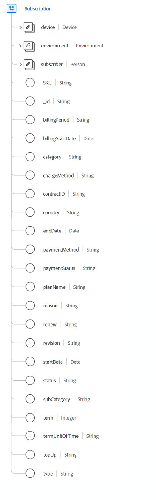

# [!UICONTROL Subscription] datatyp

[!UICONTROL Subscription] är en XDM-datatyp (Standard Experience Data Model) som beskriver licensierade rättigheter till programvara, tjänster eller varor som används baserat på tid eller användning.

 

| Egenskap | Datatyp | Beskrivning |
| --- | --- | --- |
| `device` | [[!UICONTROL Device]](./device.md) | Beskriver information om enheten som är länkad till prenumerationen. |
| `environment` | [[!UICONTROL Environment]](./environment.md) | Innehåller information om den omgivande situation som händelseobservationen inträffade, med detaljerad information om övergångar, t.ex. nätverks- eller programversioner. |
| `subscriber` | [[!UICONTROL Person]](./person.md) | Beskriver en enskild person. Detta kan även representera en person som agerar i olika roller, till exempel en kund, kontakt eller ägare. |
| `SKU` | Sträng | Lagerhållningsenheten (SKU), en unik identifierare för en produkt. |
| `billingPeriod` | Sträng | Varaktigheten mellan faktureringar. |
| `billingStartDate` | Datum | Datumet då den första fakturan förfaller. Datumformatet (utan tid) ska följa standarden [RFC 3339, avsnitt 5.6](https://tools.ietf.org/html/rfc3339#section-5.6). |
| `category` | Sträng | Huvudkategorisering på högsta nivå av den här typen av prenumeration. |
| `chargeMethod` | Sträng | Hur faktureringen ställs in för att debitera kunden. |
| `contractID` | Sträng | Unikt ID för det kontrakt som styr den här prenumerationen. |
| `country` | Sträng | Landet som prenumerationsvillkoren och avtalsvillkoren är rotade i. |
| `endDate` | Datum | Det datum som den aktuella prenumerationsperioden upphör. Datumformatet (utan tid) ska följa standarden [RFC 3339, avsnitt 5.6](https://tools.ietf.org/html/rfc3339#section-5.6). |
| `paymentMethod` | Sträng | Betalningsmetoden för återkommande betalningar. |
| `paymentStatus` | Sträng | Kontots betalningsstatus. |
| `planName` | Sträng | Prenumerationens läsbara namn. |
| `reason` | Sträng | Medlemmens allmänna avsikt är att använda prenumerationen. |
| `renew` | Sträng | Det överenskomna sättet att fortsätta prenumerationen efter slutdatumet. |
| `revision` | Sträng | Identifieringen mellan prenumerationer med samma namn och kategorihierarki. |
| `startDate` | Datum | Det datum då prenumerationen börjar. Datumformatet (utan tid) ska följa standarden [RFC 3339, avsnitt 5.6](https://tools.ietf.org/html/rfc3339#section-5.6). |
| `status` | Sträng | Prenumerationens aktuella status. |
| `subCategory` | Sträng | Den specifika underkategoriseringen av prenumerationen. |
| `term` | Heltal | Det numeriska värdet för prenumerationsperioden. |
| `termUnitOfTime` | Sträng | Tidsenhet för löptiden. |
| `topUp` | Sträng | Beskriver de överenskomna villkoren för hur konsumerbara delar av en prenumeration återköps under en faktureringsperiod. |
| `type` | Sträng | Rättighetens omfattning i förhållande till hur många personer som omfattas av prenumerationen. |

Mer information om datatypen finns i den offentliga XDM-databasen:

* [Populerat exempel](https://github.com/adobe/xdm/blob/master/components/datatypes/industry-verticals/subscription.example.1.json)
* [Fullständigt schema](https://github.com/adobe/xdm/blob/master/components/datatypes/industry-verticals/subscription.schema.json)