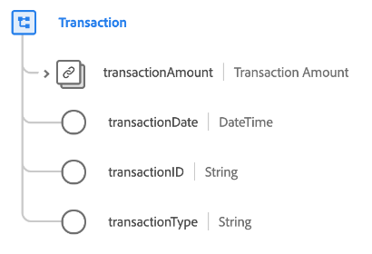

# Datatypen [!UICONTROL Transaction]

[!UICONTROL Transaction] är en XDM-datatyp (Standard Experience Data Model) som beskriver informationen för en monetär transaktion.

| Egenskap | Datatyp | Beskrivning |
| --- | --- | --- |
| `transactionAmount` | [[!UICONTROL Currency]](./currency.md) | Beskriver beloppet för den valuta som byts ut som en del av transaktionen. |
| `transactionDate` | [!UICONTROL DateTime] | En tidsstämpel som anger när transaktionen utfördes. |
| `transactionId` | [!UICONTROL String] | En unik identifierare för transaktionen. |
| `transactionType` | [!UICONTROL String] | Den typ av transaktion som används av besökaren. |

{style="table-layout:auto"}
